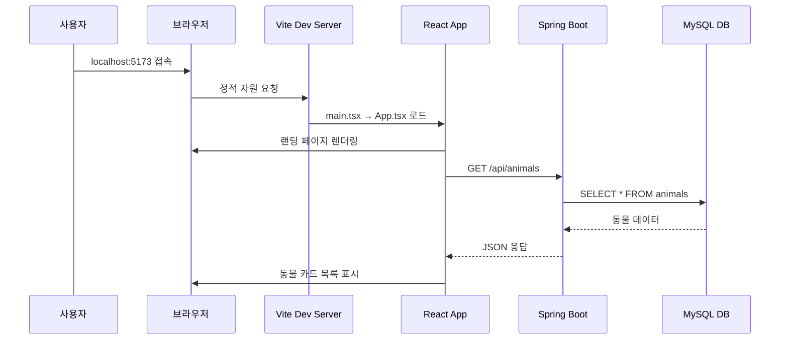
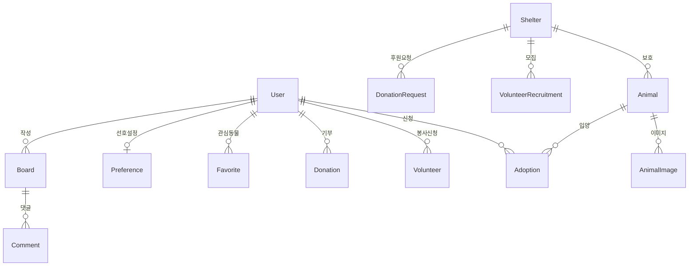

# 62DN 프로젝트 전격 분석

> 유기동물 입양/임시보호 매칭, 봉사활동 및 물품 후원 신청 플랫폼

---

## 1. 프로젝트 개요

### 1.1 기술 스택

| 영역 | 기술 |
|------|------|
| **Frontend** | React 18, TypeScript, Vite, TailwindCSS, React Query, Zustand, Axios |
| **Backend** | Java 21, Spring Boot 3.2, Spring Security + JWT, Spring Data JPA, Flyway |
| **Database** | MySQL 8.0 |
| **외부 서비스** | 공공데이터 API (유기동물/보호소), Resend (이메일), Map API |

### 1.2 주요 기능

- **일반 사용자**: 유기동물 조회/검색, 입양/임보 절차 안내, 봉사활동 신청, 물품 후원, 커뮤니티
- **보호소 관리자**: 동물 수동 등록, 봉사 모집공고, 물품 후원 요청, 신청 승인/거절
- **시스템 관리자**: 회원 관리, 보호소 인증 관리, 게시판 관리

### 1.3 아키텍처 패턴

- **Frontend**: SPA (Single Page Application) + 컴포넌트 기반 설계
- **Backend**: 레이어드 아키텍처 (Controller → Service → Repository → Entity)
- **인증**: Stateless JWT 토큰 기반 (Access + Refresh Token)
- **API 설계**: RESTful API + Role 기반 접근 제어

---

## 2. 디렉토리 구조

```
62dn/
├── backend/                          # Spring Boot 백엔드
│   ├── src/main/java/com/dnproject/platform/
│   │   ├── DnPlatformApplication.java   # 진입점
│   │   ├── config/                      # 설정 클래스 (8개)
│   │   ├── controller/                  # REST 컨트롤러 (15개)
│   │   ├── domain/                      # JPA 엔티티 (15개)
│   │   │   └── constant/                # Enum 상수 (19개)
│   │   ├── dto/                         # 요청/응답 DTO (36개)
│   │   ├── exception/                   # 예외 처리 (4개)
│   │   ├── repository/                  # JPA Repository (15개)
│   │   ├── security/                    # JWT 보안 (3개)
│   │   ├── service/                     # 비즈니스 로직 (15개)
│   │   └── util/                        # 유틸리티 (1개)
│   ├── src/main/resources/
│   │   ├── application.yml              # 공통 설정
│   │   ├── application-dev.yml          # 개발 환경 설정
│   │   └── application-prod.yml         # 운영 환경 설정
│   ├── build.gradle.kts                 # Gradle 빌드 설정
│   └── .env                             # 환경 변수
│
├── frontend/                         # React 프론트엔드
│   ├── src/
│   │   ├── main.tsx                     # React 진입점
│   │   ├── App.tsx                      # 라우팅 정의
│   │   ├── api/                         # API 모듈 (11개)
│   │   ├── components/                  # 재사용 컴포넌트 (7개 그룹)
│   │   ├── pages/                       # 페이지 컴포넌트 (8개 그룹)
│   │   ├── hooks/                       # 커스텀 훅 (2개)
│   │   ├── store/                       # Zustand 스토어 (1개)
│   │   ├── types/                       # TypeScript 타입 (2개)
│   │   └── styles/                      # CSS 스타일 (4개)
│   ├── package.json                     # npm 의존성
│   ├── vite.config.ts                   # Vite 설정
│   └── tailwind.config.js               # Tailwind 설정
│
├── scripts/                          # 실행/배포 스크립트 (6개)
├── terraform/                        # 인프라 코드 (5개)
└── README.md                         # 프로젝트 문서
```

### 2.1 폴더별 역할

| 폴더 | 역할 |
|------|------|
| `backend/config/` | Spring 설정: CORS, Security, Swagger, 스케줄러, 초기 데이터 로더 |
| `backend/controller/` | REST API 엔드포인트 정의, 요청 검증 및 응답 반환 |
| `backend/domain/` | JPA 엔티티, 테이블 매핑, 연관관계 정의 |
| `backend/service/` | 비즈니스 로직, 트랜잭션 관리, 외부 API 연동 |
| `backend/security/` | JWT 토큰 생성/검증, 인증 필터 |
| `frontend/api/` | Axios 기반 API 호출 모듈 |
| `frontend/pages/` | 라우트별 페이지 컴포넌트 |
| `frontend/store/` | Zustand 전역 상태 관리 (인증 상태) |

---

## 3. 핵심 파일 상세 분석

### 3.1 Backend 진입점

#### `DnPlatformApplication.java`
- **역할**: Spring Boot 애플리케이션 시작점
- **주요 어노테이션**:
  - `@SpringBootApplication`: 자동 설정 및 컴포넌트 스캔
  - `@EnableAsync`: 비동기 처리 활성화 (이메일 발송 등)
  - `@EnableScheduling`: 스케줄 작업 활성화 (공공API 동기화)

```java
@SpringBootApplication
@EnableAsync
@EnableScheduling
public class DnPlatformApplication {
    public static void main(String[] args) {
        SpringApplication.run(DnPlatformApplication.class, args);
    }
}
```

---

### 3.2 보안 설정

#### `SecurityConfig.java`
- **역할**: Spring Security + JWT 기반 인증/인가 설정
- **핵심 로직**:
  - CORS 설정 (프론트엔드 도메인 허용)
  - CSRF 비활성화 (Stateless API)
  - Stateless 세션 정책
  - 역할 기반 접근 제어 (USER, SHELTER_ADMIN, SUPER_ADMIN)

```java
// 공개 경로 (인증 불필요)
private static final String[] PUBLIC_PATHS = {
    "/api/auth/signup", "/api/auth/login", "/api/auth/refresh",
    "/api/animals", "/api/animals/**",
    "/api/boards", "/api/boards/**",
    // ...
};

// 역할별 접근 제어
.requestMatchers("/api/admin/users/**").hasRole("SUPER_ADMIN")
.requestMatchers("/api/admin/**").hasAnyRole("SUPER_ADMIN", "SHELTER_ADMIN")
.requestMatchers("/api/**").authenticated()
```

---

### 3.3 핵심 도메인 엔티티

#### `Animal.java`
- **역할**: 유기동물 정보 엔티티 (핵심 도메인)
- **주요 필드**:

| 필드 | 타입 | 설명 |
|------|------|------|
| `id` | Long | PK |
| `shelter` | Shelter | 보호소 (FK) |
| `publicApiAnimalId` | String | 공공API 연동 ID |
| `species` | Species(Enum) | 종류 (DOG/CAT) |
| `breed` | String | 품종 |
| `status` | AnimalStatus(Enum) | 상태 (PROTECTED/ADOPTED 등) |
| `images` | List | 이미지 목록 |

- **연관관계**: `Shelter`(N:1), `AnimalImage`(1:N), `Adoption`(1:N)

---

### 3.4 비즈니스 서비스

#### `AnimalService.java`
- **역할**: 동물 CRUD + 공공API 연동
- **주요 메서드**:

| 메서드 | 기능 |
|--------|------|
| `findAll()` | 필터링된 동물 목록 조회 (페이징) |
| `findAllRandom()` | 랜덤 정렬 목록 (다양한 노출) |
| `findById()` | 동물 상세 조회 |
| `create()` / `update()` / `delete()` | CRUD |
| `syncFromPublicApiWithStatus()` | 공공데이터포털 → DB 동기화 |
| `findRecommended()` | 사용자 선호도 기반 추천 |

---

### 3.5 Frontend 진입점

#### `main.tsx`
- **역할**: React 앱 마운트
- **특징**: 에러 핸들링 포함 (앱 로드 실패 시 사용자 친화적 메시지)

```tsx
ReactDOM.createRoot(rootEl).render(
  <React.StrictMode>
    <App />
  </React.StrictMode>
);
```

#### `App.tsx`
- **역할**: 전체 라우팅 정의
- **주요 라우트**:

| 경로 | 페이지 |
|------|--------|
| `/` | 랜딩 페이지 |
| `/animals`, `/animals/:id` | 동물 목록/상세 |
| `/volunteers` | 봉사활동 |
| `/donations` | 기부 |
| `/boards` | 게시판 |
| `/login`, `/signup` | 인증 |
| `/admin` | 관리자 대시보드 |

---

### 3.6 상태 관리

#### `authStore.ts`
- **역할**: Zustand 기반 인증 상태 전역 관리
- **주요 상태/액션**:

```typescript
interface AuthState {
  user: User | null;          // 현재 사용자
  accessToken: string | null; // JWT 토큰
  isAuthenticated: boolean;   // 인증 여부
  login: (tokenResponse) => void;  // 로그인
  logout: () => void;              // 로그아웃
  setUser: (user) => void;         // 사용자 설정
}
```

- **토큰 저장**: `localStorage` (로그인 유지) 또는 `sessionStorage`
- **Persist**: Zustand persist 미들웨어로 새로고침 시에도 상태 유지

---

## 4. 실행 흐름

### 4.1 애플리케이션 시작



### 4.2 인증 흐름 (로그인)

1. 사용자가 이메일/비밀번호 입력
2. `POST /api/auth/login` 요청
3. 백엔드: 비밀번호 검증 → JWT 토큰 생성
4. 프론트: `authStore.login()` → 토큰 저장
5. 이후 요청에 `Authorization: Bearer {token}` 헤더 포함

### 4.3 공공API 동기화

```
스케줄러 (매일 새벽 2시)
    ↓
PublicApiSyncScheduler.syncAnimals()
    ↓
AnimalSyncService.syncFromApi()
    ↓
공공데이터포털 API 호출
    ↓
Animal 엔티티로 변환 → DB 저장
```

---

## 5. 설정 및 환경

### 5.1 필수 환경변수

#### Backend (`.env` 또는 환경변수)
```bash
DB_USERNAME=root
DB_PASSWORD=your-password
JWT_SECRET=your-256-bit-base64-encoded-secret
RESEND_API_KEY=re_xxxxxxxx
DATA_API_KEY=your-public-api-key
```

#### Frontend (`.env`)
```bash
VITE_API_BASE_URL=http://localhost:8080/api
VITE_MAP_API_KEY=your-map-api-key
```

### 5.2 빌드/실행 명령어

```bash
# Backend
cd backend
./gradlew bootRun        # 개발 서버 실행

# Frontend
cd frontend
npm install              # 의존성 설치
npm run dev              # 개발 서버 실행 (localhost:5173)
```

### 5.3 주요 설정 파일

| 파일 | 역할 |
|------|------|
| `application.yml` | 공통 설정 (JWT, API키, CORS 등) |
| `application-dev.yml` | 개발 환경 (H2/MySQL 연결, 로그 레벨) |
| `vite.config.ts` | Vite 빌드/개발 서버 설정 |
| `tailwind.config.js` | TailwindCSS 커스터마이징 |

---

## 6. 주요 패턴 및 베스트 프랙티스

### 6.1 사용된 디자인 패턴

| 패턴 | 적용 위치 | 설명 |
|------|----------|------|
| **레이어드 아키텍처** | Backend 전체 | Controller → Service → Repository 분리 |
| **Builder 패턴** | Entity, DTO | Lombok `@Builder`로 객체 생성 |
| **Repository 패턴** | `*Repository.java` | Spring Data JPA 기반 데이터 접근 추상화 |
| **Filter Chain** | `JwtAuthenticationFilter` | 요청 전처리 (토큰 검증) |
| **Store 패턴** | `authStore.ts` | Zustand 기반 전역 상태 관리 |

### 6.2 코드 컨벤션

- **Backend**: Java 표준 네이밍, Lombok 활용, 한글 주석
- **Frontend**: TypeScript strict mode, 컴포넌트 파일명 PascalCase
- **API**: RESTful 명명 (`/api/animals`, `/api/auth/login`)

### 6.3 에러 핸들링

- **Backend**: `@ControllerAdvice` + 커스텀 Exception 클래스
- **Frontend**: `ErrorBoundary` 컴포넌트, API 호출 시 try-catch

---

## 7. 학습 로드맵

이 프로젝트를 이해하기 위해 **순서대로 읽어야 할 파일 목록**:

### 7.1 Backend (필수)

1. [DnPlatformApplication.java](file:///c:/workspace/62dn/backend/src/main/java/com/dnproject/platform/DnPlatformApplication.java) - 진입점
2. [application.yml](file:///c:/workspace/62dn/backend/src/main/resources/application.yml) - 전체 설정 이해
3. [SecurityConfig.java](file:///c:/workspace/62dn/backend/src/main/java/com/dnproject/platform/config/SecurityConfig.java) - 보안 구조
4. [Animal.java](file:///c:/workspace/62dn/backend/src/main/java/com/dnproject/platform/domain/Animal.java) - 핵심 도메인
5. [AnimalService.java](file:///c:/workspace/62dn/backend/src/main/java/com/dnproject/platform/service/AnimalService.java) - 비즈니스 로직
6. [AnimalController.java](file:///c:/workspace/62dn/backend/src/main/java/com/dnproject/platform/controller/AnimalController.java) - API 엔드포인트

### 7.2 Frontend (필수)

1. [main.tsx](file:///c:/workspace/62dn/frontend/src/main.tsx) - React 진입점
2. [App.tsx](file:///c:/workspace/62dn/frontend/src/App.tsx) - 라우팅 구조
3. [authStore.ts](file:///c:/workspace/62dn/frontend/src/store/authStore.ts) - 상태 관리
4. [api/animal.ts](file:///c:/workspace/62dn/frontend/src/api/animal.ts) - API 호출
5. [pages/animals/AnimalsPage.tsx](file:///c:/workspace/62dn/frontend/src/pages/animals/AnimalsPage.tsx) - 목록 페이지

### 7.3 추가 학습 자료

- [README.md](file:///c:/workspace/62dn/README.md) - 프로젝트 개요
- [BACKEND_STRUCTURE.md](file:///c:/workspace/62dn/backend/BACKEND_STRUCTURE.md) - 백엔드 상세 구조
- [API_INTEGRATION_GUIDE.md](file:///c:/workspace/62dn/frontend/API_INTEGRATION_GUIDE.md) - API 연동 가이드

---

## 8. 도메인 모델 다이어그램



---

> **문서 작성일**: 2026-02-09  
> **분석 대상**: `c:\workspace\62dn` 프로젝트
