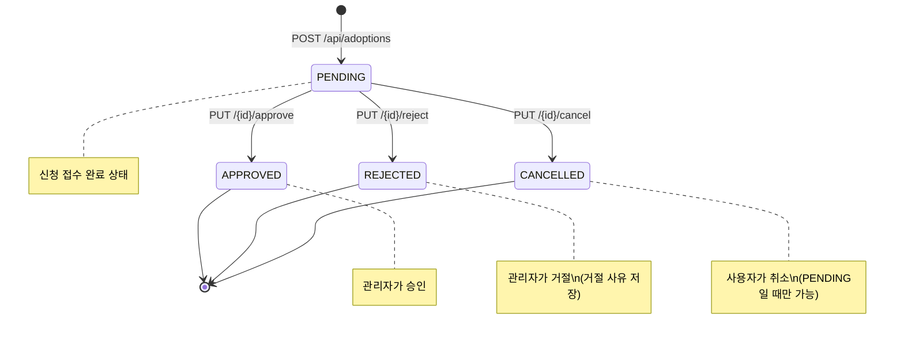
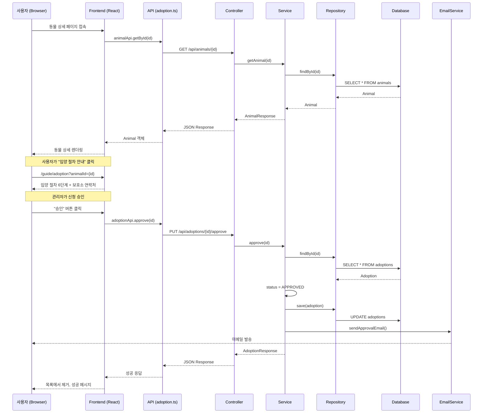

# 🐾 입양 페이지 기능 완전 가이드

> **대상**: 신규/주니어 개발자 온보딩 및 스터디 세션  
> **범위**: `http://localhost:5173/animals` 입양 페이지 관련 전체 기능

---

## 1. 기능 개요

### 1.1 사용자가 할 수 있는 작업

| 작업 | 설명 | 관련 페이지 |
|------|------|-------------|
| 동물 목록 조회 | 입양 가능한 강아지/고양이 목록 필터링 및 검색 | `/animals` |
| 동물 상세 보기 | 특정 동물의 정보, 보호소 연락처, 지도 확인 | `/animals/{id}` |
| 입양 절차 안내 | 입양 신청 절차 및 보호소 연락 방법 확인 | `/guide/adoption` |
| 내 신청 현황 조회 | 마이페이지에서 입양/임보 신청 내역 확인 | `/mypage` |

### 1.2 관리자(SHELTER_ADMIN)가 할 수 있는 작업

| 작업 | 설명 | 관련 탭 |
|------|------|---------|
| 대기 신청 목록 조회 | 나의 보호소에 접수된 PENDING 신청 확인 | 신청 관리 |
| 신청 승인 | 입양/임보 신청 승인 → 신청자에게 이메일 발송 | 신청 관리 |
| 신청 거절 | 거절 사유 입력 후 반려 → 신청자에게 이메일 발송 | 신청 관리 |

---

## 2. 아키텍처 레이어별 역할

### 2.1 Backend (Spring Boot)

```
backend/src/main/java/com/dnproject/platform/
├── domain/
│   ├── Adoption.java           # 입양 신청 엔티티
│   └── constant/
│       ├── AdoptionType.java   # ADOPTION(입양) / FOSTERING(임시보호)
│       └── AdoptionStatus.java # PENDING → APPROVED/REJECTED/CANCELLED
├── repository/
│   └── AdoptionRepository.java # JPA 쿼리 메서드
├── service/
│   └── AdoptionService.java    # 핵심 비즈니스 로직
├── controller/
│   └── AdoptionController.java # REST API 엔드포인트
└── dto/
    ├── request/AdoptionRequest.java   # 신청 요청 DTO
    └── response/AdoptionResponse.java # 응답 DTO
```

#### Domain: `Adoption.java`
```java
@Entity
@Table(name = "adoptions")
public class Adoption {
    @Id @GeneratedValue(strategy = GenerationType.IDENTITY)
    private Long id;
    
    @ManyToOne(fetch = FetchType.LAZY)
    private User user;           // 신청자
    
    @ManyToOne(fetch = FetchType.LAZY)
    private Animal animal;       // 신청 대상 동물
    
    @Enumerated(EnumType.STRING)
    private AdoptionType type;   // ADOPTION or FOSTERING
    
    @Enumerated(EnumType.STRING)
    @Builder.Default
    private AdoptionStatus status = AdoptionStatus.PENDING;
    
    private String reason;       // 신청 사유
    private String experience;   // 반려동물 경험
    private String livingEnv;    // 주거 환경
    private Boolean familyAgreement; // 가족 동의 여부
    private String rejectReason; // 거절 사유 (관리자 입력)
    private LocalDateTime processedAt; // 처리 시각
}
```

### 2.2 Frontend (React + TypeScript)

```
frontend/src/
├── api/
│   └── adoption.ts         # API 호출 모듈
├── types/
│   ├── entities.ts         # Adoption, AdoptionType, AdoptionStatus 타입
│   └── dto.ts              # AdoptionRequest, AdoptionResponse DTO
└── pages/
    ├── animals/
    │   └── AnimalDetailPage.tsx  # 동물 상세 → 입양 안내 링크
    ├── guide/
    │   └── GuideAdoptionPage.tsx # 입양 절차 안내
    ├── auth/
    │   └── MyPage.tsx            # 내 입양 신청 현황
    └── admin/
        └── AdminDashboardPage.tsx # 관리자 승인/거절
```

---

## 3. API 상세 명세

### 3.1 입양/임보 신청

```http
POST /api/adoptions
Authorization: Bearer {accessToken}
Content-Type: application/json
```

**요청 바디:**
```json
{
  "animalId": 123,
  "type": "ADOPTION",
  "reason": "가족으로 함께하고 싶습니다",
  "experience": "이전에 강아지를 5년간 키운 경험이 있습니다",
  "livingEnv": "아파트, 반려동물 허용",
  "familyAgreement": true
}
```

**성공 응답 (201 Created):**
```json
{
  "status": 201,
  "message": "신청 완료",
  "data": {
    "id": 1,
    "userId": 42,
    "animalId": 123,
    "applicantName": "홍길동",
    "animalName": "콩이",
    "type": "ADOPTION",
    "status": "PENDING",
    "createdAt": "2026-02-09T08:30:00Z"
  }
}
```

**호출 시점:** 현재는 전화 기반 신청으로 설계되어 있음 (GuideAdoptionPage에서 보호소 연락처 안내)

---

### 3.2 내 신청 목록 조회

```http
GET /api/adoptions/my?page=0&size=10
Authorization: Bearer {accessToken}
```

**응답:**
```json
{
  "status": 200,
  "message": "조회 성공",
  "data": {
    "content": [
      { "id": 1, "animalId": 123, "type": "ADOPTION", "status": "PENDING", ... }
    ],
    "page": 0,
    "size": 10,
    "totalElements": 1,
    "totalPages": 1
  }
}
```

**호출 시점:** MyPage.tsx 마운트 시 `adoptionApi.getMyList()` 호출

---

### 3.3 신청 취소

```http
PUT /api/adoptions/{id}/cancel
Authorization: Bearer {accessToken}
```

**권한:** 본인만 취소 가능  
**조건:** `status === PENDING`일 때만 가능

**오류 응답 예시:**
```json
{
  "status": 400,
  "message": "대기 중인 신청만 취소할 수 있습니다.",
  "code": "INVALID_STATUS"
}
```

---

### 3.4 보호소 대기 신청 목록 (관리자)

```http
GET /api/adoptions/shelter/pending?page=0&size=20
Authorization: Bearer {accessToken}
```

**권한:** `SHELTER_ADMIN` 전용  
**동작:** 현재 로그인한 관리자의 보호소에 접수된 PENDING 신청만 반환

---

### 3.5 신청 승인 (관리자)

```http
PUT /api/adoptions/{id}/approve
Authorization: Bearer {accessToken}
```

**권한:** `SHELTER_ADMIN` 또는 `SUPER_ADMIN`  
**부수 효과:**
- `status` → `APPROVED`
- `processedAt` 기록
- 신청자에게 승인 이메일 발송

---

### 3.6 신청 거절 (관리자)

```http
PUT /api/adoptions/{id}/reject
Authorization: Bearer {accessToken}
Content-Type: application/json
```

**요청 바디:**
```json
{
  "rejectReason": "현재 해당 동물은 다른 분께 입양이 결정되었습니다."
}
```

**부수 효과:**
- `status` → `REJECTED`
- `rejectReason` 저장
- 신청자에게 거절 사유 포함 이메일 발송

---

## 4. 상태 전이 다이어그램



### 상태별 제약 조건

| 현재 상태 | 가능한 액션 | 실행 주체 |
|-----------|-------------|-----------|
| `PENDING` | approve, reject, cancel | 관리자/본인 |
| `APPROVED` | 없음 (최종 상태) | - |
| `REJECTED` | 없음 (최종 상태) | - |
| `CANCELLED` | 없음 (최종 상태) | - |

---

## 5. 핵심 비즈니스 로직

### 5.1 입양 신청 생성: `AdoptionService.apply()`

```java
@Transactional
public AdoptionResponse apply(Long userId, AdoptionRequest request) {
    // 1. 사용자 조회
    User user = userRepository.findById(userId)
        .orElseThrow(() -> new NotFoundException("사용자를 찾을 수 없습니다."));
    
    // 2. 동물 조회
    Animal animal = animalRepository.findById(request.getAnimalId())
        .orElseThrow(() -> new NotFoundException("동물을 찾을 수 없습니다."));
    
    // 3. Adoption 엔티티 생성 (기본 상태: PENDING)
    Adoption adoption = Adoption.builder()
        .user(user)
        .animal(animal)
        .type(request.getType())
        .status(AdoptionStatus.PENDING)
        .reason(request.getReason())
        .experience(request.getExperience())
        .livingEnv(request.getLivingEnv())
        .familyAgreement(request.getFamilyAgreement())
        .build();
    
    // 4. DB 저장
    adoption = adoptionRepository.save(adoption);
    
    // 5. 신청자에게 접수 확인 이메일 발송
    emailService.sendApplicationReceivedEmail(user.getEmail(), ...);
    
    // 6. 보호소 관리자에게 알림 + 이메일 발송
    notifyAndEmailAdmin(adoption, user.getName(), animal);
    
    return toResponse(adoption);
}
```

**핵심 포인트:**
- 중복 신청 검증 로직은 현재 미구현 (향후 추가 필요)
- 동물 상태(PROTECTED/FOSTERING) 검증 미구현

---

### 5.2 신청 취소: `AdoptionService.cancel()`

```java
@Transactional
public AdoptionResponse cancel(Long id, Long userId) {
    Adoption adoption = adoptionRepository.findById(id)
        .orElseThrow(() -> new NotFoundException("신청을 찾을 수 없습니다."));
    
    // 권한 검증: 본인만 취소 가능
    if (!adoption.getUser().getId().equals(userId)) {
        throw new CustomException("본인의 신청만 취소할 수 있습니다.", 
            HttpStatus.FORBIDDEN, "FORBIDDEN");
    }
    
    // 상태 검증: PENDING일 때만 취소 가능
    if (adoption.getStatus() != AdoptionStatus.PENDING) {
        throw new CustomException("대기 중인 신청만 취소할 수 있습니다.", 
            HttpStatus.BAD_REQUEST, "INVALID_STATUS");
    }
    
    adoption.setStatus(AdoptionStatus.CANCELLED);
    return toResponse(adoptionRepository.save(adoption));
}
```

---

### 5.3 관리자 승인: `AdoptionService.approve()`

```java
@Transactional
public AdoptionResponse approve(Long id) {
    Adoption adoption = findPendingAdoption(id);
    
    adoption.setStatus(AdoptionStatus.APPROVED);
    adoption.setProcessedAt(LocalDateTime.now());
    adoption = adoptionRepository.save(adoption);
    
    // 신청자에게 승인 이메일 발송
    emailService.sendApprovalEmail(
        adoption.getUser().getEmail(),
        adoption.getUser().getName(),
        getTypeLabel(adoption.getType())
    );
    
    return toResponse(adoption);
}
```

---

### 5.4 관리자 거절: `AdoptionService.reject()`

```java
@Transactional
public AdoptionResponse reject(Long id, String rejectReason) {
    Adoption adoption = findPendingAdoption(id);
    
    adoption.setStatus(AdoptionStatus.REJECTED);
    adoption.setRejectReason(rejectReason);  // 거절 사유 저장
    adoption.setProcessedAt(LocalDateTime.now());
    adoption = adoptionRepository.save(adoption);
    
    // 신청자에게 거절 이메일 발송 (사유 포함)
    emailService.sendRejectionEmail(
        adoption.getUser().getEmail(),
        adoption.getUser().getName(),
        getTypeLabel(adoption.getType()),
        rejectReason
    );
    
    return toResponse(adoption);
}
```

---

## 6. 프론트엔드 통합

### 6.1 AnimalDetailPage에서 입양 안내

**파일:** `frontend/src/pages/animals/AnimalDetailPage.tsx`

현재 설계는 **전화 기반 신청**으로, 상세 페이지에서 보호소 연락처를 제공합니다:

```tsx
// 입양/임보 절차 안내 링크
<div className="flex gap-3 mt-auto pt-2">
  <Link
    to={`/guide/adoption?animalId=${animal.id}`}
    className="landing-btn landing-btn-primary flex-1 text-center"
  >
    입양 절차 안내
  </Link>
  <Link
    to={`/guide/foster?animalId=${animal.id}`}
    className="landing-btn landing-btn-secondary flex-1 text-center"
  >
    임보 절차 안내
  </Link>
</div>
```

**보호소 연락처 표시:**
```tsx
{(animal.chargePhone || animal.shelterPhone) && (
  <p className="text-sm text-gray-600 mb-3">
    📞 <a href={`tel:${animal.chargePhone || animal.shelterPhone}`}>
      {animal.chargePhone || animal.shelterPhone}
    </a>
  </p>
)}
```

---

### 6.2 MyPage에서 신청 내역 조회

**파일:** `frontend/src/pages/auth/MyPage.tsx`

```tsx
// 데이터 로딩
useEffect(() => {
  Promise.all([
    authApi.getMe(),
    adoptionApi.getMyList(0, 20),  // 입양 신청 내역 조회
    // ... 기타
  ]).then(([userData, adoptData, ...]) => {
    setAdoptions(adoptData?.content ?? []);
  });
}, []);

// 렌더링
<section className="toss-auth-card mb-8">
  <h2>입양 신청 현황</h2>
  {adoptions.length === 0 ? (
    <p>신청 내역이 없습니다.</p>
  ) : (
    <ul>
      {adoptions.map((a) => (
        <li key={a.id}>
          #{a.id} · {a.type === 'ADOPTION' ? '입양' : '임시보호'} · 
          {statusLabel[a.status]}
        </li>
      ))}
    </ul>
  )}
</section>
```

---

### 6.3 AdminDashboardPage에서 승인/거절

**파일:** `frontend/src/pages/admin/AdminDashboardPage.tsx`

```tsx
// 대기 신청 목록 로드
const loadPendingApplications = async () => {
  const [adoptionsRes, volunteersRes, donationsRes] = await Promise.all([
    adoptionApi.getPendingByShelter(0, 50),
    // ...
  ]);
  setPendingAdoptions(adoptionsRes?.content ?? []);
};

// 승인 핸들러
const handleAdoptionApprove = async (id: number) => {
  setApplicationActionLoading(`adoption-${id}`);
  try {
    await adoptionApi.approve(id);
    setPendingAdoptions((prev) => prev.filter((a) => a.id !== id));
  } catch (e) {
    alert('승인 처리에 실패했습니다.');
  } finally {
    setApplicationActionLoading(null);
  }
};

// 거절 핸들러
const handleAdoptionReject = async (id: number, reason?: string) => {
  await adoptionApi.reject(id, reason);
  setPendingAdoptions((prev) => prev.filter((a) => a.id !== id));
};
```

---

## 7. 실전 시나리오

### 시나리오 A: 일반 사용자가 입양 문의

```
1. 사용자가 localhost:5173/animals 접속
2. 필터(종류, 크기, 지역)로 원하는 동물 검색
3. 동물 카드 클릭 → /animals/{id} 상세 페이지 이동
4. 동물 정보 및 보호소 정보 확인
5. "입양 절차 안내" 버튼 클릭 → /guide/adoption?animalId={id}
6. 입양 절차 6단계 확인 (동물사랑배움터 교육 등)
7. 보호소 전화번호로 직접 예약 (예시 문구 복사 기능 활용)
```

### 시나리오 B: 관리자가 신청 승인

```
1. 보호소 관리자(SHELTER_ADMIN)로 로그인
2. localhost:5173/admin 대시보드 접속
3. "신청 관리" 탭 선택
4. PENDING 상태의 입양/임보 신청 목록 확인
5. 신청 상세 정보 검토 (신청 사유, 경험, 주거환경 등)
6. "승인" 버튼 클릭
7. 백엔드에서:
   - status → APPROVED 변경
   - processedAt 기록
   - 신청자에게 승인 이메일 발송
8. UI에서 해당 신청이 목록에서 제거됨
```

### 시나리오 C: 관리자가 신청 거절

```
1. 신청 관리 탭에서 PENDING 신청 선택
2. "거절" 버튼 클릭 → 거절 사유 입력 모달 표시
3. "해당 동물은 이미 다른 분께 입양 확정되었습니다" 입력
4. 확인 → PUT /api/adoptions/{id}/reject 호출
5. 백엔드에서:
   - status → REJECTED 변경
   - rejectReason 저장
   - 신청자에게 거절 이메일 발송 (사유 포함)
```

---

## 8. 트러블슈팅 가이드

### 8.1 403 Forbidden 오류

**증상:** 입양 신청 시 권한 오류 발생

**원인:**
- 로그인 토큰 만료
- JWT가 요청 헤더에 포함되지 않음

**해결:**
```tsx
// axios 인터셉터 확인 (frontend/src/lib/axios.ts)
axiosInstance.interceptors.request.use((config) => {
  const token = localStorage.getItem('accessToken');
  if (token) {
    config.headers.Authorization = `Bearer ${token}`;
  }
  return config;
});
```

---

### 8.2 "대기 중인 신청만 취소할 수 있습니다" 오류

**증상:** 신청 취소 시 400 Bad Request

**원인:** 이미 APPROVED/REJECTED/CANCELLED 상태

**해결:** 프론트엔드에서 취소 버튼을 PENDING 상태일 때만 표시

```tsx
{adoption.status === 'PENDING' && (
  <button onClick={() => handleCancel(adoption.id)}>취소</button>
)}
```

---

### 8.3 "본인의 신청만 취소할 수 있습니다" 오류

**증상:** 다른 사용자의 신청 취소 시도

**원인:** 서버에서 userId 검증

**해결:** 정상적인 보안 동작. UI에서 본인 신청만 취소 버튼 표시

---

### 8.4 이메일 발송 실패

**증상:** 신청 접수 후 이메일 미도착

**확인 사항:**
1. `backend/.env`에 메일 설정 확인
   ```
   MAIL_HOST=smtp.gmail.com
   MAIL_PORT=587
   MAIL_USERNAME=your-email@gmail.com
   MAIL_PASSWORD=your-app-password
   ```
2. 백엔드 로그에서 EmailService 관련 오류 확인
3. 스팸함 확인

---

## 9. 파일 경로 참조표

### Backend

| 파일 | 경로 | 역할 |
|------|------|------|
| Adoption.java | `backend/.../domain/Adoption.java` | 입양 엔티티 |
| AdoptionType.java | `backend/.../domain/constant/AdoptionType.java` | 입양/임보 타입 |
| AdoptionStatus.java | `backend/.../domain/constant/AdoptionStatus.java` | 상태 Enum |
| AdoptionRepository.java | `backend/.../repository/AdoptionRepository.java` | JPA Repository |
| AdoptionService.java | `backend/.../service/AdoptionService.java` | 비즈니스 로직 |
| AdoptionController.java | `backend/.../controller/AdoptionController.java` | REST API |
| AdoptionRequest.java | `backend/.../dto/request/AdoptionRequest.java` | 요청 DTO |
| AdoptionResponse.java | `backend/.../dto/response/AdoptionResponse.java` | 응답 DTO |

### Frontend

| 파일 | 경로 | 역할 |
|------|------|------|
| adoption.ts | `frontend/src/api/adoption.ts` | API 호출 모듈 |
| entities.ts | `frontend/src/types/entities.ts` | 타입 정의 |
| dto.ts | `frontend/src/types/dto.ts` | DTO 타입 |
| AnimalDetailPage.tsx | `frontend/src/pages/animals/AnimalDetailPage.tsx` | 동물 상세 |
| MyPage.tsx | `frontend/src/pages/auth/MyPage.tsx` | 마이페이지 |
| AdminDashboardPage.tsx | `frontend/src/pages/admin/AdminDashboardPage.tsx` | 관리자 대시보드 |
| GuideAdoptionPage.tsx | `frontend/src/pages/guide/GuideAdoptionPage.tsx` | 입양 안내 |

---

## 10. 학습 체크리스트

### 기초

- [ ] `AdoptionStatus`와 `AdoptionType` Enum 값을 설명할 수 있다
- [ ] 입양 신청 시 필수 필드와 선택 필드를 구분할 수 있다
- [ ] API 응답 구조(`ApiResponse<T>`, `PageResponse<T>`)를 이해한다

### 백엔드

- [ ] `AdoptionService.apply()` 메서드 흐름을 설명할 수 있다
- [ ] 신청 취소 시 권한 검증 로직을 읽고 이해할 수 있다
- [ ] Postman에서 `POST /api/adoptions` API를 직접 호출해본다
- [ ] 승인/거절 시 이메일 발송 로직을 추적할 수 있다

### 프론트엔드

- [ ] `adoptionApi` 모듈의 각 함수 역할을 설명할 수 있다
- [ ] MyPage에서 입양 신청 목록을 불러오는 `useEffect` 흐름을 따라갈 수 있다
- [ ] AdminDashboardPage에서 승인/거절 핸들러를 이해한다
- [ ] 상태별 UI 렌더링 분기를 파악한다

### 통합

- [ ] 전체 데이터 흐름을 다이어그램으로 그릴 수 있다
- [ ] 오류 시나리오(403, 400)에 대한 예상 원인을 설명할 수 있다
- [ ] 새로운 필드(예: `preferredDate`) 추가 시 수정해야 할 파일 목록을 나열할 수 있다

---

## 부록: 데이터 흐름 다이어그램



---

*작성일: 2026-02-09 | 작성자: 62dn 개발팀*
