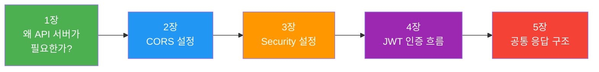
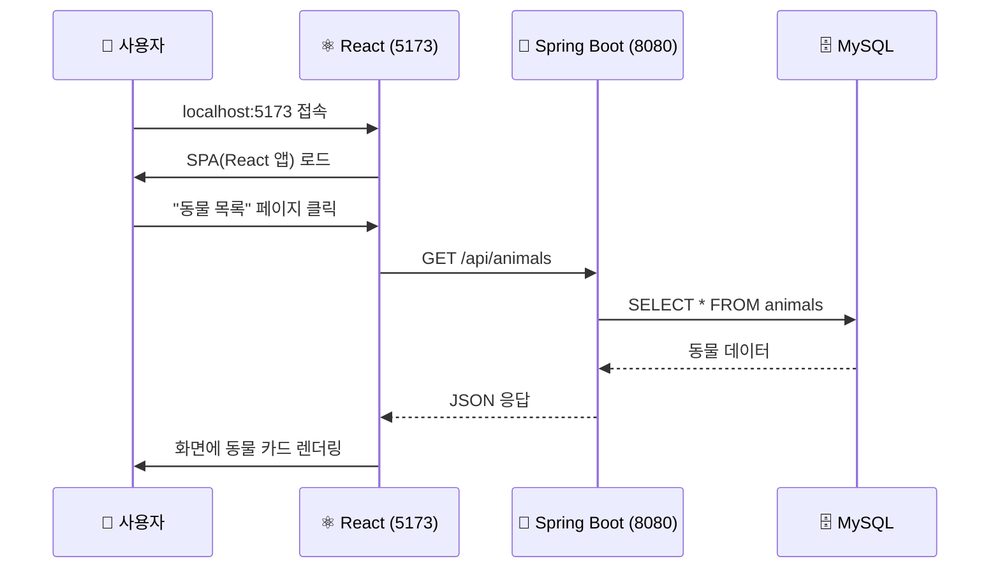
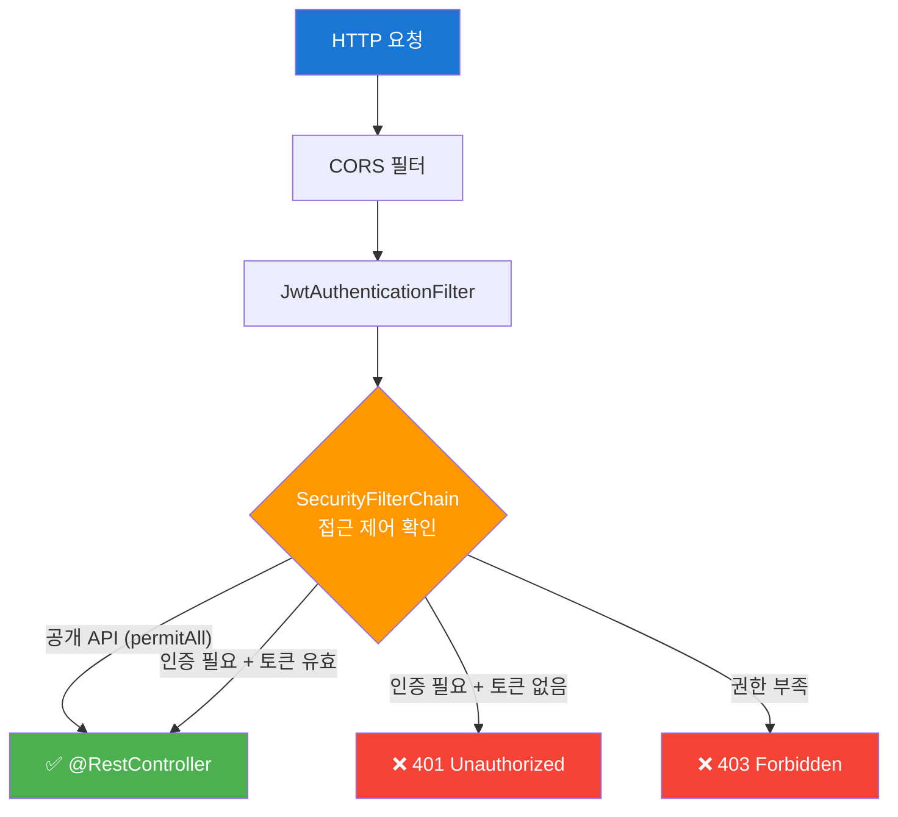
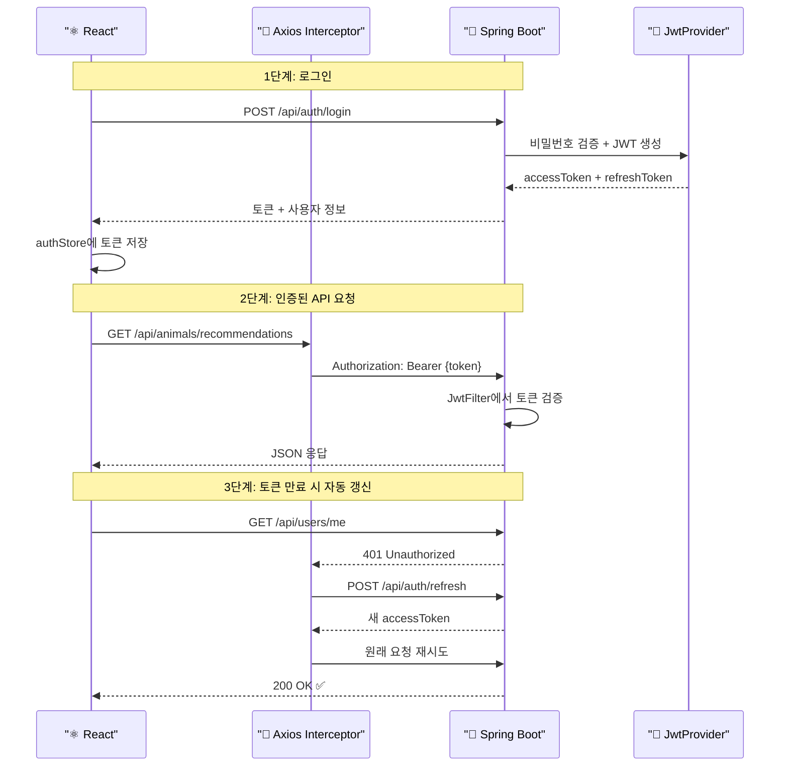

# Spring Boot + React REST API 연동 스터디 — 파트 A: 기반 구조

> **프로젝트**: 62댕냥이 (유기동물 입양/임보 매칭 플랫폼)
> **기술 스택**: Spring Boot 3.2 + Java 21 / React 18 + TypeScript + Vite
> **작성 기준**: 실제 프로젝트 코드 (`DN_project01`)

---

## 📚 관련 스터디 문서 바로가기

| 파트 | 문서 | 핵심 내용 |
|:---:|------|----------|
| **A** | 📍 **현재 문서** | REST API 기반 구조 (CORS, Security, JWT, 공통 응답) |
| **B** | [실전 API 개발](./STUDY_PART_B_실전_API_개발.md) | 동물·게시판·봉사·기부 등 도메인별 CRUD 구현 |
| **C** | [외부 API 연동](./STUDY_PART_C_외부_API_연동.md) | 공공데이터 API, 이메일 발송, 외부 서비스 통합 |
| **D** | [카카오지도 연동과 종합비교](./STUDY_PART_D_카카오지도_연동과_종합비교.md) | 카카오 지도 API, 위치 기반 검색 |
| **E** | [Terraform 인프라 생성](./STUDY_PART_E_Terraform_인프라_생성.md) | AWS 인프라를 코드로 관리 (IaC) |
| **F** | [CI/CD와 환경변수](./STUDY_PART_F_CICD와_환경변수.md) | GitHub Actions, 자동 배포, 환경 설정 |
| **G** | [안정화와 트러블슈팅](./STUDY_PART_G_안정화와_트러블슈팅.md) | 운영 안정화, 오류 해결 사례 |

> [!TIP]
> **이 문서를 읽는 순서**: A(기반 구조) → B(실전 API) → C(외부 연동) → D(지도) 순서로 읽으면 프론트-백 연동의 전체 그림을 이해할 수 있습니다.

---

## 📖 영어 약자 용어집 (Glossary)

| 약자 | 풀네임 (Full Name) | 한국어 설명 |
|:---:|---|---|
| **API** | Application Programming Interface | 애플리케이션 간 통신을 위한 인터페이스 |
| **REST** | Representational State Transfer | 리소스 기반의 아키텍처 스타일 |
| **CORS** | Cross-Origin Resource Sharing | 교차 출처 리소스 공유 (브라우저 보안 정책) |
| **JWT** | JSON Web Token | JSON 기반의 인증 토큰 |
| **SPA** | Single Page Application | 단일 페이지 애플리케이션 |
| **SSR** | Server-Side Rendering | 서버 측 렌더링 |
| **CSRF** | Cross-Site Request Forgery | 사이트 간 요청 위조 공격 |
| **HTTP** | HyperText Transfer Protocol | 웹 통신 프로토콜 |
| **JSON** | JavaScript Object Notation | 경량 데이터 교환 형식 |
| **URL** | Uniform Resource Locator | 웹 리소스 주소 |
| **HTML** | HyperText Markup Language | 웹 페이지 마크업 언어 |
| **JSP** | JavaServer Pages | Java 기반 서버 측 웹 페이지 기술 |
| **SEO** | Search Engine Optimization | 검색 엔진 최적화 |
| **CRUD** | Create, Read, Update, Delete | 생성, 조회, 수정, 삭제 (기본 데이터 조작) |
| **DTO** | Data Transfer Object | 계층 간 데이터 전달 객체 |
| **JPA** | Java Persistence API | Java 객체-관계 매핑 표준 |
| **DB** | Database | 데이터베이스 |
| **HMAC** | Hash-based Message Authentication Code | 해시 기반 메시지 인증 코드 |
| **SHA** | Secure Hash Algorithm | 보안 해시 알고리즘 |
| **XSS** | Cross-Site Scripting | 사이트 간 스크립팅 공격 |
| **ISO** | International Organization for Standardization | 국제 표준화 기구 |
| **AWS** | Amazon Web Services | 아마존 클라우드 서비스 |
| **CI/CD** | Continuous Integration / Continuous Deployment | 지속적 통합 / 지속적 배포 |
| **IaC** | Infrastructure as Code | 코드로 관리하는 인프라 |
| **BCrypt** | Blowfish Crypt | Blowfish 기반 비밀번호 해싱 알고리즘 |
| **OWASP** | Open Web Application Security Project | 웹 애플리케이션 보안 오픈 프로젝트 |

---

## 🗺️ 이 문서의 전체 흐름 미리보기



> [!NOTE]
> **초보자를 위한 안내**: 각 장은 **Why(왜?) → How(어떻게?) → What(실제 코드)** 순서로 구성되어 있습니다. "왜 이것이 필요한가"를 먼저 이해한 뒤, 실제 코드를 보면 훨씬 쉽게 이해할 수 있습니다.

---

## 목차

| 장 | 제목 | 핵심 키워드 |
|---|------|------------|
| 1장 | [왜 별도의 API 서버가 필요한가](#1장-왜-별도의-api-서버가-필요한가) | SSR vs SPA, 프론트-백 분리 |
| 2장 | [CORS 설정](#2장-cors-설정--왜-브라우저가-요청을-막는가) | Same-Origin Policy, Preflight |
| 3장 | [Spring Security 설정](#3장-spring-security-설정--어떤-api는-인증-없이-어떤-api는-인증-필요) | SecurityFilterChain, 공개/인증 엔드포인트 |
| 4장 | [JWT 인증 흐름](#4장-jwt-인증-흐름--로그인부터-토큰-갱신까지) | Access Token, Refresh Token, Interceptor |
| 5장 | [공통 응답 구조 ApiResponse\<T\>](#5장-공통-응답-구조--apiresponset) | 래퍼 클래스, ErrorResponse, PageResponse |

---

# 1장. 왜 별도의 API 서버가 필요한가

> [!NOTE]
> **🔰 쉽게 말하면**: "백엔드는 데이터(JSON)만 주고, 프론트엔드는 화면만 그린다"는 원칙을 왜 따르는지 설명하는 장입니다.
>
> **📁 관련 코드 파일**:
>
> - 백엔드: [`backend/src/main/java/.../controller/`](../backend/src/main/java/com/dnproject/platform/controller/) — REST 컨트롤러들
> - 프론트엔드: [`frontend/src/api/`](../frontend/src/api/) — API 호출 모듈
> - 프론트엔드: [`frontend/src/lib/axios.ts`](../frontend/src/lib/axios.ts) — Axios 인스턴스

## Why — 왜 이렇게 하는가

### 전통적 서버사이드 렌더링(SSR) 방식

예전에는 Spring Boot가 화면까지 만들어서 브라우저에 보내줬다. JSP나 Thymeleaf 같은 **템플릿 엔진(Template Engine)** 이 그 역할을 했다.

```
[브라우저] → 요청 → [Spring Boot + Thymeleaf] → 완성된 HTML 응답 → [브라우저가 렌더링]
```

**하나의 서버**가 비즈니스 로직 + 화면 생성을 모두 담당했다.

| 장점 | 단점 |
|------|------|
| 구조가 단순하다 | 프론트엔드 개발자와 백엔드 개발자가 같은 파일을 수정 → 충돌 |
| 초기 페이지 로딩이 빠르다 (SEO 유리) | 페이지 이동마다 전체 HTML을 다시 받아야 한다 |
| 서버 하나만 배포하면 된다 | 모바일 앱, 다른 서비스에서 같은 데이터를 쓰려면? → 불가능 |

### SPA(Single Page Application) + REST API 방식

<details>
<summary>💡 REST API의 핵심 개념 및 설계 원칙 (클릭하여 펼치기)</summary>

### 1. REST의 핵심 개념

REST(Representational State Transfer)는 **"모든 것을 리소스(자원)로 보고, HTTP 메서드를 통해 그 상태를 주고받는"** 아키텍처 스타일입니다.

### 2. REST API의 6가지 핵심 원칙

- **Client-Server**: 프론트(React)와 백(Spring Boot)이 독립적으로 진화할 수 있습니다.

- **Stateless (무상태성)**: 서버가 클라이언트의 이전 요청 상태를 저장하지 않습니다. (그래서 **JWT** 같은 토큰이 사용됩니다.)
- **Cacheable**: 응답 데이터를 캐싱하여 성능을 높일 수 있습니다.
- **Uniform Interface**: 일관된 인터페이스를 통해 시스템을 단순화합니다.
- **Layered System**: 보안이나 로드 밸런싱을 위한 중간 계층을 자유롭게 둘 수 있습니다.
- **Code on Demand (Optional)**: 서버에서 실행 가능한 코드(JS 등)를 전달할 수 있습니다.

### 3. 리소스 설계를 위한 Naming 규칙

- **명사 사용**: `/api/getAnimals` (X) → `/api/animals` (O)

- **복수형 권장**: `/api/animal` 보다는 `/api/animals`
- **계층 구조**: `/api/boards/{id}/comments` (게시글의 댓글)

### 4. HTTP 메서드의 역할 (CRUD)

| 메서드 | 역할 | 설명 |
|---|---|---|
| **GET** | Read | 리소스 조회 |
| **POST** | Create | 리소스 생성 |
| **PUT** | Update | 리소스 전체 수정 (덮어쓰기) |
| **PATCH** | Update | 리소스 일부 수정 (변경 필드만) |
| **DELETE** | Delete | 리소스 삭제 |

### 5. 이 프로젝트(62댕냥이)에서의 특징

- **JSON 데이터 통신**: 백엔드는 화면을 만들지 않고 오직 데이터(JSON)만 제공합니다.
    > 👉 **코드 보기**: [`AnimalController.java`](../backend/src/main/java/com/dnproject/platform/controller/AnimalController.java) (JSON 응답 반환)
  >
- **유효성 검증 & 공통 응답**: `ApiResponse<T>` 래퍼를 사용하여 모든 응답 형식을 통일했습니다.
    > 👉 **코드 보기**: [`ApiResponse.java`](../backend/src/main/java/com/dnproject/platform/dto/ApiResponse.java) (공통 응답), [`AnimalCreateRequest.java`](../backend/src/main/java/com/dnproject/platform/dto/request/AnimalCreateRequest.java) (DTO 유효성 검증)
- **관심사 분리**: Controller(요청 처리) → Service(비즈니스 로직) → Repository(DB 접근)의 계층 구조를 철저히 따릅니다.
    > 👉 **코드 보기**:
    > 1. [`AnimalController.java`](../backend/src/main/java/com/dnproject/platform/controller/AnimalController.java) (요청 받기)
    > 2. [`AnimalService.java`](../backend/src/main/java/com/dnproject/platform/service/AnimalService.java) (로직 처리)
    > 3. [`AnimalRepository.java`](../backend/src/main/java/com/dnproject/platform/repository/AnimalRepository.java) (DB 조회)

</details>

React, Vue 같은 프레임워크가 등장하면서 **프론트엔드가 독립**했다. 백엔드는 **데이터(JSON)만 제공**하고, 프론트엔드가 화면을 만든다.

```
[React SPA (localhost:5173)]  ←── JSON ──→  [Spring Boot API (localhost:8080)]
        ↑                                              ↑
   화면 렌더링                                    비즈니스 로직 + DB
```

| 장점 | 단점 |
|------|------|
| 프론트/백 독립 개발 가능 | CORS 설정이 필요하다 (2장에서 다룸) |
| 같은 API를 모바일 앱, 다른 서비스에서 재사용 | 초기 구조 설정이 복잡하다 |
| 페이지 전환이 빠르다 (필요한 데이터만 요청) | 인증 처리가 복잡해진다 (4장에서 다룸) |
| 각자 최적의 기술 스택 선택 가능 | 서버 두 개를 관리해야 한다 |

## How — 어떻게 동작하는가

이 프로젝트에서 프론트엔드와 백엔드가 통신하는 흐름:



**단계별 정리:**

```
1. 사용자가 브라우저에서 http://localhost:5173 접속
2. React 앱(SPA)이 로드됨
3. 동물 목록 페이지 진입 → React가 JavaScript로 HTTP 요청 발생
4. GET http://localhost:8080/api/animals → Spring Boot가 JSON 응답
5. React가 JSON 데이터를 받아서 화면에 렌더링
```

핵심: **백엔드는 JSON 데이터만 주고, 화면은 프론트엔드가 그린다.**

## What — 실제 프로젝트 구조

> [!TIP]
> **코드 따라가기**: 프론트엔드에서 API를 호출하는 시작점은 [`frontend/src/api/`](../frontend/src/api/) 폴더입니다. 예를 들어 동물 관련 API는 [`animal.ts`](../frontend/src/api/animal.ts)에서 호출합니다.

```
DN_project01/
├── frontend/                    # React 18 + TypeScript (포트: 5173)
│   ├── src/
│   │   ├── api/                 # API 호출 모듈 (auth.ts, animal.ts 등)
│   │   ├── lib/axios.ts         # Axios 인스턴스 + 인터셉터
│   │   ├── store/authStore.ts   # Zustand 인증 상태 관리
│   │   ├── pages/               # 페이지 컴포넌트
│   │   └── types/               # TypeScript 타입 정의
│   └── vite.config.ts
│
├── backend/                     # Spring Boot 3.2 + Java 21 (포트: 8080)
│   ├── src/main/java/com/dnproject/platform/
│   │   ├── config/              # CORS, Security, Swagger 설정
│   │   ├── security/            # JWT 인증 (JwtProvider, JwtAuthenticationFilter)
│   │   ├── controller/          # REST 컨트롤러 (@RestController)
│   │   ├── service/             # 비즈니스 로직
│   │   ├── domain/              # JPA 엔티티
│   │   ├── repository/          # Spring Data JPA 레포지토리
│   │   ├── dto/                 # 요청/응답 DTO
│   │   └── exception/           # 예외 처리
│   └── src/main/resources/
│       ├── application.yml      # 메인 설정
│       ├── application-dev.yml  # 개발 환경
│       └── application-prod.yml # 운영 환경
```

> **핵심 정리**
>
> - 백엔드(`localhost:8080`)는 `@RestController`로 JSON API만 제공한다
> - 프론트엔드(`localhost:5173`)는 Axios로 API를 호출하고 React로 화면을 그린다
> - 두 서버는 **HTTP(REST API)**로 통신하며, 데이터 형식은 **JSON**이다

> **자주 하는 실수**
>
> - `@Controller` 대신 `@RestController`를 써야 JSON이 반환된다. `@Controller`는 뷰 이름(HTML 파일)을 반환한다
> - 프론트엔드 포트(5173)와 백엔드 포트(8080)가 다르다는 것을 간과하면 CORS 에러를 만나게 된다
> - API URL에 `/api` 접두사를 붙이는 것은 관례이자, 프론트엔드 정적 리소스와 API 경로를 구분하기 위함이다

---

# 2장. CORS 설정 — "왜 브라우저가 요청을 막는가"

> [!NOTE]
> **🔰 쉽게 말하면**: 프론트와 백 서버가 서로 다른 포트(5173, 8080)를 쓰는데, 브라우저가 "남의 서버에 요청하면 안 돼!"라고 막습니다. 이 막힘을 풀어주는 설정이 CORS입니다.
>
> **📁 관련 코드 파일**:
>
> - [`CorsConfig.java`](../backend/src/main/java/com/dnproject/platform/config/CorsConfig.java) — CORS 허용 설정
> - [`SecurityConfig.java`](../backend/src/main/java/com/dnproject/platform/config/SecurityConfig.java) — Security에 CORS 적용
> - [`application.yml`](../backend/src/main/resources/application.yml) — Origin 값 설정

## Why — 왜 CORS가 필요한가

브라우저에는 **동일 출처 정책(Same-Origin Policy)** 이라는 보안 규칙이 있다.

**출처(Origin)** = `프로토콜 + 호스트 + 포트`

```
http://localhost:5173  (프론트엔드)  ← Origin A
http://localhost:8080  (백엔드)     ← Origin B  (포트가 다르다!)
```

포트만 달라도 **다른 출처**다. 브라우저는 보안을 위해 다른 출처로의 요청을 기본적으로 **차단**한다.

```
[React App @ localhost:5173]
        |
        | fetch("http://localhost:8080/api/animals")
        |
        v
[브라우저] → "출처가 다른데? 차단!" → ❌ CORS Error
```

이 차단을 허용해주는 메커니즘이 **CORS(Cross-Origin Resource Sharing, 교차 출처 리소스 공유)** 다.

### 사전 요청(Preflight Request)이란?

브라우저는 "진짜 요청"을 보내기 전에 **OPTIONS 메서드로 먼저 물어본다**:

```
1단계: 사전 요청 (Preflight)
   브라우저 → OPTIONS /api/animals HTTP/1.1
              Origin: http://localhost:5173
              Access-Control-Request-Method: GET
              Access-Control-Request-Headers: Authorization

2단계: 서버 응답
   서버 → Access-Control-Allow-Origin: http://localhost:5173
          Access-Control-Allow-Methods: GET, POST, PUT, ...
          Access-Control-Allow-Credentials: true
          Access-Control-Max-Age: 3600

3단계: 실제 요청 (사전 요청이 통과한 경우에만)
   브라우저 → GET /api/animals HTTP/1.1
              Authorization: Bearer eyJhbGci...
```

**사전 요청이 발생하는 조건:**

- `Content-Type`이 `application/json`일 때 (대부분의 API 요청)
- `Authorization` 헤더가 포함될 때 (JWT 토큰)
- `PUT`, `PATCH`, `DELETE` 메서드를 사용할 때

즉, 이 프로젝트에서는 **거의 모든 API 요청에 사전 요청이 발생**한다.

## How — 어떻게 동작하는가

> [!TIP]
> **비유로 이해하기**: CORS는 "출입증"과 비슷합니다. 건물(백엔드)에 들어가려면 출입증(허용된 Origin)이 필요합니다. `CorsConfig.java`에서 "이 출입증을 가진 사람은 들어올 수 있다"고 설정합니다.

CORS 설정의 핵심은 "서버가 응답 헤더로 허용 범위를 알려주는 것"이다:

| 응답 헤더 | 의미 | 이 프로젝트 설정 |
|-----------|------|------------------|
| `Access-Control-Allow-Origin` | 허용할 출처 | `http://localhost:5173`, `http://localhost:3000` |
| `Access-Control-Allow-Methods` | 허용할 HTTP 메서드 | GET, POST, PUT, PATCH, DELETE, OPTIONS |
| `Access-Control-Allow-Headers` | 허용할 요청 헤더 | `*` (전체 허용) |
| `Access-Control-Allow-Credentials` | 쿠키/인증 헤더 허용 | `true` |
| `Access-Control-Max-Age` | 사전 요청 캐시 시간 | `3600`초 (1시간) |

`Max-Age: 3600`의 의미: 한 번 사전 요청이 성공하면 **1시간 동안은 같은 종류의 사전 요청을 다시 보내지 않는다.** → 성능 향상

## What — 실제 코드

### `backend/src/main/java/com/dnproject/platform/config/CorsConfig.java`

> 👉 **코드 보기**: [`CorsConfig.java`](../backend/src/main/java/com/dnproject/platform/config/CorsConfig.java) (설정 파일 전체 보기)

```java
@Configuration
public class CorsConfig {

    // application.yml에서 값을 주입받는다
    // 기본값: "http://localhost:5173,http://localhost:3000"
    @Value("${cors.allowed-origins:http://localhost:5173,http://localhost:3000}")
    private String allowedOrigins;

    @Bean
    public CorsConfigurationSource corsConfigurationSource() {
        CorsConfiguration config = new CorsConfiguration();

        // 1. 허용할 출처 설정 (쉼표로 구분된 문자열을 리스트로 변환)
        config.setAllowedOrigins(List.of(allowedOrigins.split(",")));

        // 2. 허용할 HTTP 메서드
        config.setAllowedMethods(List.of("GET", "POST", "PUT", "PATCH", "DELETE", "OPTIONS"));

        // 3. 허용할 요청 헤더 (* = 전체)
        config.setAllowedHeaders(List.of("*"));

        // 4. 인증 정보(쿠키, Authorization 헤더) 전송 허용
        config.setAllowCredentials(true);

        // 5. 사전 요청 결과 캐시 시간 (초)
        config.setMaxAge(3600L);

        // 모든 경로(/**)에 위 설정을 적용
        UrlBasedCorsConfigurationSource source = new UrlBasedCorsConfigurationSource();
        source.registerCorsConfiguration("/**", config);
        return source;
    }
}
```

### `application.yml`에서 CORS Origin 설정

> 👉 **코드 보기**: [`application.yml`](../backend/src/main/resources/application.yml) (메인 설정 파일)

```yaml
# CORS (쉼표로 구분된 Origin 목록)
cors:
  allowed-origins: http://localhost:5173,http://localhost:3000
```

### SecurityConfig에서 CORS 설정 적용

> 👉 **코드 보기**: [`SecurityConfig.java`](../backend/src/main/java/com/dnproject/platform/config/SecurityConfig.java) (Security 설정 전체 보기)

CorsConfig에서 만든 `CorsConfigurationSource` 빈을 SecurityConfig에서 사용한다:

```java
@Configuration
@EnableWebSecurity
@RequiredArgsConstructor
public class SecurityConfig {

    private final CorsConfigurationSource corsConfigurationSource;  // ← CorsConfig에서 등록한 빈

    @Bean
    public SecurityFilterChain securityFilterChain(HttpSecurity http) throws Exception {
        http
            .cors(cors -> cors.configurationSource(corsConfigurationSource))  // ← 여기서 적용
            // ... 나머지 설정
        return http.build();
    }
}
```

> **왜 SecurityConfig에서도 CORS를 설정하나?**
> Spring Security는 자체적으로 요청을 필터링한다. `CorsConfig`만 있으면 Spring MVC 레벨에서만 CORS가 적용되고, Security 필터에서 먼저 차단당할 수 있다. Security에 명시적으로 CORS 설정을 전달해야 **Security 필터 체인에서도 CORS 응답 헤더가 올바르게 추가**된다.

### 운영 환경세팅: 실제 배포 시 (이 프로젝트의 방식)

> 👉 **코드 보기**: [`.github/workflows/deploy.yml`](../.github/workflows/deploy.yml) (CI/CD 배포 스크립트)

이 프로젝트에서는 `application-prod.yml`에 CORS를 직접 적는 대신, **GitHub Actions 배포 스크립트(`deploy.yml`)에서 동적으로 CORS를 주입**합니다.

#### 1단계: GitHub Secrets에 프론트엔드 URL 등록

GitHub 저장소 → **Settings → Secrets and variables → Actions**에서 `FRONTEND_URL`을 등록합니다:

```text
FRONTEND_URL = http://13.125.175.126
```

> 도메인을 연결한 경우: `FRONTEND_URL = https://www.62dangnyang.com`

#### 2단계: deploy.yml에서 CORS Origin 동적 구성

배포 스크립트가 EC2 서버에서 실행될 때, `FRONTEND_URL` 값을 로컬 개발 Origin과 합쳐서 CORS 허용 목록을 만듭니다:

```bash
# .github/workflows/deploy.yml (144~148라인)
if [ -n "${FRONTEND_URL}" ]; then
  CORS_ORIGINS="http://localhost:5173,http://localhost:3000,${FRONTEND_URL}"
else
  CORS_ORIGINS="http://localhost:5173,http://localhost:3000"
fi
```

#### 3단계: Java 실행 시 명령줄 인자로 주입

구성된 `CORS_ORIGINS` 값을 Spring Boot 실행 인자(`--cors.allowed-origins`)로 전달합니다:

```bash
# .github/workflows/deploy.yml (152, 165라인)
exec java -jar -Dspring.profiles.active=prod platform-0.0.1-SNAPSHOT.jar \
  --cors.allowed-origins="${CORS_ORIGINS}" \
  ...
```

> **왜 이 방식이 동작하는가?**
>
> Spring Boot의 설정 우선순위에 따라, **명령줄 인자(`--key=value`)** 는 `application.yml`이나 `application-prod.yml`의 값보다 **더 높은 우선순위**를 가집니다. 따라서 `application.yml`에 `localhost`만 적혀 있어도, 실제 서버에서는 배포 스크립트가 주입한 실제 도메인이 적용됩니다.

```text
설정 우선순위 (높음 → 낮음):
1. 명령줄 인자 (--cors.allowed-origins=...)   ← deploy.yml이 여기서 주입
2. 환경 변수 (CORS_ALLOWED_ORIGINS)
3. application-prod.yml
4. application.yml                              ← 로컬 개발용 기본값
```

> **핵심 정리**
>
> - CORS는 **브라우저의 보안 정책**이다. 서버 간 통신(Postman 등)에서는 발생하지 않는다
> - `CorsConfig.java`에서 허용할 Origin, 메서드, 헤더를 설정한다
> - `SecurityConfig.java`에서 `.cors(cors -> cors.configurationSource(...))`로 Spring Security에도 적용해야 한다
> - `allowCredentials(true)`를 설정하면 `allowedOrigins`에 `*`(와일드카드)를 쓸 수 없다. 반드시 구체적인 Origin을 명시해야 한다
> - `maxAge(3600)`으로 사전 요청을 캐시하여 불필요한 OPTIONS 요청을 줄인다

> **자주 하는 실수**
>
> - `allowCredentials(true)`인데 Origin을 `*`로 설정하면 → 에러 발생. 반드시 구체적인 URL을 명시해야 한다
> - `CorsConfig`만 만들고 `SecurityConfig`에서 CORS를 활성화하지 않으면 → Security 필터가 먼저 차단
> - 프론트엔드에서 Axios 설정 시 `withCredentials: true`로 보내는데, 백엔드에서 `allowCredentials(false)`이면 → 인증 헤더가 전달되지 않는다
> - 개발 중 "CORS 에러인데 코드를 고쳐도 안 된다" → 브라우저 캐시 문제일 수 있다. 시크릿 모드로 테스트

---

# 3장. Spring Security 설정 — "어떤 API는 인증 없이, 어떤 API는 인증 필요"

> [!NOTE]
> **🔰 쉽게 말하면**: 동물 목록은 누구나 볼 수 있지만, 동물 등록은 관리자만 할 수 있어야 합니다. "이 API는 누가 쓸 수 있지?"를 결정하는 것이 Security 설정입니다.
>
> **📁 관련 코드 파일**:
>
> - [`SecurityConfig.java`](../backend/src/main/java/com/dnproject/platform/config/SecurityConfig.java) — URL별 접근 권한 설정
> - [`JwtAuthenticationFilter.java`](../backend/src/main/java/com/dnproject/platform/security/JwtAuthenticationFilter.java) — JWT 필터

## Why — 왜 이렇게 하는가

모든 API가 누구에게나 열려 있으면 안 된다:

| API | 누구나 접근 가능? | 이유 |
|-----|-------------------|------|
| `GET /api/animals` (동물 목록) | O | 비로그인 사용자도 동물 목록을 봐야 한다 |
| `POST /api/auth/login` (로그인) | O | 로그인하려면 당연히 인증 전이어야 한다 |
| `GET /api/animals/recommendations` (추천) | X | 사용자 맞춤 추천이므로 "누군지" 알아야 한다 |
| `POST /api/animals` (동물 등록) | X | 아무나 등록하면 안 된다 |
| `GET /api/admin/users` (전체 회원 관리) | X (SUPER_ADMIN만) | 시스템 관리자만 접근해야 한다 |

Spring Security가 이런 **접근 제어(Access Control)** 를 담당한다.

### CSRF를 왜 비활성화하는가?

**CSRF(Cross-Site Request Forgery, 사이트 간 요청 위조)** 는 세션 기반 인증에서 필요한 보호 메커니즘이다.

- 세션 방식: 브라우저가 쿠키를 **자동으로** 보낸다 → 악의적 사이트가 이를 악용 가능 → CSRF 토큰이 필요
- JWT 방식: 토큰을 **직접 헤더에 넣어서** 보낸다 → 자동으로 전송되지 않음 → CSRF 보호 불필요

이 프로젝트는 JWT(Stateless)를 사용하므로 CSRF를 비활성화한다.

### 세션 정책: STATELESS

```
세션 기반(STATEFUL):  서버가 세션 ID를 기억 → 메모리 차지 → 서버 여러 대일 때 동기화 문제
JWT 기반(STATELESS): 서버가 아무것도 기억 안 함 → 토큰 자체에 정보 포함 → 확장 용이
```

## How — 어떻게 동작하는가

> [!TIP]
> **비유로 이해하기**: Security는 "경비원"과 같습니다. 건물 입구(필터)에서 신분증(JWT)을 확인하고, 각 층(엔드포인트)마다 출입 권한이 다릅니다.

Spring Security의 요청 처리 흐름:



**텍스트 버전 흐름:**

```
[HTTP 요청]
    │
    ▼
[CORS 필터] ─── Origin 확인, OPTIONS 처리
    │
    ▼
[JwtAuthenticationFilter] ─── Authorization 헤더에서 토큰 추출 + 검증
    │                         → 유효하면 SecurityContext에 인증 정보 저장
    │                         → 없거나 무효하면 그냥 통과 (인증 정보 없음)
    │
    ▼
[SecurityFilterChain] ─── 접근 제어 규칙 확인
    │                     → permitAll() 경로면 통과
    │                     → authenticated() 경로인데 인증 정보 없으면 → 401
    │                     → hasRole() 경로인데 권한 없으면 → 403
    │
    ▼
[@RestController] ─── 비즈니스 로직 실행
```

**규칙 적용 순서가 중요하다:** Spring Security는 `requestMatchers`를 **위에서 아래로 순서대로** 평가한다. 먼저 매칭되는 규칙이 적용된다.

## What — 실제 코드

### `backend/src/main/java/com/dnproject/platform/config/SecurityConfig.java`

> 👉 **코드 보기**: [`SecurityConfig.java`](../backend/src/main/java/com/dnproject/platform/config/SecurityConfig.java) (Security 필터 체인 설정)
> 👉 **코드 보기**: [`JwtAuthenticationFilter.java`](../backend/src/main/java/com/dnproject/platform/security/JwtAuthenticationFilter.java) (JWT 인증 필터 로직)

```java
@Configuration
@EnableWebSecurity
@EnableMethodSecurity       // @PreAuthorize 등 메서드 레벨 보안 활성화
@RequiredArgsConstructor
public class SecurityConfig {

    private final JwtAuthenticationFilter jwtAuthenticationFilter;
    private final CorsConfigurationSource corsConfigurationSource;

    // ── 공개 경로 목록 ──────────────────────────────
    private static final String[] PUBLIC_PATHS = {
        // 인증 관련
        "/api/auth/signup",
        "/api/auth/shelter-signup",
        "/api/auth/login",
        "/api/auth/refresh",

        // 조회용 공개 API (비로그인 사용자도 열람 가능)
        "/api/animals",
        "/api/animals/**",
        "/api/boards",
        "/api/boards/**",
        "/api/volunteers/recruitments",
        "/api/volunteers/recruitments/**",
        "/api/donations/requests",
        "/api/donations/requests/**",

        // Swagger 문서
        "/v3/api-docs/**",
        "/swagger-ui/**",
        "/swagger-ui.html",
        "/error"
    };

    @Bean
    public SecurityFilterChain securityFilterChain(HttpSecurity http) throws Exception {
        http
            // 1. CORS 설정 적용
            .cors(cors -> cors.configurationSource(corsConfigurationSource))

            // 2. CSRF 비활성화 (JWT 사용이므로)
            .csrf(AbstractHttpConfigurer::disable)

            // 3. 세션을 사용하지 않음 (STATELESS)
            .sessionManagement(session ->
                session.sessionCreationPolicy(SessionCreationPolicy.STATELESS))

            // 4. URL별 접근 권한 설정 (순서 중요!)
            .authorizeHttpRequests(auth -> auth
                // ① 인증 필요 경로를 먼저 선언 (PUBLIC_PATHS의 /api/animals/** 보다 구체적)
                .requestMatchers("/api/animals/recommendations",
                                 "/api/animals/recommendations/**").authenticated()

                // ② 사용자 본인 정보
                .requestMatchers("/api/users/me/**").authenticated()

                // ③ 공개 경로
                .requestMatchers(PUBLIC_PATHS).permitAll()

                // ④ SUPER_ADMIN 전용
                .requestMatchers("/api/admin/users", "/api/admin/users/**",
                                 "/api/admin/boards", "/api/admin/boards/**").hasRole("SUPER_ADMIN")
                .requestMatchers("/api/admin/applications",
                                 "/api/admin/applications/**").hasRole("SUPER_ADMIN")

                // ⑤ SUPER_ADMIN 또는 SHELTER_ADMIN
                .requestMatchers("/api/admin/**").hasAnyRole("SUPER_ADMIN", "SHELTER_ADMIN")

                // ⑥ 나머지 모든 /api/** → 인증 필요
                .requestMatchers("/api/**").authenticated()
            )

            // 5. JWT 필터를 UsernamePasswordAuthenticationFilter 앞에 추가
            .addFilterBefore(jwtAuthenticationFilter,
                             UsernamePasswordAuthenticationFilter.class);

        return http.build();
    }

    @Bean
    public PasswordEncoder passwordEncoder() {
        return new BCryptPasswordEncoder();
    }
}
```

### 규칙 순서가 왜 중요한가 — 구체적인 예시

> 👉 **코드 보기**: [`SecurityConfig.java`](../backend/src/main/java/com/dnproject/platform/config/SecurityConfig.java) (접근 제어 규칙 순서 확인)

```
요청: GET /api/animals/recommendations
```

만약 `PUBLIC_PATHS`의 `/api/animals/**`이 먼저 매칭되면 → `permitAll()` → 인증 없이 접근 가능 (의도와 다름!)

그래서 **구체적인 경로**(`/api/animals/recommendations`)를 **먼저 선언**하고, **포괄적인 경로**(`/api/animals/**`)를 나중에 선언한다.

```java
// ✅ 올바른 순서: 구체적인 것 먼저
.requestMatchers("/api/animals/recommendations/**").authenticated()  // ← 먼저!
.requestMatchers(PUBLIC_PATHS).permitAll()                           // ← 나중에

// ❌ 잘못된 순서: 포괄적인 것이 먼저 매칭됨
.requestMatchers(PUBLIC_PATHS).permitAll()                           // /api/animals/** 가 먼저 매칭!
.requestMatchers("/api/animals/recommendations/**").authenticated()  // 도달하지 않음
```

### 역할(Role) 기반 접근 제어

| Role | 접근 가능 범위 | 예시 사용자 |
|------|---------------|------------|
| `USER` | 공개 API + 인증된 일반 API | 일반 회원 |
| `SHELTER_ADMIN` | 위 + `/api/admin/**` (일부) | 보호소 관리자 |
| `SUPER_ADMIN` | 모든 API | 시스템 관리자 |

Spring Security에서 `hasRole("SUPER_ADMIN")`은 내부적으로 `ROLE_SUPER_ADMIN` 권한을 확인한다. JWT 필터에서 `"ROLE_" + role`로 prefix를 붙이는 이유다.

> **핵심 정리**
>
> - `SecurityFilterChain`에서 URL별 접근 권한을 설정한다
> - **순서 원칙**: 구체적인 경로 → 포괄적인 경로 순서로 선언해야 한다
> - JWT를 사용하므로 CSRF 비활성화 + 세션 STATELESS 설정
> - `JwtAuthenticationFilter`는 `UsernamePasswordAuthenticationFilter` **앞에** 등록하여, 모든 요청에서 토큰을 먼저 검증한다
> - `permitAll()`은 인증 없이 접근 가능, `authenticated()`는 유효한 JWT 필요, `hasRole()`은 특정 권한 필요

> **자주 하는 실수**
>
> - `/api/animals/**`을 `permitAll()`로 열었는데, 하위 경로인 `/api/animals/recommendations`도 인증 없이 접근 가능해짐 → 구체적인 경로를 먼저 선언
> - `hasRole("SUPER_ADMIN")`에서 `"ROLE_"` 접두사를 직접 붙이면 → `ROLE_ROLE_SUPER_ADMIN`이 되어 매칭 실패. `hasRole()`은 자동으로 `ROLE_`을 추가한다. `hasAuthority()`를 쓸 때만 `"ROLE_SUPER_ADMIN"`으로 직접 작성
> - CSRF를 비활성화하지 않으면 POST 요청이 403으로 거부된다 (JWT 환경에서)
> - Swagger 경로를 PUBLIC_PATHS에 넣지 않으면 API 문서에 접근할 수 없다

---

# 4장. JWT 인증 흐름 — "로그인부터 토큰 갱신까지"

> [!NOTE]
> **🔰 쉽게 말하면**: JWT는 "신분증"입니다. 로그인하면 신분증을 발급받고, API를 호출할 때마다 이 신분증을 함께 보냅니다.
>
> **📁 관련 코드 파일**:
>
> - 백엔드: [`JwtProvider.java`](../backend/src/main/java/com/dnproject/platform/security/JwtProvider.java) — 토큰 생성/검증
> - 백엔드: [`JwtAuthenticationFilter.java`](../backend/src/main/java/com/dnproject/platform/security/JwtAuthenticationFilter.java) — 요청마다 토큰 확인
> - 백엔드: [`AuthService.java`](../backend/src/main/java/com/dnproject/platform/service/AuthService.java) — 로그인 처리
> - 프론트엔드: [`authStore.ts`](../frontend/src/store/authStore.ts) — 토큰 저장/관리
> - 프론트엔드: [`axios.ts`](../frontend/src/lib/axios.ts) — 토큰 자동 추가 인터셉터
> - 프론트엔드: [`auth.ts`](../frontend/src/api/auth.ts) — 로그인/회원가입 API 호출

## Why — 왜 JWT를 사용하는가

REST API는 **무상태(Stateless)** 가 원칙이다. 서버가 "이 사용자가 로그인했다"를 기억하지 않는다. 그럼 매 요청마다 "나는 누구인가"를 증명해야 한다.

**JWT(JSON Web Token)** 가 그 증명서 역할을 한다:

```
[세션 방식]
  → 서버가 세션 저장소에 로그인 상태 기억
  → 서버 메모리 차지, 서버 여러 대일 때 동기화 필요

[JWT 방식]
  → 토큰 자체에 사용자 정보 포함 (email, role, userId)
  → 서버는 토큰의 서명만 검증하면 됨
  → 서버 메모리 사용 없음, 확장 용이
```

### Access Token + Refresh Token을 분리하는 이유

| | Access Token | Refresh Token |
|---|---|---|
| **목적** | API 요청 시 인증 | Access Token 만료 시 갱신 |
| **유효기간** | 짧다 (이 프로젝트: 24시간) | 길다 (이 프로젝트: 30일) |
| **포함 정보** | email, role, userId | email, type="refresh" |
| **보안 위험** | 탈취 시 API 접근 가능 (단기간) | 탈취 시 새 Access Token 발급 가능 (장기간) |

Access Token만 사용하면:

- 유효기간을 길게 → 탈취 시 오랫동안 악용 가능
- 유효기간을 짧게 → 사용자가 자주 재로그인해야 함

두 토큰을 분리하면 **Access Token은 짧게, Refresh Token으로 자동 갱신** → 보안과 사용자 경험 모두 확보.

## How — 어떻게 동작하는가

### 전체 인증 흐름도



**텍스트 버전 흐름:**

```
[1단계: 로그인]
  React → POST /api/auth/login { email, password }
  Spring Boot → 비밀번호 검증 → JWT 생성 → { accessToken, refreshToken, user }
  React → zustand(authStore)에 토큰 저장

[2단계: 인증된 API 요청]
  React → GET /api/animals/recommendations
  Axios Interceptor → Authorization: Bearer {accessToken} 자동 추가
  Spring Boot → JwtAuthenticationFilter에서 토큰 검증 → 요청 처리 → JSON 응답

[3단계: Access Token 만료 시 자동 갱신]
  React → GET /api/users/me
  Spring Boot → 401 Unauthorized (토큰 만료)
  Axios Interceptor → POST /api/auth/refresh { refreshToken }
  Spring Boot → 새 accessToken + refreshToken 발급
  Axios Interceptor → 새 토큰으로 원래 요청 재시도
```

### JWT 토큰의 내부 구조

```
eyJhbGciOiJIUzI1NiJ9.eyJzdWIiOiJ1c2VyQGV4YW1wbGUuY29tIiwicm9sZSI6IlVTRVIiLCJ1c2VySWQiOjEsImlhdCI6MTcwMDAwMDAwMCwiZXhwIjoxNzAwMDg2NDAwfQ.서명값
│          HEADER          │                         PAYLOAD (Claims)                           │   SIGNATURE  │
```

**Access Token의 Claims:**

```json
{
  "sub": "user@example.com",   // subject (이메일)
  "role": "USER",               // 역할
  "userId": 1,                  // 사용자 ID
  "iat": 1700000000,            // 발급 시간
  "exp": 1700086400             // 만료 시간 (24시간 후)
}
```

**Refresh Token의 Claims:**

```json
{
  "sub": "user@example.com",   // subject (이메일)
  "type": "refresh",            // 토큰 종류 구분
  "iat": 1700000000,
  "exp": 1702592000             // 만료 시간 (30일 후)
}
```

## What — 실제 코드

### 백엔드: JWT 생성 — `JwtProvider.java`

> 👉 **코드 보기**: [`JwtProvider.java`](../backend/src/main/java/com/dnproject/platform/security/JwtProvider.java) (토큰 생성 및 검증 로직)

```java
@Component
public class JwtProvider {

    private final SecretKey accessKey;
    private final SecretKey refreshKey;
    private final long accessValidityMs;
    private final long refreshValidityMs;

    public JwtProvider(
            @Value("${jwt.secret}") String secret,
            @Value("${jwt.access-token-validity:3600}") long accessValiditySeconds,
            @Value("${jwt.refresh-token-validity:604800}") long refreshValiditySeconds) {

        // 비밀 키는 최소 32바이트 필요 (HMAC-SHA256)
        byte[] keyBytes = secret.getBytes(StandardCharsets.UTF_8);
        if (keyBytes.length < 32) {
            keyBytes = java.util.Arrays.copyOf(keyBytes, 32);  // 부족하면 0으로 패딩
        }
        this.accessKey = Keys.hmacShaKeyFor(keyBytes);
        this.refreshKey = Keys.hmacShaKeyFor(keyBytes);
        this.accessValidityMs = accessValiditySeconds * 1000L;
        this.refreshValidityMs = refreshValiditySeconds * 1000L;
    }

    // Access Token 생성: email + role + userId 포함
    public String createAccessToken(String email, String role, Long userId) {
        Date now = new Date();
        Date expiry = new Date(now.getTime() + accessValidityMs);
        return Jwts.builder()
                .subject(email)             // "sub" claim
                .claim("role", role)        // 커스텀 claim
                .claim("userId", userId)    // 커스텀 claim
                .issuedAt(now)              // "iat" claim
                .expiration(expiry)         // "exp" claim
                .signWith(accessKey)        // HMAC-SHA256 서명
                .compact();
    }

    // Refresh Token 생성: email + type="refresh"만 포함
    public String createRefreshToken(String email) {
        Date now = new Date();
        Date expiry = new Date(now.getTime() + refreshValidityMs);
        return Jwts.builder()
                .subject(email)
                .claim("type", "refresh")
                .issuedAt(now)
                .expiration(expiry)
                .signWith(refreshKey)
                .compact();
    }

    // Refresh Token 검증: 서명 + 만료 + type="refresh" 확인
    public boolean validateRefreshToken(String token) {
        try {
            Claims claims = parseRefreshToken(token);
            return "refresh".equals(claims.get("type", String.class));
        } catch (Exception e) {
            return false;
        }
    }
}
```

### 백엔드: 로그인 처리 — `AuthService.java`

> 👉 **코드 보기**: [`AuthService.java`](../backend/src/main/java/com/dnproject/platform/service/AuthService.java) (로그인 비즈니스 로직)

```java
public TokenResponse login(LoginRequest request) {
    String email = request.getEmail().trim();
    String rawPassword = request.getPassword().trim();

    // 1. 이메일로 사용자 조회
    User user = userRepository.findByEmailTrimmed(email)
            .orElseThrow(() -> new UnauthorizedException("이메일 또는 비밀번호가 올바르지 않습니다."));

    // 2. 비밀번호 검증 (BCrypt)
    if (!passwordEncoder.matches(rawPassword, user.getPassword())) {
        throw new UnauthorizedException("이메일 또는 비밀번호가 올바르지 않습니다.");
    }

    // 3. JWT 토큰 생성
    String accessToken = jwtProvider.createAccessToken(
        user.getEmail(), user.getRole().name(), user.getId()
    );
    String refreshToken = jwtProvider.createRefreshToken(user.getEmail());

    // 4. 응답 구성: 토큰 + 사용자 정보
    return TokenResponse.builder()
            .accessToken(accessToken)
            .refreshToken(refreshToken)
            .tokenType("Bearer")
            .expiresIn(jwtProvider.getAccessValiditySeconds())
            .user(toUserResponse(user))
            .build();
}
```

**응답 JSON 예시:**

```json
{
    "status": 200,
    "message": "로그인 성공",
    "data": {
        "accessToken": "eyJhbGciOiJIUzI1NiJ9...",
        "refreshToken": "eyJhbGciOiJIUzI1NiJ9...",
        "tokenType": "Bearer",
        "expiresIn": 86400,
        "user": {
            "id": 1,
            "email": "user@example.com",
            "name": "홍길동",
            "role": "USER",
            "createdAt": "2025-01-15T10:30:00"
        }
    },
    "timestamp": "2025-01-15T10:30:00.123Z"
}
```

### 백엔드: JWT 필터 — `JwtAuthenticationFilter.java`

> 👉 **코드 보기**: [`JwtAuthenticationFilter.java`](../backend/src/main/java/com/dnproject/platform/security/JwtAuthenticationFilter.java) (요청 가로채기 및 인증 처리)

모든 HTTP 요청마다 실행되며, 토큰에서 인증 정보를 추출한다:

```java
@Component
@RequiredArgsConstructor
public class JwtAuthenticationFilter extends OncePerRequestFilter {

    private final JwtProvider jwtProvider;

    @Override
    protected void doFilterInternal(HttpServletRequest request,
                                    HttpServletResponse response,
                                    FilterChain filterChain) throws ServletException, IOException {
        try {
            // 1. Authorization 헤더에서 토큰 추출
            String token = resolveToken(request);

            // 2. 토큰이 있고, 유효하면
            if (StringUtils.hasText(token) && jwtProvider.validateAccessToken(token)) {
                Claims claims = jwtProvider.parseAccessToken(token);

                // 3. Claims에서 사용자 정보 추출
                String email = claims.getSubject();
                String role = claims.get("role", String.class);
                if (role == null || role.isBlank()) role = "USER";

                // userId는 작은 숫자일 때 Integer로 역직렬화될 수 있으므로 Number로 처리
                Object userIdObj = claims.get("userId");
                Long userId = (userIdObj instanceof Number) ? ((Number) userIdObj).longValue() : null;

                // 4. Spring Security 인증 객체 생성 + SecurityContext에 저장
                UsernamePasswordAuthenticationToken authentication =
                        new UsernamePasswordAuthenticationToken(
                                email, null,
                                Collections.singletonList(new SimpleGrantedAuthority("ROLE_" + role))
                        );
                authentication.setDetails(new WebAuthenticationDetailsSource().buildDetails(request));
                SecurityContextHolder.getContext().setAuthentication(authentication);

                // 5. 컨트롤러에서 userId를 꺼내 쓸 수 있도록 request attribute에 저장
                request.setAttribute("userId", userId);
            }
        } catch (Exception ignored) {
            // 토큰이 유효하지 않으면 인증 정보 없이 다음 필터로 진행
        }

        filterChain.doFilter(request, response);
    }

    // "Authorization: Bearer eyJhbGci..." → "eyJhbGci..." 추출
    private String resolveToken(HttpServletRequest request) {
        String bearer = request.getHeader("Authorization");
        if (StringUtils.hasText(bearer) && bearer.startsWith("Bearer ")) {
            return bearer.substring(7).trim();
        }
        return null;
    }
}
```

### 프론트엔드: Zustand 인증 스토어 — `authStore.ts`

> 👉 **코드 보기**: [`authStore.ts`](../frontend/src/store/authStore.ts) (프론트엔드 상태 관리)

```typescript
import { create } from 'zustand';
import { persist } from 'zustand/middleware';

interface AuthState {
    user: User | null;
    accessToken: string | null;
    isAuthenticated: boolean;
    login: (tokenResponse: TokenResponse, options?: { keepLoggedIn?: boolean }) => void;
    logout: () => void;
}

// 토큰을 localStorage 또는 sessionStorage에서 꺼내는 헬퍼
export function getAccessToken(): string | null {
    return localStorage.getItem('accessToken') || sessionStorage.getItem('accessToken');
}

export function getRefreshToken(): string | null {
    return localStorage.getItem('refreshToken') || sessionStorage.getItem('refreshToken');
}

export const useAuthStore = create<AuthState>()(
    persist(
        (set) => ({
            user: null,
            accessToken: null,
            isAuthenticated: false,

            login: (tokenResponse, options) => {
                // "로그인 유지" 체크 여부에 따라 저장소 선택
                const storage = (options?.keepLoggedIn ?? true) ? localStorage : sessionStorage;
                storage.setItem('accessToken', tokenResponse.accessToken);
                storage.setItem('refreshToken', tokenResponse.refreshToken ?? '');

                set({
                    user: tokenResponse.user,
                    accessToken: tokenResponse.accessToken,
                    isAuthenticated: true,
                });
            },

            logout: () => {
                // 양쪽 저장소 모두 정리
                localStorage.removeItem('accessToken');
                localStorage.removeItem('refreshToken');
                sessionStorage.removeItem('accessToken');
                sessionStorage.removeItem('refreshToken');
                set({ user: null, accessToken: null, isAuthenticated: false });
            },
        }),
        {
            name: 'auth-storage',  // localStorage key
            // user와 isAuthenticated만 persist (토큰은 별도 관리)
            partialize: (s) => ({ user: s.user, isAuthenticated: s.isAuthenticated }),
        }
    )
);
```

**`keepLoggedIn` 옵션의 동작:**

```
✅ "로그인 유지" 체크 → localStorage → 탭/브라우저 닫아도 유지
❌ "로그인 유지" 미체크 → sessionStorage → 탭 닫으면 삭제
```

### 프론트엔드: Axios 인터셉터 — `axios.ts`

> 👉 **코드 보기**: [`axios.ts`](../frontend/src/lib/axios.ts) (HTTP 요청 인터셉터 설정)

```typescript
import axios from 'axios';
import { getAccessToken, getRefreshToken, useAuthStore } from '@/store/authStore';

const BASE_URL = import.meta.env.VITE_API_BASE_URL || 'http://localhost:8080/api';

export const axiosInstance = axios.create({
    baseURL: BASE_URL,
    timeout: 10000,
    headers: { 'Content-Type': 'application/json' },
});

// ── Request Interceptor ──
// 모든 요청에 JWT 토큰을 자동으로 추가
axiosInstance.interceptors.request.use((config) => {
    const token = getAccessToken();
    if (token) {
        config.headers.Authorization = `Bearer ${token}`;
    }
    return config;
});

// ── Response Interceptor ──
// 401 에러 시 자동으로 토큰 갱신
axiosInstance.interceptors.response.use(
    (response) => response,  // 성공 시 그대로 반환
    async (error) => {
        const originalRequest = error.config;

        // 401이고, 아직 재시도하지 않은 요청이면
        if (error.response?.status === 401 && !originalRequest._retry) {
            originalRequest._retry = true;  // 무한 루프 방지 플래그

            try {
                const refreshToken = getRefreshToken();
                if (!refreshToken) {
                    // Refresh Token 없으면 → 로그아웃
                    window.location.href = '/login';
                    return Promise.reject(error);
                }

                // 토큰 갱신 요청 (axiosInstance가 아닌 일반 axios 사용!)
                const response = await axios.post(`${BASE_URL}/auth/refresh`, {
                    refreshToken,
                });

                const payload = response.data?.data ?? response.data;
                const accessToken = payload.accessToken;
                const newRefreshToken = payload.refreshToken;

                // 새 토큰 저장
                const storage = localStorage.getItem('refreshToken') ? localStorage : sessionStorage;
                if (accessToken) storage.setItem('accessToken', accessToken);
                if (newRefreshToken) storage.setItem('refreshToken', newRefreshToken);

                // Zustand 스토어 업데이트
                if (accessToken && payload.user) {
                    useAuthStore.getState().login(
                        { accessToken, refreshToken: newRefreshToken, expiresIn: payload.expiresIn, user: payload.user },
                        { keepLoggedIn: !!localStorage.getItem('refreshToken') }
                    );
                }

                // 원래 요청 재시도 (새 토큰으로)
                originalRequest.headers.Authorization = `Bearer ${accessToken}`;
                return axiosInstance(originalRequest);

            } catch (refreshError) {
                // 갱신 실패 → 로그아웃 + 로그인 페이지로
                localStorage.removeItem('accessToken');
                localStorage.removeItem('refreshToken');
                sessionStorage.removeItem('accessToken');
                sessionStorage.removeItem('refreshToken');
                window.location.href = '/login';
                return Promise.reject(refreshError);
            }
        }

        return Promise.reject(error);
    }
);
```

### `_retry` 플래그의 역할

> 👉 **코드 보기**: [`axios.ts`](../frontend/src/lib/axios.ts) (Response Interceptor에서 `_retry` 사용부분)

```
[만약 _retry가 없다면]
요청 실패(401) → 갱신 시도 → 갱신도 401 → 갱신 시도 → 갱신도 401 → ... 무한 루프!

[_retry 플래그 사용]
요청 실패(401) → _retry = true → 갱신 시도 → 갱신 성공 → 원래 요청 재시도 (성공)
                                            → 갱신 실패 → 로그아웃 (종료)
요청 실패(401) → _retry = true → 재시도 요청도 401 → _retry가 true이므로 → 바로 reject (무한 루프 방지)
```

### 토큰 갱신 시 왜 `axiosInstance`가 아닌 일반 `axios`를 사용하나?

> 👉 **코드 보기**: [`axios.ts`](../frontend/src/lib/axios.ts) (토큰 갱신 로직)

```typescript
// ❌ 이렇게 하면: axiosInstance의 interceptor가 다시 동작 → 무한 루프 위험
const response = await axiosInstance.post('/auth/refresh', { refreshToken });

// ✅ 이렇게 해야: 인터셉터를 거치지 않는 별도의 axios로 호출
const response = await axios.post(`${BASE_URL}/auth/refresh`, { refreshToken });
```

> **핵심 정리**
>
> - 로그인 → 백엔드가 Access Token(24시간) + Refresh Token(30일) 발급
> - 모든 API 요청 → Axios Request Interceptor가 `Authorization: Bearer {token}` 자동 추가
> - 토큰 만료(401) → Axios Response Interceptor가 `/api/auth/refresh`로 자동 갱신 → 원래 요청 재시도
> - `_retry` 플래그로 무한 루프를 방지한다
> - `keepLoggedIn` 옵션으로 localStorage(영구)/sessionStorage(세션) 선택 가능

> **자주 하는 실수**
>
> - JWT Secret Key가 32바이트 미만이면 서버 시작 시 에러. 운영 환경에서는 반드시 강력한 키를 환경 변수로 주입한다
> - 토큰 갱신 API를 `axiosInstance`로 호출하면 인터셉터가 중첩 실행되어 무한 루프 발생
> - `localStorage`에 토큰을 저장하면 XSS 공격에 취약하다. 운영 환경에서는 `httpOnly 쿠키` 방식을 고려할 것
> - Access Token의 유효기간을 너무 길게(예: 30일) 설정하면 Refresh Token의 의미가 없어진다
> - `SecurityContextHolder`에 저장된 인증 정보는 해당 요청(스레드) 내에서만 유효하다. 다음 요청에서는 다시 JWT를 검증한다

---

# 5장. 공통 응답 구조 — ApiResponse\<T\>

> [!NOTE]
> **🔰 쉽게 말하면**: 모든 API 응답을 "같은 포장지"로 감싸는 것입니다. 성공하든 실패하든 항상 똑같은 형태로 응답이 오면 프론트엔드에서 처리하기 쉬워집니다.
>
> **📁 관련 코드 파일**:
>
> - [`ApiResponse.java`](../backend/src/main/java/com/dnproject/platform/dto/ApiResponse.java) — 성공 응답 래퍼
> - [`ErrorResponse.java`](../backend/src/main/java/com/dnproject/platform/dto/ErrorResponse.java) — 에러 응답 구조
> - [`PageResponse.java`](../backend/src/main/java/com/dnproject/platform/dto/PageResponse.java) — 페이지네이션
> - [`GlobalExceptionHandler.java`](../backend/src/main/java/com/dnproject/platform/exception/GlobalExceptionHandler.java) — 중앙 예외 처리

## Why — 왜 공통 응답 구조가 필요한가

프론트엔드 개발자 입장에서, API마다 응답 형식이 다르면 처리가 어렵다:

```javascript
// ❌ API마다 응답 형식이 제각각이면...
const animals = await axios.get('/api/animals');     // [{ id: 1, name: "..." }]
const user = await axios.get('/api/auth/me');        // { id: 1, email: "..." }
const error = await axios.post('/api/auth/login');   // "Invalid credentials"

// → 매번 "이 API는 어떤 형태로 오더라?" 확인해야 함
```

```javascript
// ✅ 공통 구조를 사용하면...
// 성공 시: { status: 200, message: "조회 성공", data: { ... }, timestamp: "..." }
// 실패 시: { status: 401, error: "UNAUTHORIZED", message: "인증 필요", timestamp: "..." }

// → 항상 같은 패턴으로 처리 가능
const result = response.data;
if (result.status === 200) {
    const actualData = result.data;  // 실제 데이터는 항상 .data 안에
}
```

## How — 어떻게 동작하는가

### 성공 응답 흐름

```
Controller → return ApiResponse.success("조회 성공", animalList);
                          ↓
                  Spring이 JSON 변환
                          ↓
{
    "status": 200,
    "message": "조회 성공",
    "data": [ { "id": 1, "name": "초코", ... }, ... ],
    "timestamp": "2025-01-15T10:30:00.123Z"
}
                          ↓
          Axios가 받으면: response.data = 위 JSON 전체
          실제 데이터:    response.data.data = animalList
```

> **주의: `response.data.data` 패턴**
> Axios는 HTTP 응답 본문을 `response.data`에 넣는다.
> 우리 `ApiResponse`에서 실제 데이터는 `data` 필드에 있다.
> 따라서 실제 데이터는 `response.data.data`로 접근해야 한다.

### 에러 응답 흐름

```
Service에서 예외 발생
    throw new CustomException("이미 사용 중인 이메일입니다.", HttpStatus.CONFLICT, "EMAIL_EXISTS")
                          ↓
GlobalExceptionHandler가 잡음
                          ↓
{
    "status": 409,
    "error": "EMAIL_EXISTS",
    "message": "이미 사용 중인 이메일입니다.",
    "timestamp": "2025-01-15T10:30:00.123Z"
}
```

### 페이지네이션 응답 흐름

```
Controller → PageResponse<AnimalResponse> 생성 → ApiResponse로 래핑
                          ↓
{
    "status": 200,
    "message": "조회 성공",
    "data": {
        "content": [ { "id": 1, ... }, { "id": 2, ... } ],
        "page": 0,
        "size": 20,
        "totalElements": 150,
        "totalPages": 8,
        "first": true,
        "last": false
    },
    "timestamp": "2025-01-15T10:30:00.123Z"
}
```

## What — 실제 코드

### `ApiResponse.java` — 성공 응답 래퍼

> 👉 **코드 보기**: [`ApiResponse.java`](../backend/src/main/java/com/dnproject/platform/dto/response/ApiResponse.java) (공통 응답 래퍼 클래스)

```java
@Data
@NoArgsConstructor
@AllArgsConstructor
@Builder
@JsonInclude(JsonInclude.Include.NON_NULL)  // null인 필드는 JSON에 포함하지 않음
public class ApiResponse<T> {

    private int status;        // HTTP 상태 코드
    private String message;    // 사용자 친화적 메시지 (한국어)
    private T data;            // 실제 데이터 (제네릭)
    private String timestamp;  // ISO 8601 형식 시간

    // 200 OK
    public static <T> ApiResponse<T> success(String message, T data) {
        return success(200, message, data);
    }

    // 201 Created
    public static <T> ApiResponse<T> created(String message, T data) {
        return success(201, message, data);
    }

    public static <T> ApiResponse<T> success(int status, String message, T data) {
        return ApiResponse.<T>builder()
                .status(status)
                .message(message)
                .data(data)
                .timestamp(Instant.now().toString())
                .build();
    }
}
```

**사용 예시 (컨트롤러):**

> 👉 **코드 보기**: [`AnimalController.java`](../backend/src/main/java/com/dnproject/platform/controller/AnimalController.java) | [`AuthController.java`](../backend/src/main/java/com/dnproject/platform/controller/AuthController.java)

```java
// 목록 조회 → 200
@GetMapping("/api/animals")
public ApiResponse<List<AnimalResponse>> getAnimals() {
    List<AnimalResponse> data = animalService.getAll();
    return ApiResponse.success("조회 성공", data);
}

// 생성 → 201
@PostMapping("/api/auth/signup")
public ApiResponse<UserResponse> signup(@Valid @RequestBody SignupRequest request) {
    UserResponse data = authService.signup(request);
    return ApiResponse.created("회원가입 성공", data);
}
```

### `ErrorResponse.java` — 에러 응답 구조

> 👉 **코드 보기**: [`ErrorResponse.java`](../backend/src/main/java/com/dnproject/platform/dto/ErrorResponse.java) (에러 응답 구조 클래스)

```java
@Data
@NoArgsConstructor
@AllArgsConstructor
@Builder
@JsonInclude(JsonInclude.Include.NON_NULL)
public class ErrorResponse {

    private int status;                   // HTTP 상태 코드
    private String error;                 // 에러 코드 (프론트엔드가 분기 처리에 사용)
    private String message;               // 사용자에게 보여줄 메시지
    private Map<String, String[]> errors; // 필드별 유효성 검증 에러 (있을 때만)
    private String timestamp;

    public static ErrorResponse of(int status, String error, String message) {
        return ErrorResponse.builder()
                .status(status)
                .error(error)
                .message(message)
                .timestamp(Instant.now().toString())
                .build();
    }
}
```

**에러 응답 예시들:**

```json
// 인증 실패 (401)
{
    "status": 401,
    "error": "UNAUTHORIZED",
    "message": "이메일 또는 비밀번호가 올바르지 않습니다.",
    "timestamp": "2025-01-15T10:30:00.123Z"
}

// 유효성 검증 실패 (400) — errors 필드에 필드별 에러
{
    "status": 400,
    "error": "VALIDATION_FAILED",
    "message": "입력값 검증에 실패했습니다.",
    "errors": {
        "email": ["이메일은 필수입니다"],
        "password": ["비밀번호는 필수입니다"]
    },
    "timestamp": "2025-01-15T10:30:00.123Z"
}

// 중복 데이터 (409)
{
    "status": 409,
    "error": "EMAIL_EXISTS",
    "message": "이미 사용 중인 이메일입니다.",
    "timestamp": "2025-01-15T10:30:00.123Z"
}
```

### `GlobalExceptionHandler.java` — 중앙 집중 예외 처리

> 👉 **코드 보기**: [`GlobalExceptionHandler.java`](../backend/src/main/java/com/dnproject/platform/exception/GlobalExceptionHandler.java) (전역 예외 처리 핸들러)

```java
@Slf4j
@RestControllerAdvice  // 모든 컨트롤러의 예외를 여기서 처리
public class GlobalExceptionHandler {

    // ── 비즈니스 예외 ──────────────────────
    @ExceptionHandler(CustomException.class)
    public ResponseEntity<ErrorResponse> handleCustomException(CustomException ex) {
        ErrorResponse body = ErrorResponse.of(
                ex.getStatus().value(), ex.getErrorCode(), ex.getMessage()
        );
        return ResponseEntity.status(ex.getStatus()).body(body);
    }

    // ── 유효성 검증 예외 (@Valid 실패) ──────
    @ExceptionHandler(MethodArgumentNotValidException.class)
    public ResponseEntity<ErrorResponse> handleValidation(MethodArgumentNotValidException ex) {
        Map<String, String[]> errors = new HashMap<>();
        for (FieldError err : ex.getBindingResult().getFieldErrors()) {
            errors.put(err.getField(), new String[]{ err.getDefaultMessage() });
        }
        ErrorResponse body = ErrorResponse.builder()
                .status(400)
                .error("VALIDATION_FAILED")
                .message("입력값 검증에 실패했습니다.")
                .errors(errors)
                .timestamp(Instant.now().toString())
                .build();
        return ResponseEntity.badRequest().body(body);
    }

    // ── 인증 예외 (Spring Security) ─────────
    @ExceptionHandler(BadCredentialsException.class)
    public ResponseEntity<ErrorResponse> handleBadCredentials(BadCredentialsException ex) {
        ErrorResponse body = ErrorResponse.of(401, "UNAUTHORIZED",
                "이메일 또는 비밀번호가 올바르지 않습니다.");
        return ResponseEntity.status(HttpStatus.UNAUTHORIZED).body(body);
    }

    // ── DB 제약 조건 위반 ──────────────────
    @ExceptionHandler(DataIntegrityViolationException.class)
    public ResponseEntity<ErrorResponse> handleDataIntegrity(DataIntegrityViolationException ex) {
        ErrorResponse body = ErrorResponse.of(409, "DATA_CONSTRAINT",
                "데이터 저장 중 제약 조건 위반이 발생했습니다.");
        return ResponseEntity.status(HttpStatus.CONFLICT).body(body);
    }

    // ── 기타 모든 예외 (catch-all) ──────────
    @ExceptionHandler(Exception.class)
    public ResponseEntity<ErrorResponse> handleException(Exception ex) {
        log.error("Unhandled exception", ex);
        ErrorResponse body = ErrorResponse.of(500, "INTERNAL_ERROR", "서버 오류가 발생했습니다.");
        return ResponseEntity.status(HttpStatus.INTERNAL_SERVER_ERROR).body(body);
    }
}
```

**예외 처리 우선순위:**

```
CustomException (비즈니스 로직 에러)
    ├── NotFoundException (404)
    └── UnauthorizedException (401)
MethodArgumentNotValidException (유효성 검증 실패, 400)
BadCredentialsException (인증 실패, 401)
DataIntegrityViolationException (DB 제약 조건, 409)
Exception (그 외 모든 에러, 500)
```

### `PageResponse.java` — 페이지네이션 응답

> 👉 **코드 보기**: [`PageResponse.java`](../backend/src/main/java/com/dnproject/platform/dto/response/PageResponse.java) (페이지네이션 응답 구조)

```java
@Data
@NoArgsConstructor
@AllArgsConstructor
@Builder
public class PageResponse<T> {

    private List<T> content;       // 현재 페이지의 데이터 목록
    private int page;              // 현재 페이지 번호 (0부터 시작)
    private int size;              // 페이지당 항목 수
    private long totalElements;    // 전체 항목 수
    private int totalPages;        // 전체 페이지 수
    private boolean first;         // 첫 페이지 여부
    private boolean last;          // 마지막 페이지 여부
}
```

**컨트롤러에서 사용 예시:**

> 👉 **코드 보기**: [`AnimalController.java`](../backend/src/main/java/com/dnproject/platform/controller/AnimalController.java) (페이지네이션 적용 예시)

```java
@GetMapping("/api/animals")
public ApiResponse<PageResponse<AnimalResponse>> getAnimals(
        @RequestParam(defaultValue = "0") int page,
        @RequestParam(defaultValue = "20") int size) {

    Page<AnimalResponse> result = animalService.getAnimals(PageRequest.of(page, size));

    PageResponse<AnimalResponse> pageResponse = PageResponse.<AnimalResponse>builder()
            .content(result.getContent())
            .page(result.getNumber())
            .size(result.getSize())
            .totalElements(result.getTotalElements())
            .totalPages(result.getTotalPages())
            .first(result.isFirst())
            .last(result.isLast())
            .build();

    return ApiResponse.success("조회 성공", pageResponse);
}
```

### 프론트엔드에서 응답 처리 패턴

> 👉 **코드 보기**: [`axios.ts`](../frontend/src/lib/axios.ts) (Axios 인스턴스) | [`animal.ts`](../frontend/src/api/animal.ts) (동물 API 호출) | [`auth.ts`](../frontend/src/api/auth.ts) (인증 API 호출)

```typescript
import { axiosInstance } from '@/lib/axios';

// ── 성공 응답 처리 ──────────────────────
const response = await axiosInstance.get('/animals');
const animals = response.data.data;  // response.data = ApiResponse, .data = 실제 데이터

// ── 페이지네이션 응답 처리 ───────────────
const response = await axiosInstance.get('/animals', { params: { page: 0, size: 20 } });
const pageData = response.data.data;
console.log(pageData.content);        // 동물 목록
console.log(pageData.totalElements);  // 전체 건수
console.log(pageData.totalPages);     // 전체 페이지 수

// ── 에러 응답 처리 ──────────────────────
try {
    await axiosInstance.post('/auth/login', { email, password });
} catch (error) {
    if (axios.isAxiosError(error) && error.response) {
        const errorData = error.response.data;
        console.log(errorData.error);    // "UNAUTHORIZED"
        console.log(errorData.message);  // "이메일 또는 비밀번호가 올바르지 않습니다."

        // 유효성 검증 에러인 경우
        if (errorData.errors) {
            console.log(errorData.errors.email);    // ["이메일은 필수입니다"]
            console.log(errorData.errors.password); // ["비밀번호는 필수입니다"]
        }
    }
}
```

> **핵심 정리**
>
> - 모든 성공 응답은 `ApiResponse<T>` 형태: `{ status, message, data, timestamp }`
> - 모든 에러 응답은 `ErrorResponse` 형태: `{ status, error, message, errors?, timestamp }`
> - 프론트엔드에서 실제 데이터는 `response.data.data`로 접근 (Axios 래핑 + ApiResponse 래핑)
> - `GlobalExceptionHandler`가 모든 예외를 일관된 형태로 변환한다
> - `PageResponse<T>`로 페이지네이션 정보를 표준화한다

> **자주 하는 실수**
>
> - `response.data`가 `ApiResponse` 전체라는 것을 잊고 `response.data.id`처럼 접근 → `undefined`
> - 에러 응답에서 `error.response.data`가 아닌 `error.data`로 접근 → Axios는 에러 시 `error.response`에 응답을 넣는다
> - `@JsonInclude(NON_NULL)` 덕분에 `data`가 null이면 JSON에 아예 포함되지 않는다. 프론트에서 `response.data.data`가 `undefined`일 수 있으므로 옵셔널 체이닝(`?.`)을 사용
> - `ErrorResponse`의 `errors` 필드는 유효성 검증 실패 시에만 존재한다. 모든 에러에서 `errors`를 읽으려고 하면 `undefined`

---

# 부록: 전체 흐름 종합 — 로그인부터 데이터 조회까지

```
[1] 사용자가 로그인 폼에서 이메일/비밀번호 입력 후 "로그인" 클릭

[2] React → POST http://localhost:8080/api/auth/login
    Body: { "email": "user@example.com", "password": "1234" }

[3] 브라우저 → OPTIONS 사전 요청 (CORS)
    서버 → Access-Control-Allow-Origin: http://localhost:5173 ✅

[4] 실제 POST 요청 전달
    → CorsFilter 통과
    → JwtAuthenticationFilter: 토큰 없음 → 그냥 통과
    → SecurityFilterChain: /api/auth/login은 permitAll() → 통과
    → AuthController.login()
    → AuthService.login(): 비밀번호 검증 → JWT 생성
    → ApiResponse.success("로그인 성공", tokenResponse) 응답

[5] React ← 200 OK
    { status: 200, message: "로그인 성공", data: { accessToken: "eyJ...", refreshToken: "eyJ...", user: {...} } }

[6] Zustand authStore.login() → localStorage에 토큰 저장

[7] 사용자가 "AI 추천 동물" 페이지로 이동

[8] React → GET http://localhost:8080/api/animals/recommendations
    Axios Request Interceptor → Authorization: Bearer eyJ... 자동 추가

[9] → JwtAuthenticationFilter: 토큰 추출 → 검증 성공 → SecurityContext에 인증 정보 저장
    → SecurityFilterChain: /api/animals/recommendations는 authenticated() → 인증 있음 ✅
    → AnimalController → AnimalService → DB 조회 → 응답

[10] React ← 200 OK
     { status: 200, message: "조회 성공", data: [...] }

[11] (24시간 후) Access Token 만료

[12] React → GET /api/users/me
     Spring Boot → 401 Unauthorized

[13] Axios Response Interceptor →
     → _retry = true
     → axios.post("/api/auth/refresh", { refreshToken: "eyJ..." })
     → 새 Access Token 발급
     → localStorage에 새 토큰 저장
     → 원래 요청(GET /api/users/me) 재시도 (새 토큰으로)
     → 200 OK ✅
```

---

> **이 문서의 범위**
> 이 문서는 **파트 A: 기반 구조**로, Spring Boot와 React 사이의 REST API 연동을 위한 기반 설정을 다루었다. 파트 B에서는 실제 도메인별 API(동물, 게시판, 봉사, 기부 등)의 구현 패턴을 다룰 예정이다.

---

## 📚 다음 단계로 이동하기

| 방향 | 문서 | 설명 |
|:---:|------|------|
| ▶️ 다음 | [파트 B: 실전 API 개발](./STUDY_PART_B_실전_API_개발.md) | 동물·게시판·봉사·기부 등 실제 CRUD API 구현 |
| 📚 전체 | [스터디 문서 목록](#-관련-스터디-문서-바로가기) | 모든 파트 바로가기 |

---

> [!TIP]
> **학습 팁**: 이 문서를 읽은 후에는 실제 코드 파일을 열어보며 흐름을 따라가 보세요!
>
> 1. [`frontend/src/api/auth.ts`](../frontend/src/api/auth.ts) → 로그인 요청 시작점
> 2. [`frontend/src/lib/axios.ts`](../frontend/src/lib/axios.ts) → 토큰 자동 추가 & 갱신 로직
> 3. [`backend/.../security/JwtAuthenticationFilter.java`](../backend/src/main/java/com/dnproject/platform/security/JwtAuthenticationFilter.java) → 토큰 검증
> 4. [`backend/.../config/SecurityConfig.java`](../backend/src/main/java/com/dnproject/platform/config/SecurityConfig.java) → URL별 접근 제어
> 5. [`backend/.../dto/ApiResponse.java`](../backend/src/main/java/com/dnproject/platform/dto/ApiResponse.java) → 응답 형식 확인
