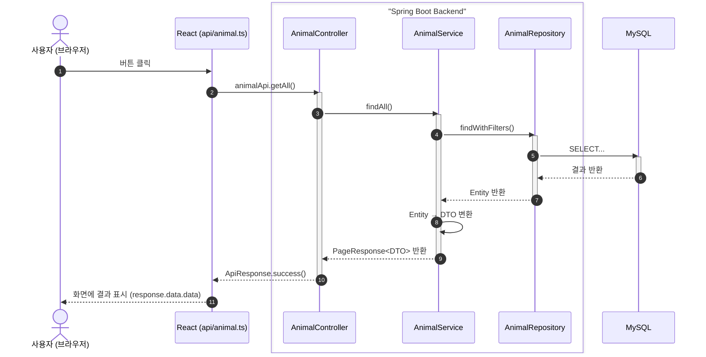

# Spring Boot + React REST API 연동 스터디 — 파트 B: 실전 API 개발

> **프로젝트**: 62댕냥이 (유기동물 입양/임보 매칭 플랫폼)
> **기술 스택**: Spring Boot 3.2 + Java 21 / React 18 + TypeScript + Vite
> **작성 기준**: 실제 프로젝트 코드 (`DN_project01`)
> **선행 학습**: [파트 A: 기반 구조](./STUDY_PART_A_REST_API_기반구조.md) — CORS, Security, JWT, ApiResponse

---

## 관련 문서 바로가기

| 문서 | 설명 |
|------|------|
| [파트 A: REST API 기반구조](./STUDY_PART_A_REST_API_기반구조.md) | CORS, Security, JWT, ApiResponse 공통 응답 |
| [파트 C: 외부 API 연동](./STUDY_PART_C_외부_API_연동.md) | 공공데이터 API, 이메일(Resend) 연동 |
| [파트 D: 카카오지도 연동](./STUDY_PART_D_카카오지도_연동과_종합비교.md) | 카카오맵 API 연동, 지도 기반 보호소 검색 |
| [파트 E: Terraform 인프라](./STUDY_PART_E_Terraform_인프라_생성.md) | AWS 인프라 코드(IaC) 생성 |
| [파트 F: CI/CD와 환경변수](./STUDY_PART_F_CICD와_환경변수.md) | GitHub Actions, 배포 자동화 |
| [파트 G: 안정화와 트러블슈팅](./STUDY_PART_G_안정화와_트러블슈팅.md) | 운영 중 문제 해결, 디버깅 |
| [API 명세서](./API_SPEC.md) | 전체 엔드포인트 상세 스펙 |
| [DB 스키마](./DATABASE.md) | 테이블 구조, ERD, 마이그레이션 |
| [통합 테스트 체크리스트](./INTEGRATION_CHECK.md) | 프론트↔백엔드 연동 테스트 항목 |

---

## 이 문서를 읽기 전에: 전체 코드 흐름 한눈에 보기

이 프로젝트는 **"사용자가 브라우저에서 버튼을 누르면 → 데이터가 DB에 저장되고 → 결과가 화면에 표시된다"** 라는 흐름을 따른다. 초보자라면 아래 그림을 먼저 머릿속에 그려두자.



**각 계층의 역할 요약:**

| 계층 | 파일 위치 | 하는 일 | 비유 |
|------|-----------|---------|------|
| **React 컴포넌트** | `frontend/src/pages/` | 화면 렌더링, 사용자 이벤트 처리 | 식당의 홀 서빙 |
| **API 모듈** | `frontend/src/api/*.ts` | HTTP 요청 생성, 응답 추출 | 주문서 작성 |
| **Axios 인스턴스** | `frontend/src/lib/axios.ts` | baseURL, JWT 토큰 자동 첨부 | 배달부 (모든 주문에 인증서 첨부) |
| **Controller** | `backend/.../controller/` | HTTP 요청 수신, 파라미터 추출, 응답 래핑 | 식당 카운터 (주문 접수) |
| **Service** | `backend/.../service/` | 비즈니스 로직, Entity↔DTO 변환 | 주방 (요리 담당) |
| **Repository** | `backend/.../repository/` | DB 쿼리 실행 | 냉장고 (재료 꺼내기) |
| **Entity** | `backend/.../domain/` | DB 테이블과 1:1 매핑된 Java 객체 | 재료 원본 |
| **DTO** | `backend/.../dto/` | API 요청/응답 전용 데이터 구조 | 접시에 담긴 완성 요리 |

> **소스코드 바로가기** (이 문서에서 다루는 핵심 파일들)
>
> | 분류 | 파일 | 경로 |
> |------|------|------|
> | Entity | `Animal.java` | [`backend/src/main/java/.../domain/Animal.java`](../backend/src/main/java/com/dnproject/platform/domain/Animal.java) |
> | Request DTO | `AnimalCreateRequest.java` | [`backend/src/main/java/.../dto/request/AnimalCreateRequest.java`](../backend/src/main/java/com/dnproject/platform/dto/request/AnimalCreateRequest.java) |
> | Response DTO | `AnimalResponse.java` | [`backend/src/main/java/.../dto/response/AnimalResponse.java`](../backend/src/main/java/com/dnproject/platform/dto/response/AnimalResponse.java) |
> | Service | `AnimalService.java` | [`backend/src/main/java/.../service/AnimalService.java`](../backend/src/main/java/com/dnproject/platform/service/AnimalService.java) |
> | Controller | `AnimalController.java` | [`backend/src/main/java/.../controller/AnimalController.java`](../backend/src/main/java/com/dnproject/platform/controller/AnimalController.java) |
> | Repository | `AnimalRepository.java` | [`backend/src/main/java/.../repository/AnimalRepository.java`](../backend/src/main/java/com/dnproject/platform/repository/AnimalRepository.java) |
> | 공통 응답 | `ApiResponse.java` | [`backend/src/main/java/.../dto/response/ApiResponse.java`](../backend/src/main/java/com/dnproject/platform/dto/response/ApiResponse.java) |
> | 페이지 응답 | `PageResponse.java` | [`backend/src/main/java/.../dto/response/PageResponse.java`](../backend/src/main/java/com/dnproject/platform/dto/response/PageResponse.java) |
> | 프론트 API | `animal.ts` | [`frontend/src/api/animal.ts`](../frontend/src/api/animal.ts) |
> | 프론트 타입 | `dto.ts` | [`frontend/src/types/dto.ts`](../frontend/src/types/dto.ts) |
> | Axios 설정 | `axios.ts` | [`frontend/src/lib/axios.ts`](../frontend/src/lib/axios.ts) |

---

## 목차

| 장 | 제목 | 핵심 키워드 | 관련 소스코드 |
|---|------|------------|-------------|
| [6장](#6장-api-설계-원칙--restful-url과-http-메서드) | API 설계 원칙 — RESTful URL과 HTTP 메서드 | 리소스 설계, PUT vs PATCH | 모든 Controller 파일 |
| [7장](#7장-entity--dto--controller-흐름-동물-api를-예시로) | Entity → DTO → Controller 흐름 | 계층 구조, 변환 패턴 | Animal.java, AnimalService.java |
| [8장](#8장-페이지네이션과-필터링) | 페이지네이션과 필터링 | Pageable, PageResponse, @RequestParam | AnimalController.java, animal.ts |
| [9장](#9장-인증이-필요한-api-개발-입양-신청을-예시로) | 인증이 필요한 API 개발 | 입양 신청, 권한별 분기, 상태 머신 | AdoptionController.java, AdoptionService.java |
| [10장](#10장-파일-업로드-api-보호소-회원가입을-예시로) | 파일 업로드 API | Multipart, FormData, FileStorageService | AuthController.java, FileStorageService.java |
| [11장](#11장-프론트엔드-api-모듈-구조-분석) | 프론트엔드 API 모듈 구조 분석 | 도메인별 분리, TypeScript 타입, 대응 관계 | frontend/src/api/*.ts |

---

# 6장. API 설계 원칙 — RESTful URL과 HTTP 메서드

> **이 장에서 배우는 것**: URL을 어떻게 설계하면 프론트엔드 개발자가 보기만 해도 API의 기능을 알 수 있는지 배운다.
>
> **관련 소스코드 바로가기**
>
> - [`AnimalController.java`](../backend/src/main/java/com/dnproject/platform/controller/AnimalController.java) — 리소스 중심 CRUD 패턴
> - [`AdoptionController.java`](../backend/src/main/java/com/dnproject/platform/controller/AdoptionController.java) — 행위(Action) 엔드포인트 패턴
> - [`BoardController.java`](../backend/src/main/java/com/dnproject/platform/controller/BoardController.java) — 중첩 리소스 패턴 (게시글→댓글)
> - [`AuthController.java`](../backend/src/main/java/com/dnproject/platform/controller/AuthController.java) — PUT vs PATCH 사용 예시
> - [`SecurityConfig.java`](../backend/src/main/java/com/dnproject/platform/config/SecurityConfig.java) — URL별 접근 권한 설정
>
> **관련 문서**: [API 명세서](./API_SPEC.md) — 전체 엔드포인트 상세 스펙

## Why — 왜 URL 설계가 중요한가

REST API의 URL은 **프론트엔드 개발자와의 계약서**다. URL을 보고 "이 API가 뭘 하는지" 직관적으로 알 수 있어야 한다.

```
✅ 좋은 URL: GET /api/animals          → "동물 목록을 조회한다"
✅ 좋은 URL: POST /api/adoptions        → "입양 신청을 생성한다"
❌ 나쁜 URL: GET /api/getAnimalList     → 동사가 URL에 포함됨
❌ 나쁜 URL: POST /api/doAdopt          → 행위가 URL에 포함됨
```

핵심 원칙: **URL은 명사(리소스), HTTP 메서드가 동사(행위)**

## How — 이 프로젝트의 URL 설계 패턴

### 패턴 1: 리소스 중심 CRUD

가장 기본적인 패턴. 하나의 리소스에 대해 HTTP 메서드로 행위를 구분한다.

```
GET    /api/animals          → 동물 목록 조회
GET    /api/animals/{id}     → 동물 상세 조회
POST   /api/animals          → 동물 등록
PUT    /api/animals/{id}     → 동물 수정
DELETE /api/animals/{id}     → 동물 삭제
```

이 프로젝트에서 이 패턴을 따르는 리소스:

| 리소스 | 기본 경로 | CRUD |
|--------|-----------|------|
| 동물 | `/api/animals` | GET, GET/{id}, POST, PUT/{id}, DELETE/{id} |
| 게시글 | `/api/boards` | GET, GET/{id}, POST, PUT/{id}, DELETE/{id} |
| 봉사 모집공고 | `/api/volunteers/recruitments` | GET, GET/{id}, POST |
| 기부 요청 | `/api/donations/requests` | GET, GET/{id}, POST |

### 패턴 2: 행위(Action) 엔드포인트

상태 변경처럼 단순 CRUD로 표현하기 어려운 행위는 **동사를 하위 경로로** 표현한다.

```
PUT /api/adoptions/{id}/approve    → 입양 신청 승인
PUT /api/adoptions/{id}/reject     → 입양 신청 거절
PUT /api/adoptions/{id}/cancel     → 입양 신청 취소
PUT /api/donations/{id}/complete   → 기부 수령 완료
PUT /api/notifications/{id}/read   → 알림 읽음 처리
```

**왜 PUT을 사용하나?** 이 행위들은 리소스의 **상태(status) 필드를 변경**하는 것이므로 PUT(수정)이 적합하다.

```
approve → status: PENDING → APPROVED
reject  → status: PENDING → REJECTED
cancel  → status: PENDING → CANCELLED
```

### 패턴 3: 중첩 리소스(Nested Resource)

게시글(`Board`)에 속한 댓글(`Comment`)처럼, 부모-자식 관계가 있는 리소스:

```
GET  /api/boards/{id}/comments          → 특정 게시글의 댓글 목록
POST /api/boards/{id}/comments          → 특정 게시글에 댓글 작성
```

**왜 `/api/comments`가 아닌가?** 댓글은 항상 게시글에 속한다. URL 자체가 "이 댓글은 어떤 게시글의 것인지"를 표현한다.

### 패턴 4: 관리자 분리 네임스페이스

일반 사용자 API와 관리자 API를 **URL 접두사로 분리**한다:

```
일반 사용자:
  GET /api/boards              → 게시글 목록 (공개)

관리자:
  GET /api/admin/boards        → 게시글 목록 (관리자용 - 고정/삭제 가능)
  PUT /api/admin/boards/{id}/pin    → 게시글 상단 고정
  DELETE /api/admin/boards/{id}     → 게시글 삭제 (관리자 권한)
```

이 프로젝트의 관리자 컨트롤러 5개:

| 컨트롤러 | 경로 | 역할 |
|----------|------|------|
| `AdminShelterController` | `/api/admin/shelters` | 보호소 인증 승인/거절 |
| `AdminUserController` | `/api/admin/users` | 회원 목록 조회 |
| `AdminBoardController` | `/api/admin/boards` | 게시글 고정/삭제 |
| `AdminAnimalController` | `/api/admin/animals` | 공공API 동기화 |
| `AdminApplicationController` | `/api/admin/applications` | 전체 신청 내역 |

### 패턴 5: 소유자 기준 필터링

"내 것"을 조회하는 엔드포인트:

```
GET /api/adoptions/my               → 내 입양 신청 목록
GET /api/volunteers/my              → 내 봉사 신청 목록
GET /api/donations/my               → 내 기부 목록
GET /api/favorites                  → 내 찜 목록
GET /api/favorites/ids              → 내 찜한 동물 ID 목록
GET /api/notifications              → 내 알림 목록
GET /api/auth/me                    → 내 정보
GET /api/users/me/preferences       → 내 선호도
```

**왜 `/api/adoptions/my`인가?** JWT에서 사용자를 식별하므로 URL에 userId를 넣지 않는다. `/my`는 "인증된 사용자 본인"을 의미한다.

## What — PUT vs PATCH 사용 사례

### PUT: 전체 상태 변경

```java
// AdoptionController.java
@PutMapping("/{id}/approve")
public ApiResponse<AdoptionResponse> approve(@PathVariable Long id) {
    AdoptionResponse data = adoptionService.approve(id);
    return ApiResponse.success("승인 완료", data);
}
```

승인/거절은 리소스의 상태를 **확정적으로 변경**한다. 부분 수정이 아니라 "이 상태로 전환"이므로 PUT.

### PATCH: 일부 필드만 수정

```java
// AuthController.java
@PatchMapping("/me")
public ApiResponse<UserResponse> updateMe(HttpServletRequest httpRequest,
                                          @RequestBody UpdateMeRequest request) {
    Long userId = (Long) httpRequest.getAttribute("userId");
    UserResponse data = authService.updateMe(userId, request);
    return ApiResponse.success("수정되었습니다.", data);
}
```

이름만 바꾸거나 이메일만 바꿀 수 있다. **보내지 않은 필드는 변경하지 않는다** → PATCH.

```java
// AuthService.java — null 체크로 부분 수정 구현
if (request.getName() != null && !request.getName().isBlank()) {
    user.setName(request.getName().trim());
}
if (request.getEmail() != null && !request.getEmail().isBlank()) {
    user.setEmail(request.getEmail().trim());
}
```

> **핵심 정리**
>
> - URL은 **명사**(리소스), HTTP 메서드가 **동사**(행위)
> - 상태 변경 행위는 `PUT /{id}/approve` 형태로 표현
> - 부모-자식 관계는 중첩 URL: `/boards/{id}/comments`
> - 관리자 API는 `/api/admin/**`으로 네임스페이스 분리
> - "내 것" 조회는 `/my` 경로 또는 인증 정보로 필터링
> - PUT = 전체 변경/상태 전환, PATCH = 일부 필드만 수정

> **자주 하는 실수**
>
> - URL에 동사를 넣는 것: `/api/getAnimals` → `/api/animals` + `GET`이 올바름
> - 모든 것을 POST로 처리하는 것: POST는 "생성"에만 사용. 조회는 GET, 수정은 PUT/PATCH
> - 중첩 리소스를 너무 깊게 만드는 것: `/api/shelters/{id}/animals/{id}/adoptions/{id}` → 3단계 이상은 피하자
> - 복수형/단수형 혼용: `/api/animals`(복수), `/api/animal`(단수) → **항상 복수형** 사용이 관례

### 초보자 체크리스트 — 6장을 읽고 나서 스스로 확인해보자

- [ ] `GET /api/animals`가 왜 `/api/getAnimalList`보다 좋은 설계인지 설명할 수 있는가?
- [ ] 입양 승인(`approve`)을 왜 `PUT /api/adoptions/{id}/approve`로 표현하는지 이해했는가?
- [ ] `/api/boards/{id}/comments`에서 `{id}`가 게시글 ID인 이유를 설명할 수 있는가?
- [ ] 관리자 API는 왜 `/api/admin/**`으로 분리하는지 이해했는가?
- [ ] [`SecurityConfig.java`](../backend/src/main/java/com/dnproject/platform/config/SecurityConfig.java)에서 위의 URL 패턴들이 어떻게 권한 설정되는지 확인했는가?

---

# 7장. Entity → DTO → Controller 흐름 (동물 API를 예시로)

> **이 장에서 배우는 것**: "사용자가 동물 목록을 요청하면 데이터가 어떤 과정을 거쳐서 화면에 보이는지" — 백엔드의 핵심 계층 구조를 따라간다.
>
> **관련 소스코드 바로가기**
>
> - [`Animal.java`](../backend/src/main/java/com/dnproject/platform/domain/Animal.java) — Entity (DB 테이블 매핑)
> - [`AnimalCreateRequest.java`](../backend/src/main/java/com/dnproject/platform/dto/request/AnimalCreateRequest.java) — 요청 DTO
> - [`AnimalResponse.java`](../backend/src/main/java/com/dnproject/platform/dto/response/AnimalResponse.java) — 응답 DTO
> - [`AnimalService.java`](../backend/src/main/java/com/dnproject/platform/service/AnimalService.java) — Service (Entity↔DTO 변환)
> - [`AnimalController.java`](../backend/src/main/java/com/dnproject/platform/controller/AnimalController.java) — Controller (HTTP 요청 수신)
> - [`AnimalRepository.java`](../backend/src/main/java/com/dnproject/platform/repository/AnimalRepository.java) — Repository (DB 쿼리)
>
> **관련 문서**: [DB 스키마](./DATABASE.md) — animals 테이블 구조 확인

## Why — 왜 이런 계층 구조를 사용하는가

```
❌ 단순한 구조: Controller → DB
   → 비즈니스 로직이 Controller에 몰린다
   → DB 구조가 바뀌면 API 응답도 바뀐다
   → Entity를 직접 반환하면 불필요한 필드(password 등)가 노출된다

✅ 계층화된 구조: Controller → Service → Repository → DB
   → 각 계층이 자기 역할에만 집중
   → Entity(DB 구조)와 DTO(API 응답)가 분리되어 독립적으로 변경 가능
```

### Entity를 직접 반환하지 않는 이유

```java
// ❌ Entity를 직접 반환하면...
@GetMapping("/{id}")
public Animal getById(@PathVariable Long id) {
    return animalRepository.findById(id).orElseThrow();
}
// 문제 1: shelter 연관 객체가 통째로 직렬화 → 순환 참조 or 과도한 데이터
// 문제 2: DB 컬럼이 변경되면 API 응답 형태도 변경됨
// 문제 3: 민감한 정보(예: User의 password)가 노출될 수 있음

// ✅ DTO를 사용하면...
@GetMapping("/{id}")
public ApiResponse<AnimalResponse> getById(@PathVariable Long id) {
    AnimalResponse data = animalService.findById(id);  // Entity → DTO 변환은 Service에서
    return ApiResponse.success("조회 성공", data);
}
// → API 응답 형태를 자유롭게 설계 가능
// → shelterName, shelterAddress만 포함 (Shelter Entity 전체가 아님)
```

## How — 전체 요청-응답 흐름도

```
[프론트엔드]                                    [백엔드]

animal.ts                                       AnimalController
  animalApi.getAll(params)                        @GetMapping
  │                                               │
  │  GET /api/animals?species=DOG&page=0           │
  │ ─────────────────────────────────────────────→ │
  │                                               │
  │                                          AnimalService
  │                                            findAll(species, status, ...)
  │                                               │
  │                                          AnimalRepository
  │                                            findWithFilters(...)
  │                                               │
  │                                             [MySQL]
  │                                               │
  │                                          List<Animal> (Entity)
  │                                               │
  │                                          AnimalService
  │                                            .map(this::toResponse)
  │                                               │
  │                                          PageResponse<AnimalResponse> (DTO)
  │                                               │
  │                                          AnimalController
  │                                            ApiResponse.success("조회 성공", data)
  │                                               │
  │  { status: 200, data: { content: [...] } }     │
  │ ←──────────────────────────────────────────── │
  │
  response.data.data  → 화면 렌더링
```

### 초보자를 위한 비유: 택배 시스템으로 이해하기

위의 흐름을 택배 시스템에 비유하면 이렇다:

```
1. 고객(프론트)이 주문서(Request DTO)를 택배 접수처(Controller)에 가져간다
2. 접수처는 주문 내용을 확인만 하고, 물류 창고(Service)에 전달한다
3. 물류 창고는 창고 선반(Repository)에서 상품(Entity)을 꺼낸다
4. 상품을 포장(Entity → Response DTO 변환)해서 접수처에 돌려준다
5. 접수처는 송장(ApiResponse)을 붙여서 고객에게 보낸다
```

**왜 Entity를 그대로 보내지 않나?** → 창고에서 꺼낸 상품(Entity)에는 가격표, 입고일, 공급업체 정보(민감한 데이터) 등이 붙어있다. 고객에게는 상품 사진과 이름만 있으면 되므로, 예쁘게 포장(DTO 변환)해서 보내는 것이다.

## What — 실제 코드

### Entity: `Animal.java` — DB 테이블과 1:1 매핑

> **소스코드 바로가기**: [`Animal.java`](../backend/src/main/java/com/dnproject/platform/domain/Animal.java)

```java
@Entity
@Table(name = "animals", indexes = {
    @Index(name = "idx_animals_species", columnList = "species"),
    @Index(name = "idx_animals_status", columnList = "status"),
    @Index(name = "idx_animals_shelter", columnList = "shelter_id")
})
@Getter @Setter @NoArgsConstructor @AllArgsConstructor @Builder
public class Animal {

    @Id
    @GeneratedValue(strategy = GenerationType.IDENTITY)
    private Long id;

    // 다대일 관계: 하나의 보호소에 여러 동물이 소속
    @ManyToOne(fetch = FetchType.LAZY)       // LAZY: 필요할 때만 보호소 정보 로드
    @JoinColumn(name = "shelter_id", nullable = false)
    private Shelter shelter;

    @Enumerated(EnumType.STRING)             // Enum을 문자열로 DB에 저장 (DOG, CAT)
    @Column(nullable = false, length = 10)
    private Species species;

    @Column(length = 50)
    private String breed;

    @Column(length = 50)
    private String name;

    private Integer age;

    @Enumerated(EnumType.STRING)
    private Gender gender;                   // MALE, FEMALE

    @Enumerated(EnumType.STRING)
    private Size size;                       // SMALL, MEDIUM, LARGE

    @Column(columnDefinition = "TEXT")       // 긴 텍스트
    private String description;

    @Column(name = "image_url", length = 500)
    private String imageUrl;

    @Builder.Default
    private Boolean neutered = false;

    @Enumerated(EnumType.STRING)
    @Builder.Default
    private AnimalStatus status = AnimalStatus.PROTECTED;  // 기본값: 보호중

    // 일대다 관계: 하나의 동물에 여러 이미지
    @OneToMany(mappedBy = "animal", cascade = CascadeType.ALL, orphanRemoval = true)
    @Builder.Default
    private List<AnimalImage> images = new ArrayList<>();

    // 생성/수정 시간 자동 관리
    @Column(name = "created_at", nullable = false, updatable = false)
    private Instant createdAt;

    @PrePersist
    void prePersist() {
        Instant now = Instant.now();
        if (createdAt == null) createdAt = now;
        if (updatedAt == null) updatedAt = now;
    }

    @PreUpdate
    void preUpdate() { updatedAt = Instant.now(); }
}
```

**주요 JPA 어노테이션 정리:**

| 어노테이션 | 역할 | 예시 |
|-----------|------|------|
| `@Entity` | 이 클래스가 DB 테이블과 매핑됨 | `animals` 테이블 |
| `@Id` + `@GeneratedValue` | 기본키 자동 생성 | AUTO_INCREMENT |
| `@ManyToOne` | 다대일 관계 | 동물 N : 보호소 1 |
| `@OneToMany` | 일대다 관계 | 동물 1 : 이미지 N |
| `@Enumerated(STRING)` | Enum을 문자열로 저장 | "DOG", "PROTECTED" |
| `@Column(columnDefinition = "TEXT")` | 긴 텍스트 컬럼 | description |
| `@PrePersist` / `@PreUpdate` | 저장/수정 전 자동 실행 | 시간 자동 기록 |
| `FetchType.LAZY` | 지연 로딩 | shelter를 실제 접근할 때만 쿼리 |

### 요청 DTO: `AnimalCreateRequest.java` — 프론트에서 보내는 데이터

> **소스코드 바로가기**: [`AnimalCreateRequest.java`](../backend/src/main/java/com/dnproject/platform/dto/request/AnimalCreateRequest.java)

```java
@Data @NoArgsConstructor @AllArgsConstructor @Builder
public class AnimalCreateRequest {

    @NotNull
    private Long shelterId;         // 필수: 어느 보호소의 동물인지

    @NotNull
    private Species species;        // 필수: 개 or 고양이

    private String breed;           // 선택: 품종
    private String name;            // 선택: 이름
    private Integer age;            // 선택: 나이
    private Gender gender;          // 선택: 성별
    private Size size;              // 선택: 크기
    private String description;     // 선택: 설명
    private String imageUrl;        // 선택: 이미지 URL
    private Boolean neutered;       // 선택: 중성화 여부
    private Boolean vaccinated;     // 선택: 접종 여부
    private AnimalStatus status;    // 선택: 상태 (기본값: PROTECTED)
}
```

**Entity와의 차이:**

- Entity에 있지만 DTO에 **없는** 것: `id`, `createdAt`, `updatedAt`, `shelter` 객체, `images` 리스트
- DTO에는 `shelterId`(Long)만 있고, Entity에는 `shelter`(Shelter 객체)가 있다
- `@NotNull`로 필수 필드 유효성 검증

### 응답 DTO: `AnimalResponse.java` — 프론트로 내려주는 데이터

> **소스코드 바로가기**: [`AnimalResponse.java`](../backend/src/main/java/com/dnproject/platform/dto/response/AnimalResponse.java)

```java
@Data @NoArgsConstructor @AllArgsConstructor @Builder
public class AnimalResponse {

    private Long id;
    private String publicApiAnimalId;    // 공공API 유기번호
    private String orgName;              // 관할기관
    private String chargeName;           // 담당자
    private String chargePhone;          // 담당자 연락처

    // Shelter 객체 전체가 아닌, 필요한 필드만 평탄화(Flatten)
    private Long shelterId;
    private String shelterName;
    private String shelterAddress;       // 지도 표시용
    private String shelterPhone;
    private Double shelterLatitude;      // 지도 마커용
    private Double shelterLongitude;

    private Species species;
    private String breed;
    private String name;
    private Integer age;
    private Gender gender;
    private Size size;
    private String description;
    private String imageUrl;
    private Boolean neutered;
    private AnimalStatus status;
    private Instant createdAt;
}
```

**Entity와의 차이:**

- Shelter **객체** 대신 `shelterName`, `shelterAddress` 등 **개별 필드**로 평탄화
- `updatedAt`, `vaccinated`, `images` 등 프론트에 불필요한 필드 제외
- `shelterLatitude`, `shelterLongitude` 추가 (Entity에는 Shelter 안에 있음)

### Service: Entity ↔ DTO 변환 — `AnimalService.java`

> **소스코드 바로가기**: [`AnimalService.java`](../backend/src/main/java/com/dnproject/platform/service/AnimalService.java)

```java
@Service
@RequiredArgsConstructor
public class AnimalService {

    private final AnimalRepository animalRepository;
    private final ShelterRepository shelterRepository;

    // ── 생성: Request DTO → Entity ──────────────────
    @Transactional
    public AnimalResponse create(AnimalCreateRequest request) {
        // 1. shelterId로 Shelter Entity 조회
        Shelter shelter = shelterRepository.findById(request.getShelterId())
                .orElseThrow(() -> new NotFoundException("보호소를 찾을 수 없습니다."));

        // 2. Request DTO → Entity 변환 (Builder 패턴)
        Animal animal = Animal.builder()
                .shelter(shelter)                                      // shelterId → Shelter 객체
                .species(request.getSpecies())
                .breed(request.getBreed())
                .name(request.getName())
                .age(request.getAge())
                .gender(request.getGender())
                .size(request.getSize())
                .description(request.getDescription())
                .imageUrl(request.getImageUrl())
                .neutered(request.getNeutered() != null ? request.getNeutered() : false)
                .vaccinated(request.getVaccinated() != null ? request.getVaccinated() : false)
                .status(request.getStatus() != null ? request.getStatus() : AnimalStatus.PROTECTED)
                .build();

        // 3. DB 저장
        animal = animalRepository.save(animal);

        // 4. Entity → Response DTO 변환
        return toResponse(animal);
    }

    // ── 수정: null이 아닌 필드만 업데이트 ──────────
    @Transactional
    public AnimalResponse update(Long id, AnimalCreateRequest request) {
        Animal animal = animalRepository.findById(id)
                .orElseThrow(() -> new NotFoundException("동물을 찾을 수 없습니다. id=" + id));

        // null 체크로 "보낸 필드만" 수정 (PATCH 의미론)
        if (request.getSpecies() != null) animal.setSpecies(request.getSpecies());
        if (request.getBreed() != null)   animal.setBreed(request.getBreed());
        if (request.getName() != null)    animal.setName(request.getName());
        if (request.getAge() != null)     animal.setAge(request.getAge());
        // ... 나머지 필드도 동일 패턴

        animal = animalRepository.save(animal);
        return toResponse(animal);
    }

    // ── Entity → Response DTO 변환 메서드 ──────────
    private AnimalResponse toResponse(Animal a) {
        Shelter shelter = a.getShelter();
        return AnimalResponse.builder()
                .id(a.getId())
                .publicApiAnimalId(a.getPublicApiAnimalId())
                .orgName(a.getOrgName())
                .chargeName(a.getChargeName())
                .chargePhone(a.getChargePhone())
                // Shelter 객체에서 필요한 필드만 추출 (평탄화)
                .shelterId(shelter != null ? shelter.getId() : null)
                .shelterName(shelter != null ? shelter.getName() : null)
                .shelterAddress(shelter != null ? shelter.getAddress() : null)
                .shelterPhone(shelter != null ? shelter.getPhone() : null)
                .shelterLatitude(shelter != null && shelter.getLatitude() != null
                        ? shelter.getLatitude().doubleValue() : null)
                .shelterLongitude(shelter != null && shelter.getLongitude() != null
                        ? shelter.getLongitude().doubleValue() : null)
                .species(a.getSpecies())
                .breed(a.getBreed())
                .name(a.getName())
                .age(a.getAge())
                .gender(a.getGender())
                .size(a.getSize())
                .description(a.getDescription())
                .imageUrl(a.getImageUrl())
                .neutered(a.getNeutered())
                .status(a.getStatus())
                .createdAt(a.getCreatedAt())
                .build();
    }
}
```

### Controller: 요청 수신 + 응답 반환 — `AnimalController.java`

> **소스코드 바로가기**: [`AnimalController.java`](../backend/src/main/java/com/dnproject/platform/controller/AnimalController.java)

```java
@RestController
@RequestMapping("/api/animals")
@RequiredArgsConstructor
public class AnimalController {

    private final AnimalService animalService;

    // GET /api/animals/{id}
    @GetMapping("/{id}")
    public ApiResponse<AnimalResponse> getById(@PathVariable Long id) {
        AnimalResponse data = animalService.findById(id);       // Service 호출
        return ApiResponse.success("조회 성공", data);            // 공통 응답 래핑
    }

    // POST /api/animals
    @PostMapping
    public ApiResponse<AnimalResponse> create(@RequestBody AnimalCreateRequest request) {
        AnimalResponse data = animalService.create(request);    // DTO를 Service에 전달
        return ApiResponse.created("등록 완료", data);            // 201 Created
    }

    // PUT /api/animals/{id}
    @PutMapping("/{id}")
    public ApiResponse<AnimalResponse> update(@PathVariable Long id,
                                              @RequestBody AnimalCreateRequest request) {
        AnimalResponse data = animalService.update(id, request);
        return ApiResponse.success("수정 완료", data);
    }

    // DELETE /api/animals/{id}
    @DeleteMapping("/{id}")
    public ApiResponse<Void> delete(@PathVariable Long id) {
        animalService.delete(id);
        return ApiResponse.success("삭제 완료", null);            // data가 null
    }
}
```

**컨트롤러의 역할은 단순하다:**

1. HTTP 요청을 받는다 (`@GetMapping`, `@PostMapping`, ...)
2. 파라미터를 추출한다 (`@PathVariable`, `@RequestBody`, `@RequestParam`)
3. Service를 호출한다
4. 결과를 `ApiResponse`로 감싸서 반환한다

> **핵심 정리**
>
> - **Entity**: DB 테이블과 1:1 매핑. JPA 어노테이션으로 관계와 제약 조건을 표현
> - **Request DTO**: 프론트에서 보내는 데이터 구조. `@NotNull` 등으로 유효성 검증
> - **Response DTO**: 프론트로 내려주는 데이터 구조. Entity의 연관 객체를 평탄화
> - **Service**: Entity ↔ DTO 변환, 비즈니스 로직 처리, 트랜잭션 관리
> - **Controller**: HTTP 요청 수신 → Service 호출 → ApiResponse 래핑

> **자주 하는 실수**
>
> - Entity를 `@RestController`에서 직접 반환하면 `@ManyToOne` 순환 참조로 무한 루프 발생 (Jackson 직렬화 에러)
> - `@Transactional`을 빼먹으면 LAZY 로딩 시 `LazyInitializationException` 발생 (세션 이미 닫힘)
> - `FetchType.EAGER`를 남발하면 N+1 문제 발생. 기본은 `LAZY`로 설정하고 필요 시 `JOIN FETCH` 사용
> - Builder 패턴에서 null 체크를 빼먹으면 `NullPointerException` (예: `request.getNeutered()`가 null일 때)

### 초보자 체크리스트 — 7장을 읽고 나서 스스로 확인해보자

- [ ] Entity, Request DTO, Response DTO가 각각 왜 필요한지 설명할 수 있는가?
- [ ] `AnimalCreateRequest`에는 `id`가 없고 `shelterId`(Long)만 있는 이유를 이해했는가?
- [ ] `AnimalResponse`에서 `Shelter` 객체 대신 `shelterName`, `shelterAddress` 등으로 평탄화하는 이유를 알겠는가?
- [ ] `toResponse()` 메서드가 왜 Service에 위치하는지 이해했는가?
- [ ] `@Transactional`이 왜 필요한지, 빼먹으면 어떤 에러가 나는지 설명할 수 있는가?
- [ ] 직접 [`AnimalService.java`](../backend/src/main/java/com/dnproject/platform/service/AnimalService.java)를 열어서 `create()` → `toResponse()` 흐름을 따라가 봤는가?

---

# 8장. 페이지네이션과 필터링

> **이 장에서 배우는 것**: 수천 건의 데이터를 한 번에 보내지 않고, 20건씩 나눠서 보내는 방법(페이지네이션)과 "강아지만 보기" 같은 필터링 방법을 배운다.
>
> **관련 소스코드 바로가기**
>
> - [`AnimalController.java`](../backend/src/main/java/com/dnproject/platform/controller/AnimalController.java) — `@RequestParam`으로 필터 조건 수신
> - [`AnimalService.java`](../backend/src/main/java/com/dnproject/platform/service/AnimalService.java) — `Page<Entity>` → `PageResponse<DTO>` 변환
> - [`AnimalRepository.java`](../backend/src/main/java/com/dnproject/platform/repository/AnimalRepository.java) — `findWithFilters()` 쿼리
> - [`PageResponse.java`](../backend/src/main/java/com/dnproject/platform/dto/response/PageResponse.java) — 공통 페이지 응답 DTO
> - [`animal.ts`](../frontend/src/api/animal.ts) — 프론트에서 params 객체로 요청
> - [`dto.ts`](../frontend/src/types/dto.ts) — `AnimalListRequest`, `PageResponse<T>` 타입 정의
>
> **관련 문서**: [API 명세서](./API_SPEC.md) — `GET /api/animals` 파라미터 상세

## Why — 왜 페이지네이션이 필요한가

```
동물 데이터 5,000건을 한 번에 응답하면:
  → 응답 JSON 크기: ~5MB
  → DB 쿼리 시간: 수 초
  → 브라우저 렌더링: 느림 + 메모리 과다 사용

페이지네이션으로 20건씩 나누면:
  → 응답 JSON 크기: ~20KB
  → DB 쿼리: LIMIT 20 (빠름)
  → 사용자 경험: 즉시 로딩
```

## How — Spring Data JPA의 Pageable

Spring Data JPA는 `Pageable` 인터페이스를 통해 페이지네이션을 지원한다.

```
프론트:    GET /api/animals?page=0&sizeParam=10&species=DOG&region=서울
             └─ page: 0번째 페이지 (0부터 시작)
             └─ sizeParam: 한 페이지에 10건
             └─ species: 필터 조건
             └─ region: 필터 조건

백엔드:    SELECT * FROM animals WHERE species='DOG' AND region LIKE '%서울%'
           LIMIT 10 OFFSET 0

응답:      { content: [...10건...], totalElements: 150, totalPages: 15, page: 0 }
```

### 초보자를 위한 비유: 도서관 검색 시스템

페이지네이션은 도서관에서 책을 검색하는 것과 같다:

```
당신: "과학 분야 책 찾아줘" (필터: species=DOG)
사서: "총 150권이 있어요. 한 번에 20권씩 보여드릴게요." (totalElements: 150, size: 20)
당신: "첫 번째 묶음 보여줘" (page: 0)
사서: "여기 1~20번 책이요. 총 8묶음이에요." (content: [...], totalPages: 8)
당신: "다음 묶음!" (page: 1)
사서: "21~40번 책이요."
```

핵심: **전체를 한꺼번에 주지 않고, 요청한 만큼만 나눠서 준다.**

## What — 실제 코드

### 백엔드: 컨트롤러에서 필터 + 페이지네이션 처리

> **소스코드 바로가기**: [`AnimalController.java`](../backend/src/main/java/com/dnproject/platform/controller/AnimalController.java)

```java
// AnimalController.java
@GetMapping
public ApiResponse<PageResponse<AnimalResponse>> getAll(
        // ── 필터링 파라미터 ──
        @RequestParam(required = false) Species species,         // 종류: DOG, CAT
        @RequestParam(required = false) AnimalStatus status,     // 상태: PROTECTED, ADOPTED
        @RequestParam(name = "animalSize", required = false) Size animalSize, // 크기
        @RequestParam(required = false) String region,           // 지역 (시/도)
        @RequestParam(required = false) String sigungu,          // 세부 지역 (시/군/구)
        @RequestParam(required = false) String search,           // 검색어

        // ── 페이지네이션 파라미터 ──
        @RequestParam(defaultValue = "0") int page,              // 페이지 번호 (0부터)
        @RequestParam(defaultValue = "10") int sizeParam,        // 페이지 크기
        @RequestParam(defaultValue = "random") String sort) {    // 정렬 기준

    Pageable pageable;

    // 정렬 방식 처리: "random"이면 랜덤, 아니면 지정된 필드로 정렬
    if (sort != null && sort.trim().toLowerCase().startsWith("random")) {
        pageable = PageRequest.of(page, sizeParam);
        return ApiResponse.success("조회 성공",
            animalService.findAllRandom(species, status, animalSize,
                                        region, sigungu, search, pageable));
    }

    // "createdAt,desc" → 필드명: createdAt, 방향: DESC
    String[] sortParts = sort.split(",");
    Sort.Direction direction = sortParts.length > 1 && "asc".equalsIgnoreCase(sortParts[1])
            ? Sort.Direction.ASC : Sort.Direction.DESC;
    pageable = PageRequest.of(page, sizeParam, Sort.by(direction, sortParts[0]));

    PageResponse<AnimalResponse> data = animalService.findAll(
            species, status, animalSize, region, sigungu, search, pageable);
    return ApiResponse.success("조회 성공", data);
}
```

**`@RequestParam` 옵션 정리:**

| 속성 | 의미 | 예시 |
|------|------|------|
| `required = false` | 선택 파라미터 (없으면 null) | `species` |
| `defaultValue = "0"` | 미전송 시 기본값 | `page` |
| `name = "animalSize"` | URL 파라미터명 지정 (Java 변수명과 다를 때) | `?animalSize=SMALL` |

### 백엔드: Service에서 Page → PageResponse 변환

> **소스코드 바로가기**: [`AnimalService.java`](../backend/src/main/java/com/dnproject/platform/service/AnimalService.java) · [`PageResponse.java`](../backend/src/main/java/com/dnproject/platform/dto/response/PageResponse.java)

```java
// AnimalService.java
@Transactional(readOnly = true)   // 조회 전용 트랜잭션 (성능 최적화)
public PageResponse<AnimalResponse> findAll(Species species, AnimalStatus status,
        Size size, String region, String sigungu, String search, Pageable pageable) {

    // Repository에서 Page<Animal> 반환
    Page<Animal> page = animalRepository.findWithFilters(
            species, status, size, region, sigungu, search, pageable);

    // Page<Entity> → PageResponse<DTO> 변환
    return toPageResponse(page);
}

private PageResponse<AnimalResponse> toPageResponse(Page<Animal> page) {
    return PageResponse.<AnimalResponse>builder()
            .content(page.getContent().stream()    // List<Animal>
                         .map(this::toResponse)     // List<AnimalResponse>로 변환
                         .toList())
            .page(page.getNumber())                 // 현재 페이지 번호
            .size(page.getSize())                   // 페이지 크기
            .totalElements(page.getTotalElements()) // 전체 항목 수
            .totalPages(page.getTotalPages())       // 전체 페이지 수
            .first(page.isFirst())                  // 첫 페이지 여부
            .last(page.isLast())                    // 마지막 페이지 여부
            .build();
}
```

### 프론트엔드: 파라미터 전달 + 응답 처리

> **소스코드 바로가기**: [`animal.ts`](../frontend/src/api/animal.ts)

```typescript
// frontend/src/api/animal.ts
export const animalApi = {
  getAll: async (params?: AnimalListRequest) => {
    const response = await axiosInstance.get<ApiResponse<AnimalListResponse>>(
      '/animals',
      { params }   // ← 객체가 자동으로 쿼리스트링으로 변환됨
    );
    return response.data.data;  // PageResponse<Animal>
  },
};

// 사용 예시:
const result = await animalApi.getAll({
  species: 'DOG',
  region: '서울',
  page: 0,
  sizeParam: 20,
  sort: 'createdAt,desc'
});

// result 구조:
// {
//   content: [{ id: 1, name: "초코", species: "DOG", ... }, ...],
//   page: 0,
//   size: 20,
//   totalElements: 150,
//   totalPages: 8,
//   first: true,
//   last: false
// }

// 페이지네이션 컴포넌트에서:
const { content, totalPages, page } = result;
// content로 목록 렌더링
// totalPages로 페이지 버튼 생성
// page로 현재 페이지 표시
```

**Axios의 `params` 객체 → URL 쿼리스트링 자동 변환:**

```
{ species: 'DOG', page: 0, sizeParam: 20 }
→ ?species=DOG&page=0&sizeParam=20
```

`undefined`나 `null`인 파라미터는 **자동으로 제외**된다:

```
{ species: undefined, page: 0 }
→ ?page=0   (species는 제외됨)
```

### 프론트엔드: TypeScript 타입 정의

> **소스코드 바로가기**: [`dto.ts`](../frontend/src/types/dto.ts)

```typescript
// frontend/src/types/dto.ts
export interface AnimalListRequest {
  species?: 'DOG' | 'CAT';           // 선택: 종류 필터
  animalSize?: 'SMALL' | 'MEDIUM' | 'LARGE';
  status?: 'PROTECTED' | 'ADOPTED' | 'FOSTERING';
  region?: string;                     // 시/도 키워드
  sigungu?: string;                    // 시/군/구 키워드
  search?: string;                     // 이름/품종/보호소명 검색
  sort?: string;                       // 정렬 (기본: random)
  page?: number;
  sizeParam?: number;                  // 페이지 크기
}

export interface PageResponse<T> {
  content: T[];
  page: number;
  size: number;
  totalElements: number;
  totalPages: number;
}
```

> **핵심 정리**
>
> - `@RequestParam`으로 필터 조건을 받고, `PageRequest.of(page, size, sort)`로 `Pageable` 생성
> - Repository가 `Page<Entity>`를 반환하면, Service에서 `PageResponse<DTO>`로 변환
> - 프론트에서는 `{ params }` 객체로 쿼리스트링을 자동 구성
> - 정렬은 `"createdAt,desc"` 형태의 문자열을 파싱하여 `Sort` 객체로 변환
> - `@Transactional(readOnly = true)`는 조회 전용 트랜잭션으로 성능을 최적화

> **자주 하는 실수**
>
> - `page`가 **0부터** 시작한다는 것을 잊음 → 프론트에서 1을 보내면 2페이지가 조회됨
> - `required = false`인 `@RequestParam`에 기본 타입(`int`)을 쓰면 null 주입 시 에러 → `Integer` 사용
> - `size`라는 파라미터명이 Java의 `Size` enum과 충돌 → 이 프로젝트에서는 `sizeParam`으로 이름을 변경
> - 대량 데이터에서 `COUNT(*)` 쿼리가 느릴 수 있음 → 무한 스크롤이면 총 개수가 불필요할 수 있다

### 초보자 체크리스트 — 8장을 읽고 나서 스스로 확인해보자

- [ ] `page=0`이 "첫 번째 페이지"인 이유를 이해했는가? (1이 아님!)
- [ ] 프론트의 `{ params }` 객체가 어떻게 `?species=DOG&page=0`으로 변환되는지 알겠는가?
- [ ] `PageResponse`의 `totalElements`와 `totalPages`의 차이를 설명할 수 있는가?
- [ ] `@Transactional(readOnly = true)`가 왜 조회 전용에 붙는지 이해했는가?
- [ ] 직접 [`AnimalRepository.java`](../backend/src/main/java/com/dnproject/platform/repository/AnimalRepository.java)를 열어서 `findWithFilters` 쿼리를 확인했는가?

### 데이터 흐름 한눈에 보기: 프론트 → 백엔드 → DB → 프론트

```
[프론트]                          [백엔드]                         [DB]
──────                           ──────                          ────
animalApi.getAll({               AnimalController                 SELECT *
  species: 'DOG',                  @GetMapping                    FROM animals
  page: 0,                         @RequestParam species='DOG'    WHERE species='DOG'
  sizeParam: 20            →        PageRequest.of(0, 20)   →     LIMIT 20 OFFSET 0
})                                    │                              │
                                 AnimalService                       │
  result = {                      Page<Animal>              ←────────┘
    content: [...20건...],          .map(this::toResponse)
    totalElements: 150,           PageResponse<AnimalResponse>
    totalPages: 8,                    │
    page: 0                      AnimalController
  }                         ←     ApiResponse.success("조회 성공", data)
```

---

# 9장. 인증이 필요한 API 개발 (입양 신청을 예시로)

> **이 장에서 배우는 것**: 로그인한 사용자만 사용할 수 있는 API를 만드는 방법, 그리고 "일반 유저 / 보호소 관리자 / 시스템 관리자"에 따라 다른 기능을 제공하는 방법을 배운다.
>
> **관련 소스코드 바로가기**
>
> - [`AdoptionController.java`](../backend/src/main/java/com/dnproject/platform/controller/AdoptionController.java) — 입양 신청/승인/거절 API
> - [`AdoptionService.java`](../backend/src/main/java/com/dnproject/platform/service/AdoptionService.java) — 상태 머신 로직, 본인 확인
> - [`Adoption.java`](../backend/src/main/java/com/dnproject/platform/domain/Adoption.java) — 입양 Entity (상태 필드 포함)
> - [`JwtAuthenticationFilter.java`](../backend/src/main/java/com/dnproject/platform/security/JwtAuthenticationFilter.java) — JWT에서 userId 추출
> - [`adoption.ts`](../frontend/src/api/adoption.ts) — 프론트 입양 API 모듈
>
> **선행 학습**: [파트 A: 4장 JWT 인증](./STUDY_PART_A_REST_API_기반구조.md) — JwtAuthenticationFilter가 어떻게 동작하는지 먼저 읽으면 이해가 쉽다

## Why — 왜 입양 신청에 인증이 필요한가

입양 신청은 **"누가 신청했는지"** 가 핵심 정보다. 비로그인 사용자가 입양 신청을 할 수 없고, 로그인된 사용자만 자신의 이름으로 신청할 수 있다.

또한 역할에 따라 **할 수 있는 행위가 다르다**:

| 역할 | 할 수 있는 행위 |
|------|----------------|
| 일반 유저 (`USER`) | 신청, 내 목록 조회, 취소 |
| 보호소 관리자 (`SHELTER_ADMIN`) | 대기 목록 조회, 승인, 거절 |
| 시스템 관리자 (`SUPER_ADMIN`) | 전체 내역 조회 |

## How — 인증 정보를 가져오는 방법

파트 A의 4장에서 `JwtAuthenticationFilter`가 토큰에서 `userId`를 추출하여 `request.setAttribute("userId", userId)`로 저장한다고 배웠다.

컨트롤러에서는 이 값을 꺼내 쓴다:

```
[요청 헤더] Authorization: Bearer eyJhbG...
         │
         ▼
[JwtAuthenticationFilter] → 토큰에서 userId 추출 → request.setAttribute("userId", 42)
         │
         ▼
[Controller] → Long userId = (Long) request.getAttribute("userId");
         │     if (userId == null) throw UnauthorizedException
         ▼
[Service] → adoptionService.apply(userId, request)
```

### 입양 신청 상태 머신(State Machine)

```
                    ┌─── cancel ──→ [CANCELLED]
                    │
[PENDING] ──────────┤
                    ├─── approve ──→ [APPROVED]
                    │
                    └─── reject ───→ [REJECTED]

규칙: approve, reject, cancel 모두 PENDING 상태에서만 가능
```

## What — 실제 코드

### 백엔드: 입양 신청 컨트롤러

> **소스코드 바로가기**: [`AdoptionController.java`](../backend/src/main/java/com/dnproject/platform/controller/AdoptionController.java)

```java
@RestController
@RequestMapping("/api/adoptions")
@RequiredArgsConstructor
public class AdoptionController {

    private final AdoptionService adoptionService;

    // ── 공통: 인증된 사용자 ID 추출 ──────────────
    private Long getUserId(HttpServletRequest request) {
        Long userId = (Long) request.getAttribute("userId");
        if (userId == null) throw new UnauthorizedException("인증이 필요합니다.");
        return userId;
    }

    // ── 일반 유저: 입양/임보 신청 ──────────────
    @PostMapping
    public ApiResponse<AdoptionResponse> apply(
            @Valid @RequestBody AdoptionRequest request,     // 요청 본문
            HttpServletRequest httpRequest) {                // 서블릿 요청 (userId 추출용)
        Long userId = getUserId(httpRequest);
        AdoptionResponse data = adoptionService.apply(userId, request);
        return ApiResponse.created("신청 완료", data);        // 201 Created
    }

    // ── 일반 유저: 내 신청 목록 ──────────────
    @GetMapping("/my")
    public ApiResponse<PageResponse<AdoptionResponse>> getMyList(
            @RequestParam(defaultValue = "0") int page,
            @RequestParam(defaultValue = "10") int size,
            HttpServletRequest httpRequest) {
        Long userId = getUserId(httpRequest);
        PageResponse<AdoptionResponse> data = adoptionService.getMyList(userId, page, size);
        return ApiResponse.success("조회 성공", data);
    }

    // ── 일반 유저: 신청 취소 ──────────────
    @PutMapping("/{id}/cancel")
    public ApiResponse<AdoptionResponse> cancel(@PathVariable Long id,
                                                HttpServletRequest httpRequest) {
        Long userId = getUserId(httpRequest);
        AdoptionResponse data = adoptionService.cancel(id, userId);  // 본인 확인은 Service에서
        return ApiResponse.success("취소 완료", data);
    }

    // ── 관리자: 승인 ──────────────
    @PutMapping("/{id}/approve")
    public ApiResponse<AdoptionResponse> approve(@PathVariable Long id) {
        AdoptionResponse data = adoptionService.approve(id);
        return ApiResponse.success("승인 완료", data);
    }

    // ── 관리자: 거절 (거절 사유 포함) ──────────────
    @PutMapping("/{id}/reject")
    public ApiResponse<AdoptionResponse> reject(@PathVariable Long id,
                                                @RequestBody RejectBody body) {
        AdoptionResponse data = adoptionService.reject(id,
                body != null ? body.getRejectReason() : null);
        return ApiResponse.success("거절 완료", data);
    }

    @lombok.Data
    public static class RejectBody {
        private String rejectReason;     // 거절 사유
    }
}
```

### 백엔드: 입양 서비스의 핵심 로직

> **소스코드 바로가기**: [`AdoptionService.java`](../backend/src/main/java/com/dnproject/platform/service/AdoptionService.java)

```java
@Service
@RequiredArgsConstructor
public class AdoptionService {

    private final AdoptionRepository adoptionRepository;
    private final UserRepository userRepository;
    private final AnimalRepository animalRepository;
    private final NotificationService notificationService;
    private final EmailService emailService;

    // ── 신청 ──────────────────────────────────
    @Transactional
    public AdoptionResponse apply(Long userId, AdoptionRequest request) {
        // 1. 사용자와 동물 조회
        User user = userRepository.findById(userId)
                .orElseThrow(() -> new NotFoundException("사용자를 찾을 수 없습니다."));
        Animal animal = animalRepository.findById(request.getAnimalId())
                .orElseThrow(() -> new NotFoundException("동물을 찾을 수 없습니다."));

        // 2. Request DTO → Entity
        Adoption adoption = Adoption.builder()
                .user(user)
                .animal(animal)
                .type(request.getType())                  // ADOPTION or FOSTERING
                .status(AdoptionStatus.PENDING)           // 초기 상태: 대기
                .reason(request.getReason())
                .experience(request.getExperience())
                .livingEnv(request.getLivingEnv())
                .familyAgreement(request.getFamilyAgreement())
                .build();
        adoption = adoptionRepository.save(adoption);

        // 3. 이메일 + 알림 발송
        emailService.sendApplicationReceivedEmail(user.getEmail(), user.getName(), "입양");
        notifyAndEmailAdmin(adoption, user.getName(), animal);

        return toResponse(adoption);
    }

    // ── 취소 (본인 확인 + 상태 검증) ──────────
    @Transactional
    public AdoptionResponse cancel(Long id, Long userId) {
        Adoption adoption = adoptionRepository.findById(id)
                .orElseThrow(() -> new NotFoundException("신청을 찾을 수 없습니다."));

        // 본인만 취소 가능
        if (!adoption.getUser().getId().equals(userId)) {
            throw new CustomException("본인의 신청만 취소할 수 있습니다.",
                    HttpStatus.FORBIDDEN, "FORBIDDEN");
        }

        // PENDING 상태에서만 취소 가능
        if (adoption.getStatus() != AdoptionStatus.PENDING) {
            throw new CustomException("대기 중인 신청만 취소할 수 있습니다.",
                    HttpStatus.BAD_REQUEST, "INVALID_STATUS");
        }

        adoption.setStatus(AdoptionStatus.CANCELLED);
        return toResponse(adoptionRepository.save(adoption));
    }

    // ── 승인 (상태 검증 + 이메일) ──────────
    @Transactional
    public AdoptionResponse approve(Long id) {
        Adoption adoption = adoptionRepository.findById(id)
                .orElseThrow(() -> new NotFoundException("신청을 찾을 수 없습니다."));

        if (adoption.getStatus() != AdoptionStatus.PENDING) {
            throw new CustomException("대기 중인 신청만 승인할 수 있습니다.",
                    HttpStatus.BAD_REQUEST, "INVALID_STATUS");
        }

        adoption.setStatus(AdoptionStatus.APPROVED);
        adoption.setProcessedAt(LocalDateTime.now());     // 처리 시간 기록
        adoption = adoptionRepository.save(adoption);

        // 승인 이메일 발송
        emailService.sendApprovalEmail(
                adoption.getUser().getEmail(),
                adoption.getUser().getName(), "입양");

        return toResponse(adoption);
    }

    // ── 거절 (거절 사유 저장 + 이메일) ──────────
    @Transactional
    public AdoptionResponse reject(Long id, String rejectReason) {
        Adoption adoption = adoptionRepository.findById(id)
                .orElseThrow(() -> new NotFoundException("신청을 찾을 수 없습니다."));

        if (adoption.getStatus() != AdoptionStatus.PENDING) {
            throw new CustomException("대기 중인 신청만 거절할 수 있습니다.",
                    HttpStatus.BAD_REQUEST, "INVALID_STATUS");
        }

        adoption.setStatus(AdoptionStatus.REJECTED);
        adoption.setRejectReason(rejectReason);           // 거절 사유 저장
        adoption.setProcessedAt(LocalDateTime.now());
        adoption = adoptionRepository.save(adoption);

        // 거절 이메일 발송 (사유 포함)
        emailService.sendRejectionEmail(
                adoption.getUser().getEmail(),
                adoption.getUser().getName(), "입양", rejectReason);

        return toResponse(adoption);
    }
}
```

### 프론트엔드: 입양 API 모듈

> **소스코드 바로가기**: [`adoption.ts`](../frontend/src/api/adoption.ts)

```typescript
// frontend/src/api/adoption.ts
export const adoptionApi = {
  // 입양/임보 신청
  apply: async (data: AdoptionRequest) => {
    const response = await axiosInstance.post<ApiResponse<AdoptionResponse>>(
      '/adoptions', data
    );
    return response.data.data;
  },

  // 내 신청 목록
  getMyList: async (page = 0, size = 10) => {
    const response = await axiosInstance.get<ApiResponse<AdoptionListResponse>>(
      '/adoptions/my', { params: { page, size } }
    );
    return response.data.data;
  },

  // 신청 취소
  cancel: async (id: number) => {
    const response = await axiosInstance.patch<ApiResponse<AdoptionResponse>>(
      `/adoptions/${id}/cancel`
    );
    return response.data.data;
  },

  // ── 관리자용 ──
  // 보호소 대기 신청 목록
  getPendingByShelter: async (page = 0, size = 20) => {
    const response = await axiosInstance.get<ApiResponse<AdoptionListResponse>>(
      '/adoptions/shelter/pending', { params: { page, size } }
    );
    return response.data.data;
  },

  // 승인
  approve: async (id: number) => {
    const response = await axiosInstance.put<ApiResponse<AdoptionResponse>>(
      `/adoptions/${id}/approve`
    );
    return response.data.data;
  },

  // 거절 (사유 포함)
  reject: async (id: number, rejectReason?: string) => {
    const response = await axiosInstance.put<ApiResponse<AdoptionResponse>>(
      `/adoptions/${id}/reject`,
      { rejectReason: rejectReason ?? null }
    );
    return response.data.data;
  },
};
```

### 입양 신청 전체 시퀀스 다이어그램

```
[사용자]        [React]           [Axios]          [Spring Boot]         [MySQL]

  │ "입양 신청"    │                  │                  │                  │
  │ 버튼 클릭      │                  │                  │                  │
  │───────────────→│                  │                  │                  │
  │                │ adoptionApi      │                  │                  │
  │                │  .apply(data)    │                  │                  │
  │                │─────────────────→│                  │                  │
  │                │                  │ POST /api/       │                  │
  │                │                  │  adoptions       │                  │
  │                │                  │ Authorization:   │                  │
  │                │                  │  Bearer eyJ...   │                  │
  │                │                  │─────────────────→│                  │
  │                │                  │                  │ JwtFilter:       │
  │                │                  │                  │  userId=42       │
  │                │                  │                  │                  │
  │                │                  │                  │ AdoptionService  │
  │                │                  │                  │  .apply(42, req) │
  │                │                  │                  │─────────────────→│
  │                │                  │                  │                  │ INSERT
  │                │                  │                  │←─────────────────│
  │                │                  │                  │                  │
  │                │                  │                  │ 이메일 발송       │
  │                │                  │                  │ 관리자 알림       │
  │                │                  │                  │                  │
  │                │                  │  201 Created     │                  │
  │                │                  │  { status: 201,  │                  │
  │                │                  │    data: {...} } │                  │
  │                │                  │←─────────────────│                  │
  │                │ response.data    │                  │                  │
  │                │  .data           │                  │                  │
  │                │←─────────────────│                  │                  │
  │ "신청 완료"     │                  │                  │                  │
  │ 알림 표시       │                  │                  │                  │
  │←───────────────│                  │                  │                  │
```

> **핵심 정리**
>
> - `HttpServletRequest.getAttribute("userId")`로 JWT에서 추출한 사용자 ID를 가져온다
> - 상태 변경 시 반드시 **현재 상태를 검증**한다 (PENDING에서만 approve/reject/cancel 가능)
> - 본인 확인은 Service 계층에서 `adoption.getUser().getId().equals(userId)`로 수행
> - 승인/거절 시 이메일과 알림을 함께 발송 (비즈니스 로직이 Service에 집중)
> - `@Valid`로 요청 DTO의 유효성을 자동 검증 (`@NotNull` 위반 시 400 에러)

> **자주 하는 실수**
>
> - 상태 검증 없이 승인/거절하면 이미 승인된 신청을 다시 승인하는 버그 발생
> - 본인 확인 없이 취소하면 다른 사용자의 신청을 취소할 수 있는 보안 취약점
> - `@RequestBody`의 `required` 기본값은 `true`이므로, 거절 사유가 선택 사항이면 `required = false` 설정 필요
> - 이메일 발송이 실패해도 신청 자체는 성공해야 함 → 이메일 발송은 `try-catch`로 감싸거나 비동기 처리 고려

### 초보자를 위한 핵심 포인트: "인증 API"의 3가지 보안 장치

이 장에서 가장 중요한 것은 **3가지 보안 장치**가 어떻게 겹겹이 작동하는지다:

```
보안 장치 1: JWT 인증 — "너 로그인한 사람이야?"
  → JwtAuthenticationFilter가 토큰 검증
  → 실패하면 401 Unauthorized

보안 장치 2: 역할(Role) 확인 — "너 이 기능을 쓸 권한이 있어?"
  → SecurityConfig에서 URL별 역할 제한
  → SHELTER_ADMIN만 approve/reject 가능
  → 실패하면 403 Forbidden

보안 장치 3: 본인 확인 — "이거 네 신청이 맞아?"
  → Service에서 adoption.getUser().getId().equals(userId) 체크
  → 다른 사람의 신청을 취소하려 하면 403 Forbidden
```

### 초보자 체크리스트 — 9장을 읽고 나서 스스로 확인해보자

- [ ] `request.getAttribute("userId")`가 어디서 설정되는지 추적할 수 있는가? → [`JwtAuthenticationFilter.java`](../backend/src/main/java/com/dnproject/platform/security/JwtAuthenticationFilter.java) 확인
- [ ] 상태 머신에서 APPROVED 상태의 신청을 다시 approve하면 어떤 에러가 나는지 설명할 수 있는가?
- [ ] `adoption.getUser().getId().equals(userId)` — 왜 `==` 대신 `.equals()`를 사용하는지 알겠는가?
- [ ] 시퀀스 다이어그램을 보고 "JWT → Controller → Service → DB → 이메일 → 응답" 흐름을 따라갈 수 있는가?

---

# 10장. 파일 업로드 API (보호소 회원가입을 예시로)

> **이 장에서 배우는 것**: 일반 JSON API와 달리, 파일(이미지, PDF)을 업로드하는 API는 왜 다르게 만들어야 하는지, 그리고 보안을 어떻게 지키는지 배운다.
>
> **관련 소스코드 바로가기**
>
> - [`AuthController.java`](../backend/src/main/java/com/dnproject/platform/controller/AuthController.java) — `@RequestPart`로 파일 수신
> - [`FileStorageService.java`](../backend/src/main/java/com/dnproject/platform/service/FileStorageService.java) — 파일 저장 + 보안 검증
> - [`auth.ts`](../frontend/src/api/auth.ts) — FormData로 파일 + 텍스트 전송
> - [`application.yml`](../backend/src/main/resources/application.yml) — 파일 크기 제한 설정

## Why — 왜 파일 업로드가 특별한가

일반 API는 JSON을 주고받지만, 파일 업로드는 **바이너리 데이터**를 전송해야 한다. JSON으로는 파일을 보낼 수 없으므로 `multipart/form-data` 형식을 사용한다.

```
일반 API:   Content-Type: application/json       →  { "email": "...", "name": "..." }
파일 업로드: Content-Type: multipart/form-data    →  텍스트 필드 + 바이너리 파일을 함께 전송
```

이 프로젝트의 보호소 회원가입은 **폼 데이터(텍스트) + 사업자등록증 파일(PDF/이미지)** 을 동시에 보내야 한다.

## How — Multipart 요청의 구조

```
POST /api/auth/shelter-signup HTTP/1.1
Content-Type: multipart/form-data; boundary=----WebKitFormBoundary7MA4YWxkTrZu0gW

------WebKitFormBoundary7MA4YWxkTrZu0gW
Content-Disposition: form-data; name="email"

shelter@example.com
------WebKitFormBoundary7MA4YWxkTrZu0gW
Content-Disposition: form-data; name="password"

1234
------WebKitFormBoundary7MA4YWxkTrZu0gW
Content-Disposition: form-data; name="shelterName"

행복한보호소
------WebKitFormBoundary7MA4YWxkTrZu0gW
Content-Disposition: form-data; name="businessRegistrationFile"; filename="사업자등록증.pdf"
Content-Type: application/pdf

(PDF 바이너리 데이터...)
------WebKitFormBoundary7MA4YWxkTrZu0gW--
```

각 파트는 `boundary` 문자열로 구분된다. 브라우저가 이 `boundary`를 자동 생성하므로 **Content-Type을 수동으로 설정하면 안 된다**.

## What — 실제 코드

### 백엔드: 컨트롤러에서 Multipart 수신

> **소스코드 바로가기**: [`AuthController.java`](../backend/src/main/java/com/dnproject/platform/controller/AuthController.java)

```java
// AuthController.java
@PostMapping(value = "/shelter-signup",
             consumes = MediaType.MULTIPART_FORM_DATA_VALUE)  // multipart만 받겠다고 명시
public ApiResponse<ShelterSignupResponse> shelterSignupMultipart(
        // ── 텍스트 필드들: @RequestParam ──
        @RequestParam String email,
        @RequestParam String password,
        @RequestParam String managerName,
        @RequestParam String managerPhone,
        @RequestParam String shelterName,
        @RequestParam String address,
        @RequestParam String shelterPhone,
        @RequestParam(required = false) String businessRegistrationNumber,

        // ── 파일: @RequestPart ──
        @RequestPart(name = "businessRegistrationFile", required = false)
        MultipartFile businessRegistrationFile) {

    // 1. 텍스트 필드로 DTO 구성
    ShelterSignupRequest request = ShelterSignupRequest.builder()
            .email(email.trim())
            .password(password)
            .managerName(managerName.trim())
            .shelterName(shelterName.trim())
            .address(address.trim())
            .shelterPhone(shelterPhone.trim())
            .businessRegistrationNumber(
                businessRegistrationNumber != null
                    ? businessRegistrationNumber.trim().replaceAll("-", "") : null)
            .build();

    // 2. 파일이 있으면 저장
    if (businessRegistrationFile != null && !businessRegistrationFile.isEmpty()) {
        try {
            String path = fileStorageService.storeBusinessRegistration(businessRegistrationFile);
            request.setBusinessRegistrationFile(path);  // 저장된 경로를 DTO에 설정
        } catch (IOException e) {
            throw new CustomException("사업자등록증 파일 저장에 실패했습니다.",
                    HttpStatus.BAD_REQUEST, "FILE_UPLOAD_FAILED");
        }
    }

    // 3. 회원가입 처리
    ShelterSignupResponse data = authService.shelterSignup(request);
    return ApiResponse.created("보호소 가입 신청 완료", data);
}
```

**`@RequestParam` vs `@RequestPart`:**

- `@RequestParam`: 텍스트 필드 (문자열, 숫자 등)
- `@RequestPart`: 파일 또는 복합 데이터 (`MultipartFile`)

### 백엔드: 파일 저장 서비스

> **소스코드 바로가기**: [`FileStorageService.java`](../backend/src/main/java/com/dnproject/platform/service/FileStorageService.java)

```java
@Service
public class FileStorageService {

    private final Path businessRegRoot;

    public FileStorageService(@Value("${file.upload-dir:uploads}") String uploadDir) {
        this.uploadRoot = Paths.get(uploadDir).toAbsolutePath().normalize();
        this.businessRegRoot = uploadRoot.resolve("business-reg");
        Files.createDirectories(businessRegRoot);  // 디렉토리 자동 생성
    }

    public String storeBusinessRegistration(MultipartFile file) throws IOException {
        if (file == null || file.isEmpty()) return null;

        String originalFilename = file.getOriginalFilename();
        // UUID를 접두사로 붙여서 파일명 충돌 방지
        String safeName = UUID.randomUUID().toString().replace("-", "")
                + "-" + originalFilename.replaceAll("[^a-zA-Z0-9._-]", "_");

        Path target = businessRegRoot.resolve(safeName);
        Files.copy(file.getInputStream(), target);

        return "business-reg/" + safeName;  // DB에 저장할 상대 경로
    }

    // 저장된 파일 로드 (관리자가 사업자등록증 확인할 때)
    public Resource loadBusinessRegistration(String relativePath) throws IOException {
        // Path Traversal 공격 방지
        if (relativePath == null || relativePath.contains("..")) {
            throw new IllegalArgumentException("잘못된 파일 경로입니다.");
        }

        Path fullPath = uploadRoot.resolve(relativePath).normalize();
        if (!fullPath.startsWith(uploadRoot)) {
            throw new IllegalArgumentException("잘못된 파일 경로입니다.");
        }

        if (!Files.exists(fullPath)) return null;
        return new UrlResource(fullPath.toUri());
    }
}
```

**보안 고려사항:**

- `UUID`를 파일명에 추가 → 파일명 충돌/예측 방지
- 특수문자를 `_`로 치환 → 디렉토리 탈출 방지
- `relativePath.contains("..")` 체크 → Path Traversal 공격 방지
- `fullPath.startsWith(uploadRoot)` 검증 → 업로드 디렉토리 밖 접근 차단

### `application.yml` 설정

```yaml
# 파일 업로드
spring:
  servlet:
    multipart:
      max-file-size: 10MB       # 단일 파일 최대 크기
      max-request-size: 10MB    # 전체 요청 최대 크기

# 저장 경로
file:
  upload-dir: uploads           # 프로젝트 루트 기준 상대 경로
```

### 프론트엔드: FormData 구성

> **소스코드 바로가기**: [`auth.ts`](../frontend/src/api/auth.ts)

```typescript
// frontend/src/api/auth.ts
export const authApi = {
  shelterSignup: (formData: FormData) =>
    axiosInstance.post<ApiResponse<ShelterSignupResponse>>(
      '/auth/shelter-signup',
      formData,
      {
        headers: { 'Content-Type': false as unknown as string },
        // ↑ Content-Type을 명시적으로 제거!
        //   → 브라우저가 boundary를 포함한 Content-Type을 자동 설정
      }
    ),
};

// 사용하는 컴포넌트에서:
const handleSubmit = async () => {
  const formData = new FormData();

  // 텍스트 필드 추가
  formData.append('email', 'shelter@example.com');
  formData.append('password', '1234');
  formData.append('managerName', '김관리');
  formData.append('managerPhone', '010-1234-5678');
  formData.append('shelterName', '행복한보호소');
  formData.append('address', '서울시 강남구');
  formData.append('shelterPhone', '02-1234-5678');

  // 파일 추가 (input[type=file]에서 가져온 File 객체)
  if (fileInput.files[0]) {
    formData.append('businessRegistrationFile', fileInput.files[0]);
  }

  const result = await authApi.shelterSignup(formData);
};
```

**Content-Type을 직접 설정하면 안 되는 이유:**

```
❌ headers: { 'Content-Type': 'multipart/form-data' }
   → boundary가 누락됨 → 서버가 파트를 구분할 수 없음 → 파싱 에러

✅ headers: { 'Content-Type': false }  (또는 아예 생략)
   → 브라우저가 자동으로:
     Content-Type: multipart/form-data; boundary=----WebKitFormBoundary7MA4YWxkTrZu0gW
     → boundary 포함 → 서버가 정상 파싱
```

> **핵심 정리**
>
> - 파일 업로드는 `multipart/form-data` 형식을 사용한다
> - 백엔드: `@RequestParam`(텍스트) + `@RequestPart`(파일)로 분리 수신
> - `FileStorageService`에서 UUID 파일명으로 저장하고, 상대 경로를 DB에 기록
> - Path Traversal 공격 방지를 위해 `..` 포함 여부와 루트 경로 탈출 여부를 검증
> - 프론트: `FormData` 객체에 텍스트와 파일을 함께 담아 전송
> - **Content-Type을 수동 설정하지 않는다** — 브라우저가 boundary를 포함하여 자동 설정

> **자주 하는 실수**
>
> - Content-Type을 `multipart/form-data`로 직접 설정 → boundary 누락 → 400 에러
> - 파일 크기 제한(`max-file-size`)을 설정하지 않으면 대용량 파일로 서버가 다운될 수 있음
> - 업로드 디렉토리를 git에 커밋하지 않도록 `.gitignore`에 `uploads/` 추가
> - `required = false`를 빼먹으면 파일 없이 가입 시 400 에러

### 초보자를 위한 비유: JSON vs Multipart

```
일반 API (JSON):
  편지를 보내는 것과 같다.
  봉투 안에 텍스트만 넣으면 된다.
  → Content-Type: application/json
  → { "email": "...", "name": "..." }

파일 업로드 API (Multipart):
  소포를 보내는 것과 같다.
  여러 칸으로 나뉜 상자에 텍스트와 물건(파일)을 함께 넣는다.
  각 칸은 구분선(boundary)으로 나뉜다.
  → Content-Type: multipart/form-data; boundary=----xxx
  → [칸1: email=...] [칸2: name=...] [칸3: file=사업자등록증.pdf]
```

**가장 흔한 실수**: 소포의 구분선(boundary)은 브라우저가 자동으로 만들어준다. 개발자가 직접 `Content-Type: multipart/form-data`를 설정하면 구분선이 빠져서 서버가 소포를 열 수 없다!

### 초보자 체크리스트 — 10장을 읽고 나서 스스로 확인해보자

- [ ] `@RequestParam`(텍스트)과 `@RequestPart`(파일)의 차이를 설명할 수 있는가?
- [ ] 프론트에서 `Content-Type`을 직접 설정하면 안 되는 이유를 설명할 수 있는가?
- [ ] `FileStorageService`에서 Path Traversal 공격을 어떻게 방지하는지 설명할 수 있는가?
- [ ] UUID를 파일명에 붙이는 이유를 이해했는가?
- [ ] 직접 [`FileStorageService.java`](../backend/src/main/java/com/dnproject/platform/service/FileStorageService.java)를 열어서 보안 검증 로직을 확인했는가?

---

# 11장. 프론트엔드 API 모듈 구조 분석

> **이 장에서 배우는 것**: React 컴포넌트에서 API를 직접 호출하지 않고, 별도 모듈(`api/*.ts`)로 분리하는 이유와 패턴을 배운다. 백엔드 컨트롤러와 프론트 API 모듈이 1:1로 대응되는 구조를 이해한다.
>
> **관련 소스코드 바로가기**
>
> - [`axios.ts`](../frontend/src/lib/axios.ts) — Axios 인스턴스 (baseURL, JWT 인터셉터)
> - [`animal.ts`](../frontend/src/api/animal.ts) — 동물 API 모듈 (기본 CRUD 패턴)
> - [`adoption.ts`](../frontend/src/api/adoption.ts) — 입양 API 모듈 (인증 + 역할별 분기)
> - [`auth.ts`](../frontend/src/api/auth.ts) — 인증 API 모듈 (FormData 패턴)
> - [`favorite.ts`](../frontend/src/api/favorite.ts) — 찜 API 모듈 (Void 반환 패턴)
> - [`index.ts`](../frontend/src/api/index.ts) — 통합 re-export
> - [`dto.ts`](../frontend/src/types/dto.ts) — 요청/응답 TypeScript 타입
> - [`entities.ts`](../frontend/src/types/entities.ts) — 엔티티 TypeScript 타입
>
> **관련 문서**: [파트 A: Axios 인터셉터](./STUDY_PART_A_REST_API_기반구조.md) — JWT 토큰 자동 첨부, 401 에러 시 토큰 갱신 로직

## Why — 왜 API 호출을 모듈로 분리하는가

```
❌ 컴포넌트 안에서 직접 호출:
const AnimalList = () => {
  const [animals, setAnimals] = useState([]);
  useEffect(() => {
    axios.get('http://localhost:8080/api/animals', {
      headers: { Authorization: `Bearer ${token}` },
      params: { page: 0, size: 20 }
    }).then(res => setAnimals(res.data.data.content));
  }, []);
};
// → URL, 헤더, 응답 추출 로직이 컴포넌트마다 중복
// → URL이 바뀌면 모든 컴포넌트를 수정해야 함

✅ API 모듈로 분리:
const AnimalList = () => {
  const [animals, setAnimals] = useState([]);
  useEffect(() => {
    animalApi.getAll({ page: 0, sizeParam: 20 })
      .then(data => setAnimals(data.content));
  }, []);
};
// → URL, 헤더, 응답 추출은 api/animal.ts에 캡슐화
// → 컴포넌트는 "무엇을 호출할지"만 알면 됨
```

## How — 모듈 구조 설계

```
frontend/src/
├── lib/
│   └── axios.ts              ← Axios 인스턴스 (baseURL, 인터셉터)
│
├── api/
│   ├── index.ts              ← 모든 API 모듈 re-export
│   ├── auth.ts               ← 인증 (회원가입, 로그인, 토큰 갱신)
│   ├── animal.ts             ← 동물 (목록, 상세, 등록)
│   ├── board.ts              ← 게시판 (목록, 상세, 작성, 댓글)
│   ├── adoption.ts           ← 입양/임보 (신청, 취소, 승인, 거절)
│   ├── volunteer.ts          ← 봉사 (모집공고, 신청, 승인, 거절)
│   ├── donation.ts           ← 기부 (요청, 신청, 수령완료)
│   ├── favorite.ts           ← 찜 (추가, 해제, 목록)
│   ├── preference.ts         ← 선호도 (조회, 저장, 추천)
│   ├── notification.ts       ← 알림 (목록, 읽음 처리)
│   └── admin.ts              ← 관리자 (보호소 인증, 회원, 동기화)
│
└── types/
    ├── dto.ts                ← 요청/응답 타입 (ApiResponse, PageResponse, ...)
    └── entities.ts           ← 엔티티 타입 (Animal, User, Adoption, ...)
```

**구조 원칙:**

1. **도메인별 분리**: 백엔드 컨트롤러 1개 = 프론트 API 모듈 1개
2. **Axios 인스턴스 공유**: 모든 모듈이 같은 `axiosInstance` 사용 → 인터셉터 일괄 적용
3. **응답 추출 통일**: `response.data.data`를 모듈 내부에서 처리 → 컴포넌트는 실제 데이터만 받음
4. **re-export**: `index.ts`에서 한 번에 내보내기 → `import { animalApi, boardApi } from '@/api'`

## What — API 모듈의 공통 패턴 분석

### 패턴 1: 기본 CRUD (동물 API)

> **소스코드 바로가기**: [`animal.ts`](../frontend/src/api/animal.ts) ↔ [`AnimalController.java`](../backend/src/main/java/com/dnproject/platform/controller/AnimalController.java)

```typescript
// frontend/src/api/animal.ts
export const animalApi = {
  // 목록 조회: params 객체 → 자동 쿼리스트링 변환
  getAll: async (params?: AnimalListRequest) => {
    const response = await axiosInstance.get<ApiResponse<AnimalListResponse>>(
      '/animals', { params }
    );
    return response.data.data;   // PageResponse<Animal> 반환
  },

  // 상세 조회: 경로 파라미터 (Template Literal)
  getById: async (id: number) => {
    const response = await axiosInstance.get<ApiResponse<AnimalResponse>>(
      `/animals/${id}`            // ← 백틱 + ${id}
    );
    return response.data.data;   // Animal 반환
  },

  // 생성: JSON Body
  create: async (data: AnimalCreateRequest) => {
    const response = await axiosInstance.post<ApiResponse<AnimalResponse>>(
      '/animals', data
    );
    return response.data.data;
  },
};
```

### 패턴 2: 인증 필요 + 역할별 분기 (입양 API)

> **소스코드 바로가기**: [`adoption.ts`](../frontend/src/api/adoption.ts) ↔ [`AdoptionController.java`](../backend/src/main/java/com/dnproject/platform/controller/AdoptionController.java)

```typescript
// frontend/src/api/adoption.ts
export const adoptionApi = {
  // ── 일반 유저 전용 ──
  apply: async (data: AdoptionRequest) => {
    const response = await axiosInstance.post<ApiResponse<AdoptionResponse>>(
      '/adoptions', data
    );
    return response.data.data;
  },

  getMyList: async (page = 0, size = 10) => {
    const response = await axiosInstance.get<ApiResponse<AdoptionListResponse>>(
      '/adoptions/my', { params: { page, size } }
    );
    return response.data.data;
  },

  // ── 관리자 전용 ──
  approve: async (id: number) => {
    const response = await axiosInstance.put<ApiResponse<AdoptionResponse>>(
      `/adoptions/${id}/approve`
    );
    return response.data.data;
  },

  reject: async (id: number, rejectReason?: string) => {
    const response = await axiosInstance.put<ApiResponse<AdoptionResponse>>(
      `/adoptions/${id}/reject`,
      { rejectReason: rejectReason ?? null }   // 선택 필드: null 허용
    );
    return response.data.data;
  },
};
```

### 패턴 3: 조건부 파라미터 (관리자 API)

```typescript
// frontend/src/api/admin.ts
export const adminApi = {
  // role이 있을 때만 쿼리스트링에 포함
  getUsers: (page = 0, size = 20, role?: RoleFilter) =>
    axiosInstance.get<ApiResponse<PageResponse<UserResponse>>>('/admin/users', {
      params: {
        page,
        size,
        ...(role ? { role } : {})    // ← 스프레드 연산자로 조건부 추가
      },
    }),
    // role이 'USER'면: ?page=0&size=20&role=USER
    // role이 undefined면: ?page=0&size=20 (role 제외)

  // 타임아웃 커스텀 (공공API 동기화는 오래 걸림)
  syncFromPublicApi: (params?: { days?: number; maxPages?: number; species?: string }) =>
    axiosInstance.post('/admin/animals/sync-from-public-api', null, {
      params,
      timeout: 180_000    // ← 3분 타임아웃 (기본 10초 대신)
    }),
};
```

**`...(role ? { role } : {})` 패턴 해설:**

```typescript
// role = 'USER' 일 때:
{ page: 0, size: 20, ...{ role: 'USER' } }
→ { page: 0, size: 20, role: 'USER' }

// role = undefined 일 때:
{ page: 0, size: 20, ...{} }
→ { page: 0, size: 20 }
```

### 패턴 4: 토큰 불필요 + 직접 반환 (찜 API)

> **소스코드 바로가기**: [`favorite.ts`](../frontend/src/api/favorite.ts)

```typescript
// frontend/src/api/favorite.ts
export const favoriteApi = {
  // 반환값이 없는 API (Void)
  add: async (animalId: number) => {
    const response = await axiosInstance.post<ApiResponse<null>>(
      `/favorites/${animalId}`
    );
    return response.data.data;    // null 반환
  },

  // ID 목록만 반환 (카드 하트 표시용)
  getMyFavoriteIds: async () => {
    const response = await axiosInstance.get<ApiResponse<number[]>>(
      '/favorites/ids'
    );
    return response.data.data ?? [];  // null이면 빈 배열
  },
};
```

### 프론트 ↔ 백엔드 타입 대응 관계

```
[백엔드 Java]                          [프론트 TypeScript]
──────────────────────────────────────────────────────────
AnimalCreateRequest.java          ←→   AnimalCreateRequest (dto.ts)
AnimalResponse.java               ←→   Animal (entities.ts)
                                       AnimalResponse = Animal (dto.ts에서 type alias)
AdoptionRequest.java              ←→   AdoptionRequest (dto.ts)
AdoptionResponse.java             ←→   Adoption (entities.ts)
PageResponse<T>.java              ←→   PageResponse<T> (dto.ts)
ApiResponse<T>.java               ←→   ApiResponse<T> (dto.ts)

Species enum (DOG, CAT)           ←→   Species = 'DOG' | 'CAT'
AnimalStatus enum                 ←→   AnimalStatus = 'PROTECTED' | 'ADOPTED' | 'FOSTERING'
Role enum                         ←→   Role = 'USER' | 'SHELTER_ADMIN' | 'SUPER_ADMIN'
```

### `index.ts`에서 통합 re-export

> **소스코드 바로가기**: [`index.ts`](../frontend/src/api/index.ts)

```typescript
// frontend/src/api/index.ts
export * from './auth';
export * from './animal';
export * from './adoption';
export * from './volunteer';
export * from './donation';
export * from './board';
export * from './preference';
export * from './favorite';
export * from './admin';
export * from './notification';
```

이렇게 하면 어디서든 한 줄로 import:

```typescript
import { animalApi, adoptionApi, boardApi } from '@/api';
```

> **핵심 정리**
>
> - API 모듈은 **도메인별로 분리**하여 백엔드 컨트롤러와 1:1 대응시킨다
> - 모든 모듈이 같은 `axiosInstance`를 사용 → JWT 인터셉터가 자동 적용
> - `response.data.data`를 모듈 내부에서 처리 → 컴포넌트는 실제 데이터만 받음
> - 조건부 파라미터는 `...(condition ? { key } : {})` 스프레드 패턴 사용
> - TypeScript 타입(`dto.ts`, `entities.ts`)은 백엔드 DTO/Entity와 1:1 대응
> - `index.ts`에서 re-export하여 import 경로를 단순화

> **자주 하는 실수**
>
> - `response.data`와 `response.data.data`를 혼동 → Axios의 response.data = HTTP 본문 전체(ApiResponse), .data = 실제 데이터
> - TypeScript에서 `response.data.data`가 `undefined`일 수 있음 → null 체크 또는 `?? []` 사용
> - Enum 타입을 문자열 리터럴 유니온(`'DOG' | 'CAT'`)으로 정의해야 JSON 직렬화와 호환
> - API 모듈에서 에러를 catch하면 안 됨 → 에러 처리는 컴포넌트(또는 전역 에러 바운더리)에서 담당. 모듈은 에러를 그대로 전파

### 초보자를 위한 핵심 포인트: `response.data.data`가 왜 두 번인지

이것이 가장 혼란스러운 부분이다. 단계별로 보면:

```
서버가 보내는 JSON (HTTP 본문):
{
  "status": 200,
  "message": "조회 성공",
  "data": { "id": 1, "name": "초코", ... }   ← 이것이 ApiResponse의 data
}

Axios가 받은 후:
response.data = {                              ← Axios가 HTTP 본문 전체를 여기에 넣음
  "status": 200,
  "message": "조회 성공",
  "data": { "id": 1, "name": "초코", ... }
}

따라서:
response.data       → ApiResponse 전체 (status, message, data)
response.data.data  → 실제 우리가 필요한 데이터 (Animal 객체)
```

API 모듈에서 `return response.data.data`를 해주기 때문에, 컴포넌트에서는 그냥 `const animal = await animalApi.getById(1)`로 바로 사용할 수 있다.

### 프론트 ↔ 백엔드 API 모듈 대응 전체 맵

| 프론트 API 모듈 | 백엔드 Controller | 주요 기능 |
|----------------|-------------------|-----------|
| [`animal.ts`](../frontend/src/api/animal.ts) | [`AnimalController`](../backend/src/main/java/com/dnproject/platform/controller/AnimalController.java) | 동물 목록/상세/등록 |
| [`adoption.ts`](../frontend/src/api/adoption.ts) | [`AdoptionController`](../backend/src/main/java/com/dnproject/platform/controller/AdoptionController.java) | 입양 신청/승인/거절 |
| [`auth.ts`](../frontend/src/api/auth.ts) | [`AuthController`](../backend/src/main/java/com/dnproject/platform/controller/AuthController.java) | 회원가입/로그인/토큰 |
| [`board.ts`](../frontend/src/api/board.ts) | [`BoardController`](../backend/src/main/java/com/dnproject/platform/controller/BoardController.java) | 게시글/댓글 |
| [`volunteer.ts`](../frontend/src/api/volunteer.ts) | [`VolunteerController`](../backend/src/main/java/com/dnproject/platform/controller/VolunteerController.java) | 봉사 모집/신청 |
| [`donation.ts`](../frontend/src/api/donation.ts) | [`DonationController`](../backend/src/main/java/com/dnproject/platform/controller/DonationController.java) | 기부 요청/신청 |
| [`favorite.ts`](../frontend/src/api/favorite.ts) | [`FavoriteController`](../backend/src/main/java/com/dnproject/platform/controller/FavoriteController.java) | 찜 추가/해제 |
| [`preference.ts`](../frontend/src/api/preference.ts) | [`PreferenceController`](../backend/src/main/java/com/dnproject/platform/controller/PreferenceController.java) | 선호도 조회/저장 |
| [`notification.ts`](../frontend/src/api/notification.ts) | [`NotificationController`](../backend/src/main/java/com/dnproject/platform/controller/NotificationController.java) | 알림 목록/읽음 |

### 초보자 체크리스트 — 11장을 읽고 나서 스스로 확인해보자

- [ ] `response.data`와 `response.data.data`의 차이를 명확하게 설명할 수 있는가?
- [ ] 왜 컴포넌트에서 직접 `axios.get()`을 호출하지 않고 API 모듈로 분리하는지 설명할 수 있는가?
- [ ] `...(role ? { role } : {})` 스프레드 패턴이 어떻게 동작하는지 설명할 수 있는가?
- [ ] 직접 [`axios.ts`](../frontend/src/lib/axios.ts)를 열어서 인터셉터가 어떻게 JWT를 자동 첨부하는지 확인했는가?
- [ ] [`dto.ts`](../frontend/src/types/dto.ts)의 TypeScript 타입이 백엔드 Java DTO와 어떻게 대응되는지 비교했는가?

---

# 부록: 전체 API 엔드포인트 맵

> **상세 API 명세서**: [API_SPEC.md](./API_SPEC.md) — 각 엔드포인트의 요청/응답 형식, 에러 코드까지 상세하게 정리

## 공개 API (permitAll)

| 메서드 | 경로 | 설명 |
|--------|------|------|
| POST | `/api/auth/signup` | 일반 회원가입 |
| POST | `/api/auth/shelter-signup` | 보호소 회원가입 (multipart) |
| POST | `/api/auth/login` | 로그인 → 토큰 발급 |
| POST | `/api/auth/refresh` | 토큰 갱신 |
| GET | `/api/animals` | 동물 목록 (필터, 페이징, 정렬) |
| GET | `/api/animals/{id}` | 동물 상세 |
| GET | `/api/boards` | 게시글 목록 |
| GET | `/api/boards/{id}` | 게시글 상세 |
| GET | `/api/boards/{id}/comments` | 댓글 목록 |
| GET | `/api/volunteers/recruitments` | 봉사 모집공고 목록 |
| GET | `/api/volunteers/recruitments/{id}` | 봉사 모집공고 상세 |
| GET | `/api/donations/requests` | 기부 요청 목록 |
| GET | `/api/donations/requests/{id}` | 기부 요청 상세 |

## 인증 필요 (authenticated)

| 메서드 | 경로 | 설명 | 역할 |
|--------|------|------|------|
| GET | `/api/animals/recommendations` | 추천 동물 목록 | 모든 인증 사용자 |
| GET | `/api/auth/me` | 내 정보 조회 | 모든 인증 사용자 |
| PATCH | `/api/auth/me` | 내 정보 수정 | 모든 인증 사용자 |
| GET | `/api/users/me/preferences` | 내 선호도 조회 | 모든 인증 사용자 |
| PUT | `/api/users/me/preferences` | 내 선호도 저장 | 모든 인증 사용자 |
| POST | `/api/adoptions` | 입양/임보 신청 | USER |
| GET | `/api/adoptions/my` | 내 신청 목록 | USER |
| PUT | `/api/adoptions/{id}/cancel` | 신청 취소 | USER (본인만) |
| GET | `/api/adoptions/shelter/pending` | 대기 신청 목록 | SHELTER_ADMIN |
| PUT | `/api/adoptions/{id}/approve` | 신청 승인 | SHELTER_ADMIN |
| PUT | `/api/adoptions/{id}/reject` | 신청 거절 | SHELTER_ADMIN |
| POST | `/api/volunteers` | 봉사 신청 | USER |
| GET | `/api/volunteers/my` | 내 봉사 목록 | USER |
| POST | `/api/volunteers/recruitments` | 모집공고 등록 | SHELTER_ADMIN |
| PUT | `/api/volunteers/{id}/approve` | 봉사 승인 | SHELTER_ADMIN |
| PUT | `/api/volunteers/{id}/reject` | 봉사 거절 | SHELTER_ADMIN |
| POST | `/api/donations` | 기부 신청 | USER |
| GET | `/api/donations/my` | 내 기부 목록 | USER |
| POST | `/api/donations/requests` | 기부 요청 등록 | SHELTER_ADMIN |
| PUT | `/api/donations/{id}/complete` | 수령 완료 | SHELTER_ADMIN |
| PUT | `/api/donations/{id}/reject` | 기부 거절 | SHELTER_ADMIN |
| POST | `/api/favorites/{animalId}` | 찜 추가 | 모든 인증 사용자 |
| DELETE | `/api/favorites/{animalId}` | 찜 해제 | 모든 인증 사용자 |
| GET | `/api/favorites` | 내 찜 목록 | 모든 인증 사용자 |
| GET | `/api/favorites/ids` | 내 찜 ID 목록 | 모든 인증 사용자 |
| POST | `/api/boards` | 게시글 작성 | 모든 인증 사용자 |
| PUT | `/api/boards/{id}` | 게시글 수정 | 작성자 본인 |
| DELETE | `/api/boards/{id}` | 게시글 삭제 | 작성자 본인 |
| POST | `/api/boards/{id}/comments` | 댓글 작성 | 모든 인증 사용자 |
| GET | `/api/notifications` | 내 알림 목록 | 모든 인증 사용자 |
| GET | `/api/notifications/unread-count` | 읽지 않은 알림 수 | 모든 인증 사용자 |
| PUT | `/api/notifications/{id}/read` | 알림 읽음 처리 | 모든 인증 사용자 |

## 관리자 전용 (SUPER_ADMIN / SHELTER_ADMIN)

| 메서드 | 경로 | 설명 | 필요 역할 |
|--------|------|------|----------|
| GET | `/api/admin/shelters/my` | 내 보호소 조회 | SHELTER_ADMIN |
| GET | `/api/admin/shelters` | 보호소 목록 (상태별) | SUPER_ADMIN |
| PUT | `/api/admin/shelters/{id}/verify` | 보호소 인증 승인/거절 | SUPER_ADMIN |
| GET | `/api/admin/shelters/{id}/business-registration-file` | 사업자등록증 조회 | SUPER_ADMIN |
| GET | `/api/admin/users` | 회원 목록 | SUPER_ADMIN |
| GET | `/api/admin/boards` | 게시글 목록 (관리용) | SUPER_ADMIN |
| PUT | `/api/admin/boards/{id}/pin` | 게시글 고정/해제 | SUPER_ADMIN |
| DELETE | `/api/admin/boards/{id}` | 게시글 삭제 | SUPER_ADMIN |
| POST | `/api/admin/animals/sync-from-public-api` | 공공API 동기화 | SHELTER_ADMIN+ |
| GET | `/api/admin/animals/sync-history` | 동기화 이력 | SHELTER_ADMIN+ |
| GET | `/api/admin/applications/adoptions` | 전체 입양 내역 | SUPER_ADMIN |
| GET | `/api/admin/applications/volunteers` | 전체 봉사 내역 | SUPER_ADMIN |
| GET | `/api/admin/applications/donations` | 전체 기부 내역 | SUPER_ADMIN |
| POST | `/api/admin/email/test` | 테스트 이메일 발송 | SHELTER_ADMIN+ |

---

## 파트 B 전체 요약 — 초보자를 위한 핵심 정리

이 문서에서 배운 것을 한 문장씩 정리하면:

| 장 | 한 문장 요약 |
|---|------------|
| 6장 | URL은 **명사**, HTTP 메서드가 **동사**다. `GET /api/animals`는 "동물 목록 조회". |
| 7장 | DB 데이터(Entity)를 그대로 보내지 않고, 필요한 것만 담은 **DTO로 변환**해서 보낸다. |
| 8장 | 5,000건을 한 번에 보내지 않고, 20건씩 나눠서 보내는 것이 **페이지네이션**이다. |
| 9장 | 로그인한 사용자만 쓸 수 있는 API는 **JWT로 인증**하고, **역할(Role)로 권한**을 나눈다. |
| 10장 | 파일 업로드는 JSON이 아닌 **Multipart/form-data**로 보내고, Content-Type은 브라우저에 맡긴다. |
| 11장 | 프론트의 API 호출은 **도메인별 모듈**(`api/*.ts`)로 분리하여 컴포넌트를 깔끔하게 유지한다. |

---

## 다음 학습 가이드

| 순서 | 문서 | 내용 |
|------|------|------|
| **이전** | [파트 A: REST API 기반구조](./STUDY_PART_A_REST_API_기반구조.md) | CORS, Security, JWT, ApiResponse |
| **현재** | **파트 B: 실전 API 개발** | RESTful 설계, Entity↔DTO, 페이지네이션, 인증 API, 파일 업로드, 프론트 모듈 |
| **다음** | [파트 C: 외부 API 연동](./STUDY_PART_C_외부_API_연동.md) | 공공데이터 API, 이메일(Resend) 연동 |
| | [파트 D: 카카오지도 연동](./STUDY_PART_D_카카오지도_연동과_종합비교.md) | 카카오맵 API, 지도 기반 보호소 검색 |
| | [파트 E: Terraform 인프라](./STUDY_PART_E_Terraform_인프라_생성.md) | AWS 인프라 코드(IaC) |
| | [파트 F: CI/CD와 환경변수](./STUDY_PART_F_CICD와_환경변수.md) | GitHub Actions, 배포 자동화 |
| | [파트 G: 안정화와 트러블슈팅](./STUDY_PART_G_안정화와_트러블슈팅.md) | 운영 중 문제 해결 |

> **참고 문서 바로가기**
>
> - [API 명세서](./API_SPEC.md) — 전체 엔드포인트 상세 스펙
> - [DB 스키마](./DATABASE.md) — 테이블 구조, ERD
> - [통합 테스트 체크리스트](./INTEGRATION_CHECK.md) — 프론트↔백엔드 연동 테스트
> - [배포 체크리스트](./DEPLOYMENT_CHECKLIST.md) — 배포 전 확인사항
> - [공공 API 연동](./PUBLIC_API.md) — data.go.kr 유기동물 API
> - [카카오맵 설정](./KAKAO_MAP_DEV_SETUP.md) — 지도 API 키 발급 및 설정
