# Backend Architecture Guide - 62댕냥이 플랫폼

> Spring Boot 기반 동물보호 플랫폼 백엔드의 전체 흐름과 핵심 포인트 정리

---

## 목차

1. [전체 아키텍처 개요](#1-전체-아키텍처-개요)
2. [요청의 생명주기 (Request Lifecycle)](#2-요청의-생명주기)
3. [패키지 구조](#3-패키지-구조)
4. [인증/보안 흐름 (Security Flow)](#4-인증보안-흐름)
5. [핵심 도메인 모델](#5-핵심-도메인-모델)
6. [주요 비즈니스 흐름](#6-주요-비즈니스-흐름)
7. [공공 API 연동 & 동기화](#7-공공-api-연동--동기화)
8. [외워야 할 핵심 요소](#8-외워야-할-핵심-요소)
9. [부록: Entity 메서드 vs Service 메서드 차이](#부록-entity-메서드-vs-service-메서드-차이)

---

## 1. 전체 아키텍처 개요

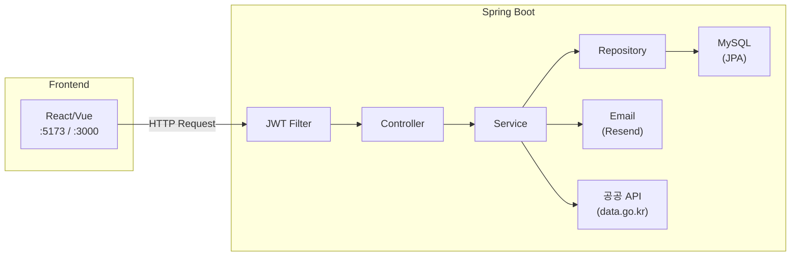

**핵심 계층 (Layered Architecture)**:

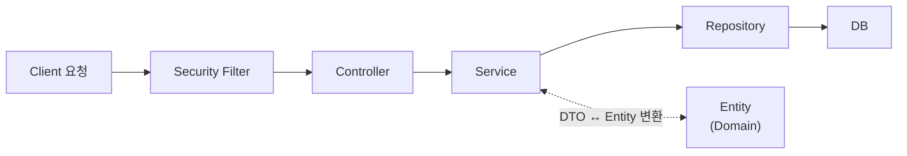

| 계층 | 역할 | 규칙 |
|------|------|------|
| **Controller** | HTTP 요청/응답 처리, 입력 검증 | 비즈니스 로직 금지 |
| **Service** | 비즈니스 로직, 트랜잭션 관리 | DB 직접 접근 금지 (Repository 통해) |
| **Repository** | 데이터 접근 (CRUD + 커스텀 쿼리) | JPA/JPQL로 DB 조작 |
| **Entity** | DB 테이블 매핑 + 도메인 로직 | 자기 자신의 상태만 관리 |

---

## 2. 요청의 생명주기

하나의 API 요청이 처리되는 전체 과정:

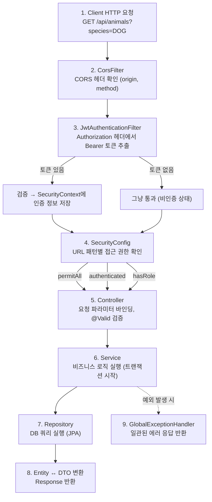

---

## 3. 패키지 구조

```
com.dnproject.platform/
│
├── config/                    # 설정 클래스
│   ├── SecurityConfig         # Spring Security 설정 (URL 접근 제어)
│   ├── CorsConfig             # CORS 설정 (프론트엔드 도메인 허용)
│   ├── SwaggerConfig          # Swagger/OpenAPI 문서 자동 생성
│   └── ResendConfig           # 이메일 발송 클라이언트 설정
│
├── security/                  # 인증/보안
│   ├── JwtProvider            # JWT 토큰 생성/검증
│   ├── JwtAuthenticationFilter # 매 요청마다 JWT 확인하는 필터
│   └── UserDetailsServiceImpl # Spring Security 유저 로딩
│
├── controller/                # API 엔드포인트 (13개)
│   ├── AuthController         # 회원가입, 로그인, OAuth
│   ├── AnimalController       # 동물 CRUD + 검색 + 추천
│   ├── AdoptionController     # 입양/임보 신청
│   ├── BoardController        # 게시판 CRUD + 댓글
│   ├── DonationController     # 기부 신청/관리
│   ├── VolunteerController    # 봉사 신청/관리
│   ├── FavoriteController     # 즐겨찾기
│   ├── NotificationController # 알림
│   ├── UserPreferenceController # 사용자 선호 설정
│   └── Admin*Controller (4개) # 관리자 전용
│
├── domain/                    # JPA 엔티티 (DB 테이블)
│   ├── User, Shelter, Animal, Adoption
│   ├── Donation, DonationRequest
│   ├── Volunteer, VolunteerRecruitment
│   ├── Board, Comment
│   ├── Notification, Preference, Favorite
│   ├── AnimalImage, SyncHistory
│   └── constant/              # Enum 상수
│       ├── UserRole            # USER, SHELTER_ADMIN, SUPER_ADMIN
│       ├── AnimalSpecies       # DOG, CAT
│       ├── AnimalStatus        # PROTECTED, ADOPTED, FOSTERING
│       ├── AdoptionStatus      # PENDING, APPROVED, REJECTED, CANCELLED
│       └── ... (기타 상태값)
│
├── dto/                       # 데이터 전송 객체
│   ├── request/               # 클라이언트 → 서버
│   ├── response/              # 서버 → 클라이언트
│   └── publicapi/             # 공공 API 응답 매핑
│
├── repository/                # DB 접근 인터페이스
│   └── *Repository            # JpaRepository 상속 + 커스텀 쿼리
│
├── service/                   # 비즈니스 로직 (10개)
│
├── exception/                 # 예외 처리
│   ├── CustomException        # 기본 커스텀 예외
│   ├── NotFoundException      # 404 Not Found
│   ├── UnauthorizedException  # 401 Unauthorized
│   └── GlobalExceptionHandler # 전역 예외 핸들러 (@ControllerAdvice)
│
└── util/                      # 유틸리티
    └── AddressRegionParser    # 주소 → 시도/시군구 파싱
```

---

## 4. 인증/보안 흐름

### 4.1 JWT 토큰 구조

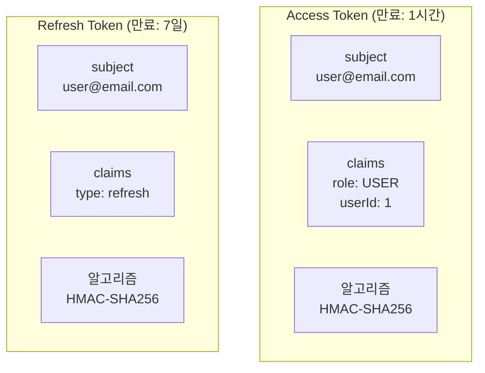

### 4.2 로그인 → 토큰 발급 → API 호출 흐름

**로그인 흐름:**

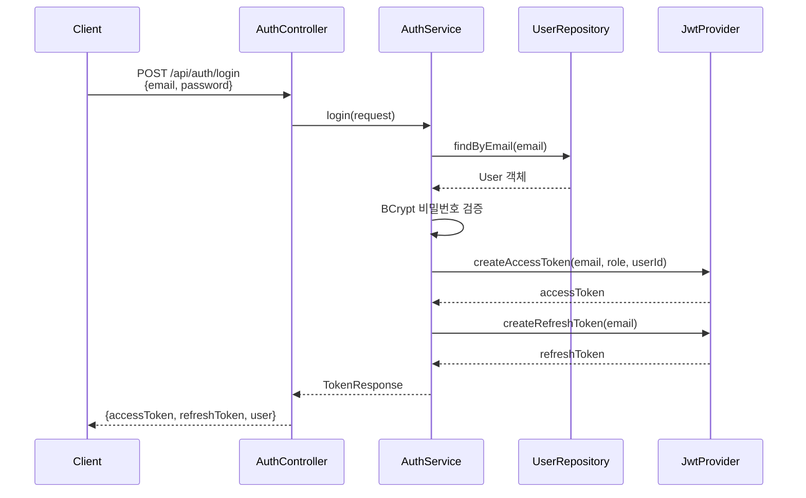

**인증된 API 호출 흐름:**

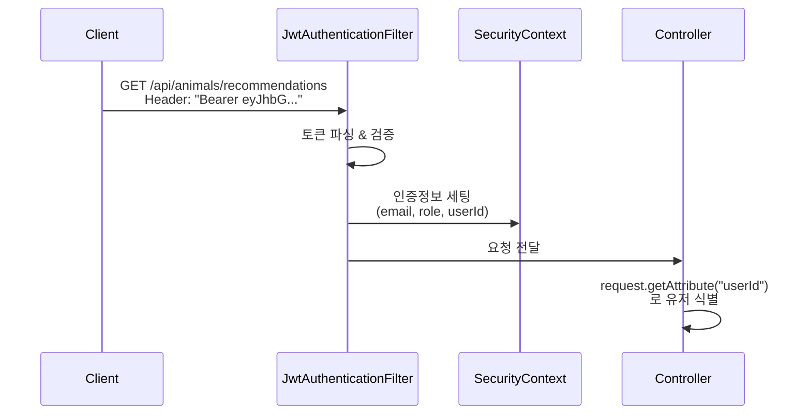

### 4.3 URL별 접근 권한 정리

```java
// 누구나 접근 가능 (토큰 불필요)
permitAll():
  /api/auth/signup, /api/auth/login, /api/auth/google, /api/auth/kakao
  /api/auth/refresh
  /api/animals (GET), /api/animals/{id} (GET)
  /api/boards (GET), /api/boards/{id} (GET)
  /api/donations/requests (GET)
  /api/volunteers/recruitments (GET)

// 로그인 필수
authenticated():
  /api/auth/me
  /api/animals/recommendations
  /api/** (그 외 대부분)

// 보호소 관리자 또는 슈퍼 관리자
hasAnyRole("SHELTER_ADMIN", "SUPER_ADMIN"):
  /api/admin/**

// 슈퍼 관리자만
hasRole("SUPER_ADMIN"):
  /api/admin/users/**
  /api/admin/boards/**
  /api/admin/applications/**
```

### 4.4 OAuth 로그인 (Google / Kakao)

**Google OAuth:**

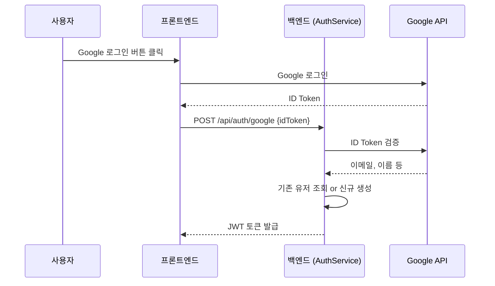

**Kakao OAuth:**

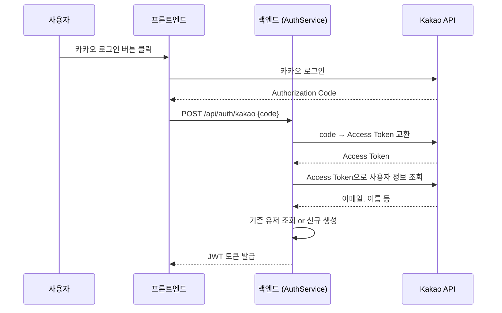

---

## 5. 핵심 도메인 모델

### 5.1 엔티티 관계도 (ER Diagram)

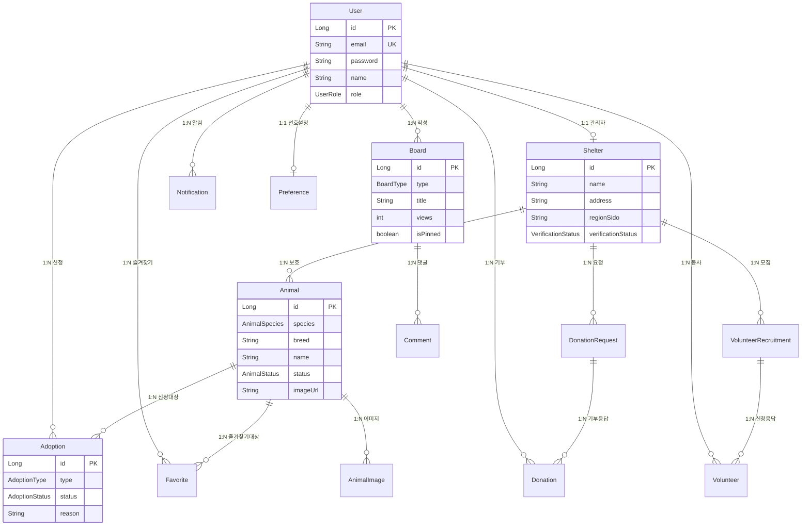

### 5.2 핵심 엔티티 필드 요약

| 엔티티 | 핵심 필드 | 상태(Status) 값 |
|--------|-----------|-----------------|
| **User** | email(unique), password, name, role | role: USER, SHELTER_ADMIN, SUPER_ADMIN |
| **Shelter** | name, address, manager(User), verificationStatus | PENDING → APPROVED / REJECTED |
| **Animal** | species, breed, name, status, shelter, imageUrl | PROTECTED, ADOPTED, FOSTERING |
| **Adoption** | user, animal, type, status, reason, experience | PENDING → APPROVED / REJECTED / CANCELLED |
| **Board** | user, type, title, content, views, isPinned | type: NOTICE, FAQ, FREE, VOLUNTEER, DONATION |
| **Donation** | user, shelter, request, amount, donationType | PENDING → COMPLETED / CANCELLED |
| **Volunteer** | user, shelter, recruitment, status | PENDING → APPROVED / REJECTED / COMPLETED |

---

## 6. 주요 비즈니스 흐름

### 6.1 입양/임보 신청 프로세스

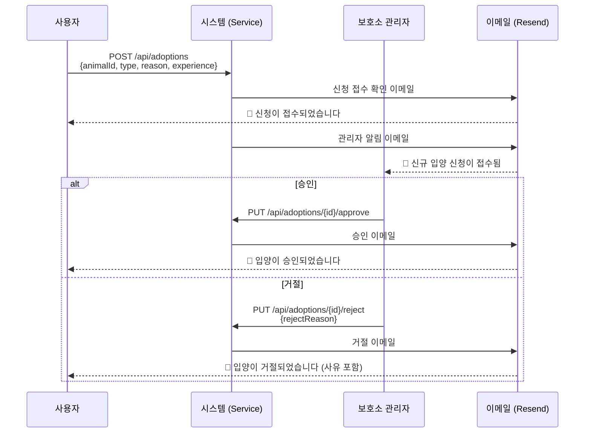

### 6.2 기부 프로세스

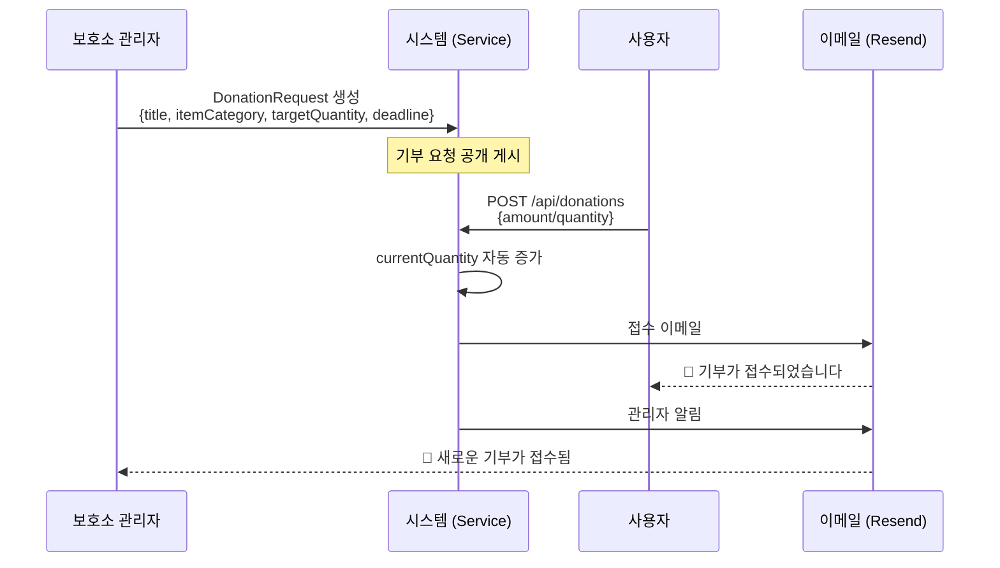

### 6.3 동물 검색 & 추천

**일반 검색 흐름:**

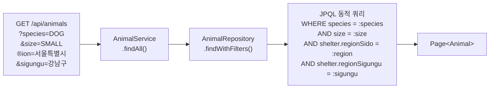

**추천 흐름:**

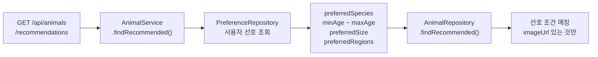

---

## 7. 공공 API 연동 & 동기화

### 7.1 동기화 흐름

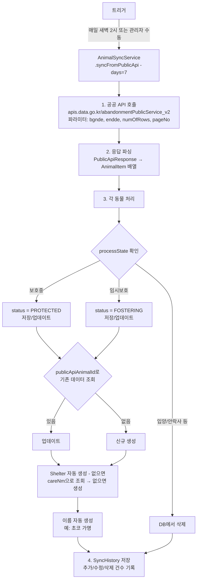

### 7.2 핵심 매핑

| 공공 API 필드 | Entity 필드 | 변환 로직 |
|--------------|-------------|----------|
| `desertionNo` | `publicApiAnimalId` | 그대로 저장 |
| `kindCd` | `species` + `breed` | "[개] 골든리트리버" → DOG + 골든리트리버 |
| `processState` | `status` | 보호중→PROTECTED, 입양→삭제 |
| `popfile` | `imageUrl` | URL 정제 (http→https 등) |
| `careNm` | `shelter.name` | 보호소 자동 생성 |
| `happenDt` | `registerDate` | yyyyMMdd → LocalDate |

---

## 8. 외워야 할 핵심 요소

### 8.1 어노테이션 체크리스트

| 어노테이션 | 위치 | 의미 |
|-----------|------|------|
| `@Entity` | 도메인 클래스 | JPA 엔티티 (DB 테이블 매핑) |
| `@Table(name, indexes)` | 도메인 클래스 | 테이블 이름 + 인덱스 지정 |
| `@Id @GeneratedValue` | 엔티티 필드 | 기본키, 자동 증가 |
| `@ManyToOne` / `@OneToMany` | 엔티티 필드 | 연관관계 매핑 |
| `@Column(unique, nullable)` | 엔티티 필드 | 컬럼 제약조건 |
| `@Enumerated(STRING)` | 엔티티 필드 | Enum을 문자열로 저장 |
| `@PrePersist` / `@PreUpdate` | 엔티티 메서드 | 저장/수정 전 자동 실행 |
| `@RestController` | 컨트롤러 | REST API 컨트롤러 |
| `@RequestMapping` | 컨트롤러 | 기본 URL 경로 매핑 |
| `@GetMapping` / `@PostMapping` 등 | 컨트롤러 메서드 | HTTP 메서드별 매핑 |
| `@RequestBody` | 파라미터 | JSON → 객체 변환 |
| `@PathVariable` | 파라미터 | URL 경로 변수 |
| `@RequestParam` | 파라미터 | 쿼리 파라미터 |
| `@Valid` | 파라미터 | 입력값 검증 활성화 |
| `@Service` | 서비스 클래스 | 비즈니스 로직 계층 빈 등록 |
| `@Transactional` | 서비스 메서드 | 트랜잭션 경계 지정 |
| `@Repository` | 리포지토리 | 데이터 접근 계층 빈 등록 |
| `@Query` | 리포지토리 메서드 | JPQL 커스텀 쿼리 |
| `@ControllerAdvice` | 예외 핸들러 | 전역 예외 처리 |
| `@ExceptionHandler` | 핸들러 메서드 | 특정 예외 처리 매핑 |
| `@Scheduled(cron)` | 메서드 | 스케줄링 (크론 표현식) |

### 8.2 응답 포맷

```java
// 성공 응답
ApiResponse<T> {
    success: true,
    data: T,
    message: "..."
}

// 에러 응답
ErrorResponse {
    status: 404,
    error: "NOT_FOUND",
    message: "동물을 찾을 수 없습니다.",
    errors: { "field": "상세 에러 메시지" }  // validation 에러 시
}

// 페이지네이션
PageResponse<T> {
    content: List<T>,
    totalElements: long,
    totalPages: int,
    currentPage: int,
    size: int
}
```

### 8.3 핵심 설계 패턴

| 패턴 | 적용 위치 | 설명 |
|------|----------|------|
| **DTO 패턴** | Request/Response 분리 | Entity를 직접 노출하지 않음 → 보안 + 유연성 |
| **Builder 패턴** | Entity, DTO 생성 | `Animal.builder().name("...").build()` |
| **Repository 패턴** | JpaRepository 상속 | 데이터 접근 추상화 |
| **전역 예외 처리** | GlobalExceptionHandler | 모든 예외를 일관된 형식으로 반환 |
| **필터 체인** | SecurityFilterChain | JWT → 권한 확인 → 컨트롤러 |

### 8.4 자주 사용하는 Repository 쿼리 패턴

```java
// 1. 메서드 이름 기반 쿼리 (Spring Data JPA 자동 생성)
findByEmail(String email)              // WHERE email = ?
findByManager_Id(Long id)              // JOIN + WHERE manager.id = ?
existsByEmail(String email)            // EXISTS 쿼리
findByVerificationStatus(Status s)     // WHERE status = ?

// 2. JPQL 커스텀 쿼리 (@Query)
@Query("SELECT a FROM Animal a WHERE " +
       "(:species IS NULL OR a.species = :species) AND " +
       "(:status IS NULL OR a.status = :status)")
Page<Animal> findWithFilters(@Param("species") Species s,
                             @Param("status") Status st,
                             Pageable pageable);

// 3. @Modifying 쿼리 (UPDATE/DELETE)
@Modifying
@Query("DELETE FROM Favorite f WHERE f.user.id = :userId AND f.animal.id = :animalId")
void deleteByUser_IdAndAnimal_Id(Long userId, Long animalId);
```

### 8.5 Role별 할 수 있는 것

| 기능 | USER | SHELTER_ADMIN | SUPER_ADMIN |
|------|:----:|:----:|:----:|
| 동물 목록 조회 | O | O | O |
| 입양/임보 신청 | O | O | O |
| 기부/봉사 신청 | O | O | O |
| 즐겨찾기/선호 설정 | O | O | O |
| 자유 게시판 글쓰기 | O | O | O |
| 보호소 동물 관리 | X | O (자기 보호소) | O |
| 입양/기부/봉사 승인/거절 | X | O (자기 보호소) | O |
| 기부요청/봉사모집 등록 | X | O | O |
| 공지/FAQ 작성 | X | X | O |
| 보호소 가입 승인 | X | X | O |
| 유저 관리 | X | X | O |

---

## 부록: Entity 메서드 vs Service 메서드 차이

### A. 개념 비교

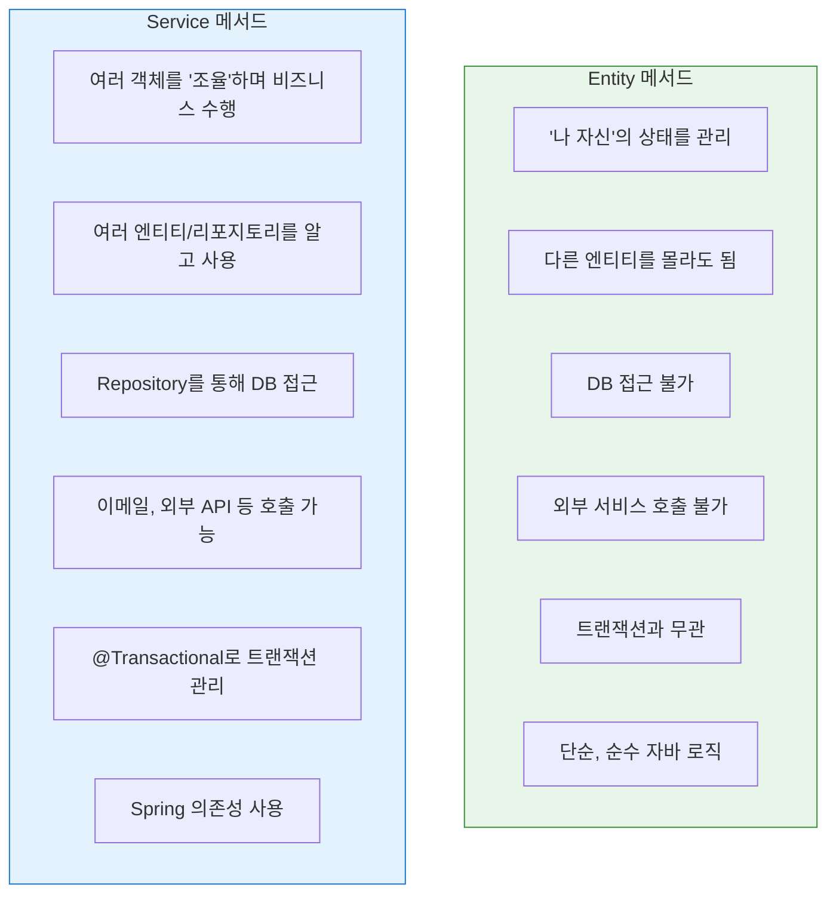

### B. 이 프로젝트에서의 실제 사례

#### Entity에 있는 메서드들

```java
// ▶ User.java - 라이프사이클 콜백
@PrePersist
protected void onCreate() {
    this.createdAt = LocalDateTime.now();
    this.updatedAt = LocalDateTime.now();
}

@PreUpdate
protected void onUpdate() {
    this.updatedAt = LocalDateTime.now();
}
// → "내가 저장/수정될 때 타임스탬프를 자동으로 설정한다"
// → 자기 자신의 필드만 건드림, 외부 의존성 없음

// ▶ Shelter.java - 주소에서 지역 파싱
public void parseRegionFromAddress() {
    if (this.address != null) {
        String[] parsed = AddressRegionParser.parse(this.address);
        this.regionSido = parsed[0];
        this.regionSigungu = parsed[1];
    }
}
// → "내 address 필드를 분석해서 내 regionSido/regionSigungu를 채운다"
// → 자기 데이터만 변환, 유틸 클래스만 사용
```

#### Service에 있는 메서드들

```java
// ▶ AuthService.login() - 여러 객체 조율
public TokenResponse login(LoginRequest request) {
    // 1. Repository로 DB 조회
    User user = userRepository.findByEmail(request.getEmail())
        .orElseThrow(() -> new UnauthorizedException("..."));

    // 2. 비밀번호 검증 (외부 라이브러리)
    if (!passwordEncoder.matches(request.getPassword(), user.getPassword()))
        throw new UnauthorizedException("...");

    // 3. JWT 토큰 생성 (다른 컴포넌트 사용)
    String accessToken = jwtProvider.createAccessToken(user.getEmail(), ...);
    String refreshToken = jwtProvider.createRefreshToken(user.getEmail());

    // 4. DTO 변환 후 반환
    return new TokenResponse(accessToken, refreshToken, UserResponse.from(user));
}
// → Repository, PasswordEncoder, JwtProvider 등 여러 컴포넌트 조율
// → Entity 혼자서는 절대 할 수 없는 작업

// ▶ AdoptionService.approve() - 비즈니스 워크플로우
public AdoptionResponse approve(Long adoptionId) {
    // 1. 입양 신청 조회 (Repository)
    Adoption adoption = adoptionRepository.findById(adoptionId)...;

    // 2. 상태 변경 (Entity 필드 수정)
    adoption.setStatus(AdoptionStatus.APPROVED);
    adoption.setProcessedAt(LocalDateTime.now());

    // 3. DB 저장 (Repository)
    adoptionRepository.save(adoption);

    // 4. 이메일 발송 (외부 서비스)
    emailService.sendApprovalEmail(adoption.getUser().getEmail(), ...);

    // 5. DTO 변환 후 반환
    return AdoptionResponse.from(adoption);
}
// → 상태 변경 + DB 저장 + 이메일 발송을 하나의 트랜잭션으로 묶음
```

### C. 판단 기준: 어디에 넣어야 할까?

| 이런 로직이라면 | 위치 | 이유 |
|---------------|------|------|
| 타임스탬프 자동 설정 | **Entity** (`@PrePersist`) | 자기 필드만 건드림 |
| 주소에서 지역 추출 | **Entity** 메서드 | 자기 데이터 변환 |
| 상태값 유효성 검사 (PENDING→APPROVED만 가능) | **Entity** 또는 **Service** | 단순하면 Entity, 복잡하면 Service |
| DB에서 데이터 조회 | **Service** | Repository 필요 |
| 여러 엔티티 간 관계 처리 | **Service** | 여러 객체 조율 필요 |
| 이메일 발송, 외부 API 호출 | **Service** | 외부 의존성 필요 |
| 트랜잭션이 필요한 작업 | **Service** | `@Transactional` 필요 |
| DTO ↔ Entity 변환 | **DTO** (static 팩토리 메서드) | `AnimalResponse.from(animal)` |

### D. 핵심 원칙 요약

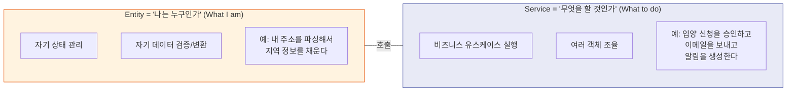

**실무 팁**: 이 프로젝트는 Entity를 비교적 "얇게(Thin)" 유지하고 대부분의 로직을 Service에 모았다. 이는 Spring Boot 프로젝트에서 가장 일반적인 패턴이다. Entity에 비즈니스 로직을 많이 넣는 "Rich Domain Model"도 있지만, 이 프로젝트처럼 Service 중심으로 하면 코드 흐름을 따라가기 쉽고 테스트하기도 편하다.

---

> 마지막 업데이트: 2026-02-13
