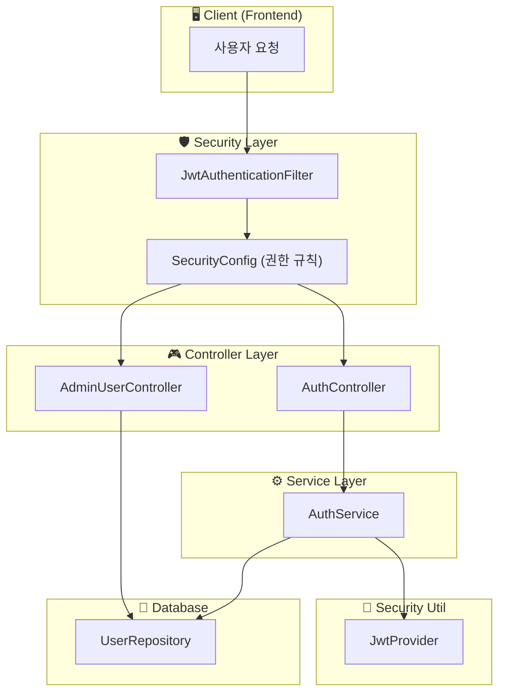
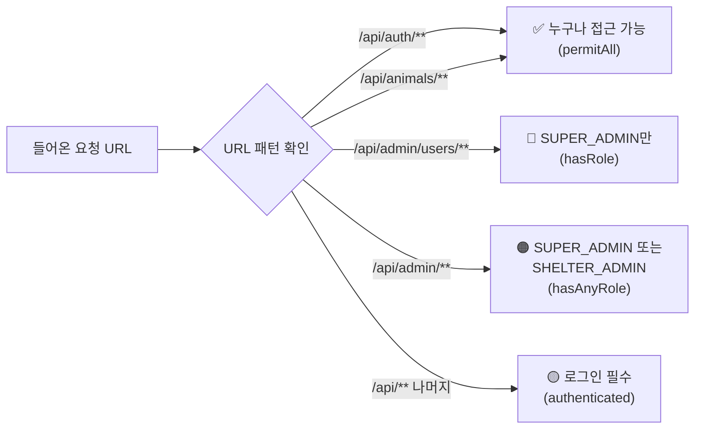
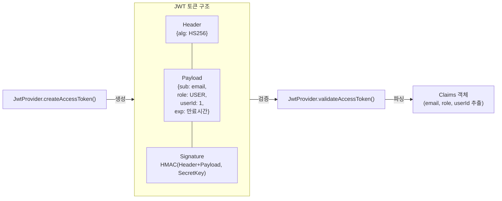
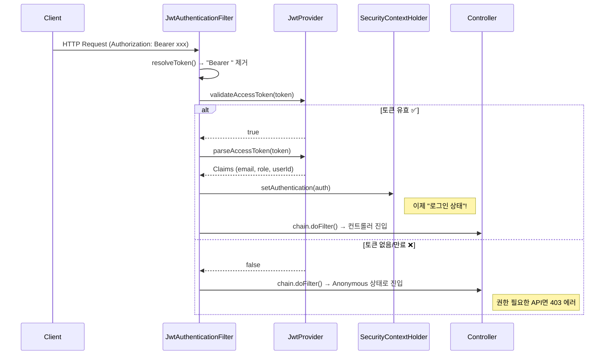
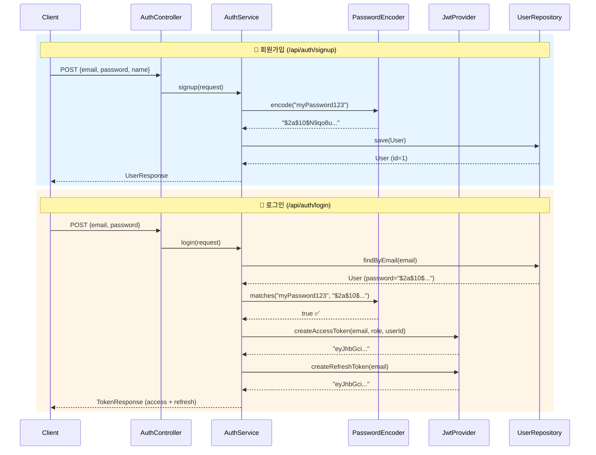
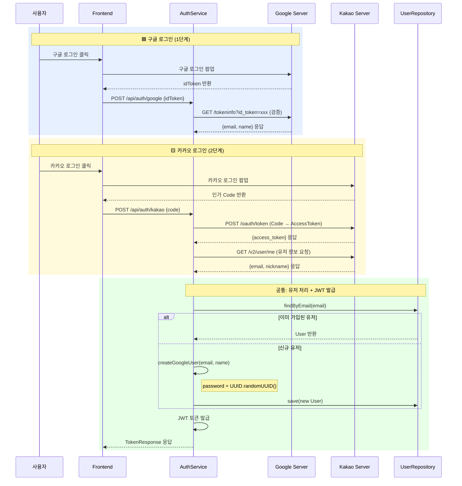
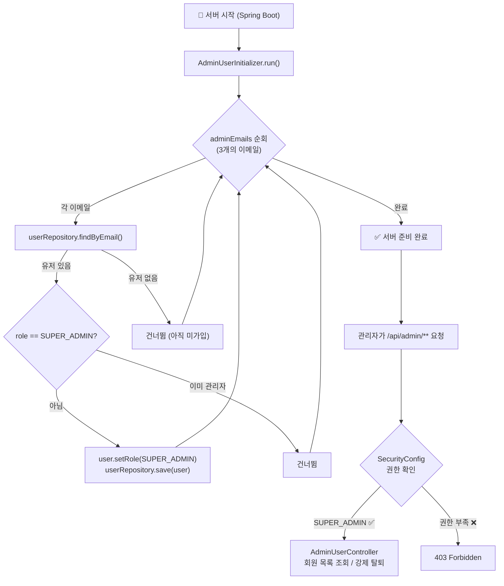

# 🔐 프로젝트 스터디 가이드: Security · JWT · 소셜 로그인 · 관리자

---

## 📁 관련 폴더 구조

내가 맡은 부분과 관련된 파일들만 모아놓은 구조입니다.

```
backend/src/main/java/com/dnproject/platform/
│
├── domain/                          ← 📦 DB 테이블과 매핑되는 엔티티
│   ├── User.java                    ← 유저 엔티티 (이메일, 비번, 권한 등)
│   └── constant/
│       └── Role.java                ← 권한 종류 (USER, SHELTER_ADMIN, SUPER_ADMIN)
│
├── dto/                             ← 📨 요청/응답 데이터 형식
│   ├── request/
│   │   ├── SignupRequest.java       ← 회원가입 요청 DTO
│   │   ├── LoginRequest.java        ← 로그인 요청 DTO
│   │   ├── GoogleLoginRequest.java  ← 구글 로그인 요청 DTO
│   │   ├── KakaoLoginRequest.java   ← 카카오 로그인 요청 DTO
│   │   └── ShelterSignupRequest.java ← 보호소 가입 요청 DTO
│   └── response/
│       ├── TokenResponse.java       ← 로그인 성공 시 응답 (토큰 포함)
│       └── UserResponse.java        ← 유저 정보 응답 DTO
│
├── config/                          ← ⚙️ 설정 파일들
│   ├── SecurityConfig.java          ← ★ Spring Security 핵심 설정
│   ├── CorsConfig.java              ← CORS 허용 설정
│   └── AdminUserInitializer.java    ← 서버 시작 시 관리자 자동 지정
│
├── security/                        ← 🛡️ 보안 관련 핵심 로직
│   ├── JwtProvider.java             ← ★ JWT 토큰 생성/검증
│   ├── JwtAuthenticationFilter.java ← ★ 매 요청마다 토큰 확인하는 필터
│   └── UserDetailsServiceImpl.java  ← Spring Security 유저 조회 서비스
│
├── controller/                      ← 🎮 API 엔드포인트
│   ├── AuthController.java          ← ★ 로그인/회원가입/소셜 로그인 API
│   └── AdminUserController.java     ← 관리자 전용 회원 관리 API
│
└── service/
    └── AuthService.java             ← ★ 인증 비즈니스 로직 (핵심!)
```

---

## 🔄 전체 아키텍처 흐름도



---

## 1️⃣ User 엔티티 & Role 권한

### `domain/constant/Role.java` — 권한 종류

```java
public enum Role {
    USER,           // 일반 사용자 (기본값)
    SHELTER_ADMIN,  // 보호소 관리자
    SUPER_ADMIN     // 시스템 관리자 (최고 권한)
}
```

### `domain/User.java` — 유저 테이블

```java
@Entity
@Table(name = "users")
public class User {

    @Id
    @GeneratedValue(strategy = GenerationType.IDENTITY)
    private Long id;                    // ← PK, 자동 생성

    @Column(nullable = false, unique = true)
    private String email;               // ← 이메일 (로그인 ID로 사용)

    @Column(nullable = false)
    private String password;            // ← 암호화된 비밀번호 (BCrypt)

    @Column(nullable = false)
    private String name;                // ← 이름

    @Enumerated(EnumType.STRING)
    @Builder.Default
    private Role role = Role.USER;      // ← 권한 (기본값: USER)

    private Instant createdAt;          // ← 가입일 (자동 설정)
    private Instant updatedAt;          // ← 수정일 (자동 설정)

    @PrePersist                         // ← DB 저장 직전에 자동 실행
    void prePersist() {
        Instant now = Instant.now();
        if (createdAt == null) createdAt = now;
        if (updatedAt == null) updatedAt = now;
    }
}
```

> **포인트**: `role` 필드의 기본값이 `Role.USER`이므로, 일반 회원가입 시 별도로 권한을 지정하지 않아도 자동으로 일반 사용자가 됩니다.

---

## 2️⃣ Spring Security 설정

### `config/SecurityConfig.java` — 보안의 대문

```java
@Configuration
@EnableWebSecurity          // ← Spring Security 활성화
@EnableMethodSecurity       // ← 메서드 레벨 권한 체크 활성화 (@PreAuthorize 등)
public class SecurityConfig {

    private final JwtAuthenticationFilter jwtAuthenticationFilter;  // ← 우리가 만든 JWT 필터

    // ────────────────────────────────────────
    // 🔓 로그인 없이 접근 가능한 URL 목록
    // ────────────────────────────────────────
    private static final String[] PUBLIC_PATHS = {
        "/api/auth/signup",         // 회원가입
        "/api/auth/login",          // 로그인
        "/api/auth/google",         // 구글 로그인
        "/api/auth/kakao",          // 카카오 로그인
        "/api/auth/refresh",        // 토큰 갱신
        "/api/animals", "/api/animals/**",  // 동물 조회 (비회원도 가능)
        // ... 생략
    };

    @Bean
    public SecurityFilterChain securityFilterChain(HttpSecurity http) throws Exception {
        http
            // ❶ CORS 설정 적용
            .cors(cors -> cors.configurationSource(corsConfigurationSource))

            // ❷ CSRF 비활성화 (REST API이므로 불필요)
            .csrf(AbstractHttpConfigurer::disable)

            // ❸ 세션 사용 안 함 (JWT 방식이니까!)
            .sessionManagement(session ->
                session.sessionCreationPolicy(SessionCreationPolicy.STATELESS))

            // ❹ URL별 접근 권한 설정
            .authorizeHttpRequests(auth -> auth
                .requestMatchers(PUBLIC_PATHS).permitAll()           // 공개 API
                .requestMatchers("/api/admin/users/**")
                    .hasRole("SUPER_ADMIN")                         // 슈퍼 관리자만
                .requestMatchers("/api/admin/**")
                    .hasAnyRole("SUPER_ADMIN", "SHELTER_ADMIN")     // 관리자급
                .requestMatchers("/api/**").authenticated())        // 나머지는 로그인 필수

            // ❺ 우리가 만든 JWT 필터를 스프링 기본 필터보다 먼저 실행
            .addFilterBefore(jwtAuthenticationFilter,
                UsernamePasswordAuthenticationFilter.class);

        return http.build();
    }

    // BCrypt 비밀번호 암호화기를 Bean으로 등록
    @Bean
    public PasswordEncoder passwordEncoder() {
        return new BCryptPasswordEncoder();
    }
}
```

### 권한 규칙 다이어그램



---

## 3️⃣ JWT 토큰 생성 & 검증

### `security/JwtProvider.java` — 토큰 공장

```java
@Component
public class JwtProvider {

    private final SecretKey accessKey;       // ← HMAC 서명용 비밀키
    private final long accessValidityMs;     // ← AccessToken 유효 시간 (기본 1시간)
    private final long refreshValidityMs;    // ← RefreshToken 유효 시간 (기본 7일)

    // ────────────────────────────────────────
    // 🔑 생성자: application.yml의 jwt.secret 값으로 키 생성
    // ────────────────────────────────────────
    public JwtProvider(@Value("${jwt.secret}") String secret, ...) {
        byte[] keyBytes = secret.getBytes(StandardCharsets.UTF_8);
        if (keyBytes.length < 32) {
            keyBytes = Arrays.copyOf(keyBytes, 32);  // ← 최소 256bit 보장
        }
        this.accessKey = Keys.hmacShaKeyFor(keyBytes);
    }

    // ────────────────────────────────────────
    // 🪙 Access Token 생성
    // ────────────────────────────────────────
    public String createAccessToken(String email, String role, Long userId) {
        Date now = new Date();
        Date expiry = new Date(now.getTime() + accessValidityMs);
        return Jwts.builder()
                .subject(email)             // ← 토큰의 주인 (이메일)
                .claim("role", role)        // ← 권한 정보
                .claim("userId", userId)    // ← 유저 ID
                .issuedAt(now)              // ← 발급 시간
                .expiration(expiry)         // ← 만료 시간
                .signWith(accessKey)        // ← 비밀키로 서명!
                .compact();
    }

    // ────────────────────────────────────────
    // 🔍 토큰 검증 (위조 여부 + 만료 여부)
    // ────────────────────────────────────────
    public boolean validateAccessToken(String token) {
        try {
            parseAccessToken(token);        // ← 파싱 성공 = 유효한 토큰
            return true;
        } catch (Exception e) {
            return false;                   // ← 파싱 실패 = 위조 or 만료
        }
    }

    // 토큰을 파싱해서 내부 정보(Claims) 추출
    public Claims parseAccessToken(String token) {
        return Jwts.parser()
                .verifyWith(accessKey)      // ← 같은 비밀키로 서명 검증
                .build()
                .parseSignedClaims(token)
                .getPayload();
    }
}
```

### JWT 토큰 구조 다이어그램



---

## 4️⃣ JWT 인증 필터 (매 요청마다 실행)

### `security/JwtAuthenticationFilter.java` — 검문소

```java
@Component
public class JwtAuthenticationFilter extends OncePerRequestFilter {
    // ↑ OncePerRequestFilter: 요청 1번당 딱 1번만 실행되는 필터

    private final JwtProvider jwtProvider;

    @Override
    protected void doFilterInternal(HttpServletRequest request, ...) {
        try {
            // ────────────────────────────────────────
            // Step 1: 헤더에서 토큰 꺼내기
            // ────────────────────────────────────────
            String token = resolveToken(request);

            // ────────────────────────────────────────
            // Step 2: 토큰이 있고 + 유효하면
            // ────────────────────────────────────────
            if (StringUtils.hasText(token) && jwtProvider.validateAccessToken(token)) {

                // Step 3: 토큰에서 정보 꺼내기
                Claims claims = jwtProvider.parseAccessToken(token);
                String email = claims.getSubject();       // ← 이메일
                String role = claims.get("role", String.class); // ← 권한

                // Step 4: Spring Security에 "이 사람 인증됨!" 알려주기
                UsernamePasswordAuthenticationToken authentication =
                    new UsernamePasswordAuthenticationToken(
                        email, null,
                        Collections.singletonList(
                            new SimpleGrantedAuthority("ROLE_" + role)
                            // ↑ "ROLE_" 접두사 필수! Security 규칙임
                        )
                    );
                SecurityContextHolder.getContext().setAuthentication(authentication);
                // ↑ 이 한 줄이 "로그인 상태"를 만드는 핵심!

                // Step 5: Controller에서 userId 쓸 수 있도록 request에 저장
                request.setAttribute("userId", userId);
            }
        } catch (Exception ignored) {
            // 토큰 없거나 잘못된 경우 → 그냥 통과 (비로그인 상태)
        }
        filterChain.doFilter(request, response);  // ← 다음 필터로 넘기기
    }

    // ────────────────────────────────────────
    // 헤더에서 "Bearer xxxx" 형식의 토큰 추출
    // ────────────────────────────────────────
    private String resolveToken(HttpServletRequest request) {
        String bearer = request.getHeader("Authorization");
        if (bearer != null && bearer.startsWith("Bearer ")) {
            return bearer.substring(7).trim();  // ← "Bearer " 제거하고 토큰만 반환
        }
        return null;
    }
}
```

### 필터 동작 흐름 다이어그램



---

## 5️⃣ 회원가입 & 로그인 API

### `controller/AuthController.java` — API 엔드포인트

```java
@RestController
@RequestMapping("/api/auth")
public class AuthController {

    private final AuthService authService;

    // ────── 회원가입 ──────
    @PostMapping("/signup")
    public ApiResponse<UserResponse> signup(@Valid @RequestBody SignupRequest request) {
        // @Valid: DTO의 @NotBlank, @Email 등 검증 자동 실행
        UserResponse data = authService.signup(request);
        return ApiResponse.created("회원가입 성공", data);
    }

    // ────── 로그인 ──────
    @PostMapping("/login")
    public ApiResponse<TokenResponse> login(@Valid @RequestBody LoginRequest request) {
        TokenResponse data = authService.login(request);
        // ↑ 로그인 성공하면 AccessToken + RefreshToken 반환
        return ApiResponse.success("로그인 성공", data);
    }

    // ────── 토큰 갱신 ──────
    @PostMapping("/refresh")
    public ApiResponse<TokenResponse> refresh(@RequestBody RefreshRequest request) {
        TokenResponse data = authService.refreshToken(request.getRefreshToken());
        return ApiResponse.success("토큰 갱신 성공", data);
    }

    // ────── 내 정보 조회 ──────
    @GetMapping("/me")
    public ApiResponse<UserResponse> getMe(HttpServletRequest httpRequest) {
        Long userId = (Long) httpRequest.getAttribute("userId");
        // ↑ JwtAuthenticationFilter에서 저장해둔 userId를 꺼냄!
        UserResponse data = authService.getMe(userId);
        return ApiResponse.success("조회 성공", data);
    }
}
```

### `service/AuthService.java` — 핵심 비즈니스 로직

```java
@Service
public class AuthService {

    private final UserRepository userRepository;
    private final PasswordEncoder passwordEncoder;  // ← BCrypt 암호화
    private final JwtProvider jwtProvider;

    // ════════════════════════════════════════
    //  📝 회원가입
    // ════════════════════════════════════════
    public UserResponse signup(SignupRequest request) {
        // 1. 이메일 중복 확인
        if (userRepository.existsByEmailTrimmed(email)) {
            throw new CustomException("이미 사용 중인 이메일입니다.", HttpStatus.CONFLICT, "EMAIL_EXISTS");
        }

        // 2. 비밀번호 암호화 (원본 → BCrypt 해시)
        String encodedPassword = passwordEncoder.encode(rawPassword);
        // 예) "myPassword123" → "$2a$10$N9qo8uLOickT..."

        // 3. User 엔티티 생성 & DB 저장
        User user = User.builder()
                .email(email)
                .password(encodedPassword)    // ← 암호화된 비번 저장
                .name(request.getName())
                .build();
        user = userRepository.save(user);     // ← DB INSERT
        return toUserResponse(user);
    }

    // ════════════════════════════════════════
    //  🔑 로그인
    // ════════════════════════════════════════
    public TokenResponse login(LoginRequest request) {
        // 1. 이메일로 유저 찾기
        User user = userRepository.findByEmailTrimmed(email)
                .orElseThrow(() -> new UnauthorizedException("이메일 또는 비밀번호가 올바르지 않습니다."));

        // 2. 입력한 비번 vs DB에 저장된 암호화 비번 비교
        if (!passwordEncoder.matches(rawPassword, user.getPassword())) {
            throw new UnauthorizedException("이메일 또는 비밀번호가 올바르지 않습니다.");
        }
        // ↑ matches()는 평문을 암호화해서 저장된 해시와 비교하는 함수

        // 3. JWT 토큰 발급
        String accessToken = jwtProvider.createAccessToken(
            user.getEmail(), user.getRole().name(), user.getId()
        );
        String refreshToken = jwtProvider.createRefreshToken(user.getEmail());

        // 4. 토큰과 유저 정보를 함께 응답
        return TokenResponse.builder()
                .accessToken(accessToken)
                .refreshToken(refreshToken)
                .tokenType("Bearer")
                .expiresIn(jwtProvider.getAccessValiditySeconds())
                .user(toUserResponse(user))
                .build();
    }
}
```

### 회원가입 → 로그인 전체 흐름



---

## 6️⃣ 소셜 로그인 (구글 & 카카오)

### `service/AuthService.java` — 구글 로그인 핵심 코드

```java
// ════════════════════════════════════════
//  🟦 구글 로그인
// ════════════════════════════════════════
public TokenResponse googleLogin(String idToken) {
    // 1. 프론트에서 받은 idToken을 구글 서버에 검증 요청
    Map<String, Object> tokenInfo = webClientBuilder.build()
            .get()
            .uri("https://oauth2.googleapis.com/tokeninfo?id_token={idToken}", idToken)
            .retrieve()
            .bodyToMono(Map.class)
            .block();
    // ↑ WebClient: 외부 API를 호출하는 HTTP 클라이언트

    // 2. 응답에서 이메일 추출
    String email = tokenInfo.get("email").toString();

    // 3. DB에 있으면 로그인, 없으면 자동 회원가입
    User user = userRepository.findByEmailTrimmed(email)
            .orElseGet(() -> createGoogleUser(email, displayName));

    // 4. JWT 발급 후 응답
    String accessToken = jwtProvider.createAccessToken(...);
    String refreshToken = jwtProvider.createRefreshToken(email);
    return TokenResponse.builder().build();
}

// 소셜 유저 자동 생성 (비밀번호는 랜덤)
private User createGoogleUser(String email, String name) {
    String randomPassword = passwordEncoder.encode(UUID.randomUUID().toString());
    // ↑ 소셜 유저는 비번이 필요 없지만 DB 컬럼이 NOT NULL이라 난수로 채움
    User user = User.builder()
            .email(email)
            .password(randomPassword)
            .name(name)
            .role(Role.USER)
            .build();
    return userRepository.save(user);
}
```

### `service/AuthService.java` — 카카오 로그인 핵심 코드

```java
// ════════════════════════════════════════
//  🟨 카카오 로그인 (2단계 과정)
// ════════════════════════════════════════
public TokenResponse kakaoLogin(String code) {

    // ── Step 1: 인가 코드 → 카카오 AccessToken 교환 ──
    Map<String, Object> tokenResponse = webClientBuilder.build()
            .post()
            .uri("https://kauth.kakao.com/oauth/token")
            .body(BodyInserters
                .fromFormData("grant_type", "authorization_code")
                .with("client_id", kakaoClientId)       // ← 카카오 앱 키
                .with("redirect_uri", kakaoRedirectUri)  // ← 콜백 URL
                .with("code", code))                     // ← 프론트에서 받은 코드
            .retrieve()
            .bodyToMono(Map.class).block();

    String kakaoAccessToken = tokenResponse.get("access_token").toString();

    // ── Step 2: 카카오 AccessToken → 유저 정보 조회 ──
    Map<String, Object> userInfo = webClientBuilder.build()
            .get()
            .uri("https://kapi.kakao.com/v2/user/me")
            .header("Authorization", "Bearer " + kakaoAccessToken)
            .retrieve()
            .bodyToMono(Map.class).block();

    // 3. 이메일, 닉네임 추출
    Map<String, Object> kakaoAccount = userInfo.get("kakao_account");
    String email = kakaoAccount.get("email").toString();

    // 4. DB 유저 확인 (없으면 자동 가입) → JWT 발급
    User user = userRepository.findByEmailTrimmed(email)
            .orElseGet(() -> createGoogleUser(email, nickname));
    // ... JWT 발급 코드 (구글 로그인과 동일)
}
```

### 소셜 로그인 전체 흐름 다이어그램



---

## 7️⃣ 관리자 기능

### `config/AdminUserInitializer.java` — 서버 시작 시 관리자 지정

```java
@Component
@Order(1)       // ← 다른 초기화보다 먼저 실행
public class AdminUserInitializer implements ApplicationRunner {
    // ↑ ApplicationRunner: 서버 시작 직후 자동으로 run() 실행

    private final UserRepository userRepository;

    @Override
    @Transactional
    public void run(ApplicationArguments args) {
        // 관리자로 지정할 이메일 목록 (하드코딩)
        List<String> adminEmails = Arrays.asList(
            "hayohio@gmail.com",
            "uoou9677@gmail.com",
            "cjoh0407@gmail.com"
        );

        for (String email : adminEmails) {
            // DB에서 유저 찾기
            Optional<User> userOpt = userRepository.findByEmail(email);
            if (userOpt.isPresent()) {
                User user = userOpt.get();
                if (user.getRole() != Role.SUPER_ADMIN) {
                    // 관리자가 아니면 → 관리자로 승격!
                    user.setRole(Role.SUPER_ADMIN);
                    userRepository.save(user);
                }
            }
            // 유저가 없으면 아무 것도 안 함 (가입 먼저 해야 함)
        }
    }
}
```

### `controller/AdminUserController.java` — 관리자 전용 API

```java
@RestController
@RequestMapping("/api/admin/users")   // ← SecurityConfig에서 SUPER_ADMIN만 접근 가능
public class AdminUserController {

    // ────── 회원 목록 조회 (페이징 + 역할 필터) ──────
    @GetMapping
    public ApiResponse<PageResponse<UserResponse>> list(
            @RequestParam(defaultValue = "0") int page,
            @RequestParam(defaultValue = "20") int size,
            @RequestParam(required = false) Role role) {
        // role 파라미터가 있으면 해당 권한의 유저만 필터링
        var userPage = role != null
                ? userRepository.findByRoleOrderByCreatedAtDesc(role, pageable)
                : userRepository.findAll(pageable);
        // ...
    }

    // ────── 회원 강제 탈퇴 ──────
    @DeleteMapping("/{userId}")
    public ApiResponse<Void> deleteUser(@PathVariable Long userId) {
        userRepository.deleteById(userId);
        return ApiResponse.success("회원이 성공적으로 탈퇴 처리되었습니다.", null);
    }
}
```

### 관리자 초기화 & 권한 체크 흐름



---

## 8️⃣ 요약: 공부할 때 이 순서로 보세요!

| 순서 | 파일 | 핵심 내용 |
|:---:|------|----------|
| 1 | `Role.java` | 권한 3가지 (USER, SHELTER_ADMIN, SUPER_ADMIN) |
| 2 | `User.java` | 유저 테이블 구조, `@Builder.Default`로 기본 권한 설정 |
| 3 | `SecurityConfig.java` | 어떤 URL을 누가 접근할 수 있는지 규칙 정의 |
| 4 | `JwtProvider.java` | 토큰 만들기 & 검증하기 (HMAC 서명) |
| 5 | `JwtAuthenticationFilter.java` | 매 요청마다 토큰 확인 → SecurityContext 설정 |
| 6 | `AuthController.java` | 회원가입/로그인/소셜/갱신 API 엔드포인트 |
| 7 | `AuthService.java` | 비밀번호 암호화, 소셜 API 통신, JWT 발급 로직 |
| 8 | `AdminUserInitializer.java` | 서버 시작 시 관리자 자동 지정 |
| 9 | `AdminUserController.java` | 관리자 전용 회원 관리 API |
