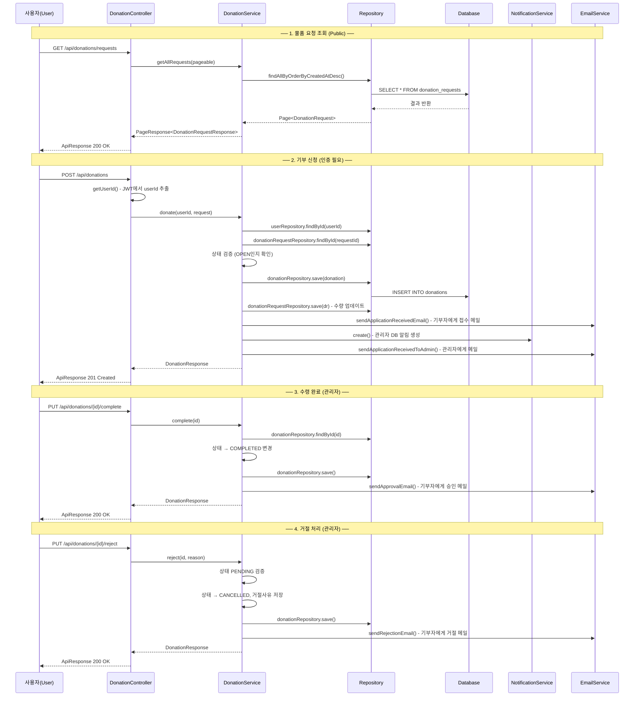
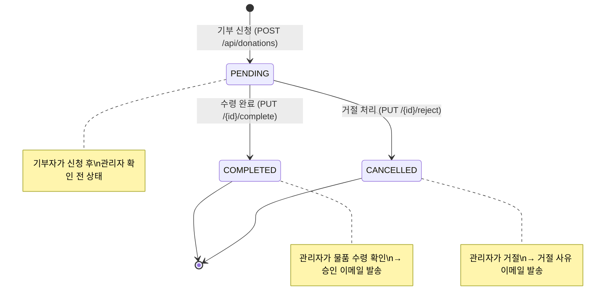

# 기부(Donation) 로직 흐름 문서

> **프로젝트**: 62dn (62댕냥이 플랫폼)  
> **패턴**: MVC (Controller → Service → Repository → DB)  
> **기준 패키지**: `com.dnproject.platform`

---

## 1. 전체 흐름도 (Mermaid)



---

## 2. 보안 설정 (Security)

> **파일**: [`config/SecurityConfig.java`](../../backend/src/main/java/com/dnproject/platform/config/SecurityConfig.java) (L27~L46)

```java
// SecurityConfig.java 27~46번째 줄
// PUBLIC_PATHS 배열에 정의된 경로 → 인증 없이 접근 가능
private static final String[] PUBLIC_PATHS = {
    // ... (생략)
    "/api/donations/requests",      // ← 기부 물품 요청 목록 조회 (Public)
    "/api/donations/requests/**",   // ← 기부 물품 요청 상세 조회 (Public)
    // ...
};
```

| API 엔드포인트 | 접근 권한 | 설명 |
|---|---|---|
| `GET /api/donations/requests` | 🟢 **Public** | 물품 요청 목록 - 누구나 조회 가능 |
| `GET /api/donations/requests/{id}` | 🟢 **Public** | 물품 요청 상세 - 누구나 조회 가능 |
| `POST /api/donations/requests` | 🔒 **인증 필요** | 물품 요청 등록 (보호소 관리자) |
| `POST /api/donations` | 🔒 **인증 필요** | 기부 신청 |
| `GET /api/donations/my` | 🔒 **인증 필요** | 내 기부 목록 |
| `GET /api/donations/shelter/pending` | 🔒 **인증 필요** | 보호소 대기 목록 |
| `PUT /api/donations/{id}/complete` | 🔒 **인증 필요** | 수령 완료 (관리자) |
| `PUT /api/donations/{id}/reject` | 🔒 **인증 필요** | 거절 처리 (관리자) |

---

## 3. 상태(Enum) 상수 정의

### 3-1. DonationStatus (기부 신청 상태)

> **파일**: [`domain/constant/DonationStatus.java`](../../backend/src/main/java/com/dnproject/platform/domain/constant/DonationStatus.java) (L6~L10)

```java
// 패키지: com.dnproject.platform.domain.constant
// 클래스: DonationStatus.java, 6~10번째 줄
// 기부 신청의 처리 상태를 나타내는 열거형(enum)
public enum DonationStatus {
    PENDING,    // 대기 중 - 기부 신청 후 관리자 확인 전 초기 상태
    COMPLETED,  // 수령 완료 - 관리자가 물품 수령을 확인한 상태
    CANCELLED   // 취소/거절 - 관리자가 기부를 거절한 상태
}
```

### 3-2. RequestStatus (물품 요청 상태)

> **파일**: [`domain/constant/RequestStatus.java`](../../backend/src/main/java/com/dnproject/platform/domain/constant/RequestStatus.java) (L6~L9)

```java
// 패키지: com.dnproject.platform.domain.constant
// 클래스: RequestStatus.java, 6~9번째 줄
// 보호소의 물품 요청 공고 상태
public enum RequestStatus {
    OPEN,   // 모집 중 - 기부를 받을 수 있는 상태
    CLOSED  // 마감 - 더 이상 기부를 받지 않는 상태
}
```

### 3-3. DonationType (기부 유형)

> **파일**: [`domain/constant/DonationType.java`](../../backend/src/main/java/com/dnproject/platform/domain/constant/DonationType.java) (L6~L9)

```java
// 패키지: com.dnproject.platform.domain.constant
// 클래스: DonationType.java, 6~9번째 줄
public enum DonationType {
    ONE_TIME,  // 일시 기부
    REGULAR    // 정기 기부
}
```

### 3-4. DonorType (기부자 유형)

> **파일**: [`domain/constant/DonorType.java`](../../backend/src/main/java/com/dnproject/platform/domain/constant/DonorType.java) (L6~L10)

```java
// 패키지: com.dnproject.platform.domain.constant
// 클래스: DonorType.java, 6~10번째 줄
public enum DonorType {
    INDIVIDUAL,   // 개인
    CORPORATION,  // 기업
    ORGANIZATION  // 단체
}
```

### 3-5. PaymentMethod (결제 수단)

> **파일**: [`domain/constant/PaymentMethod.java`](../../backend/src/main/java/com/dnproject/platform/domain/constant/PaymentMethod.java) (L6~L11)

```java
// 패키지: com.dnproject.platform.domain.constant
// 클래스: PaymentMethod.java, 6~11번째 줄
public enum PaymentMethod {
    CREDIT_CARD,     // 신용카드
    BANK_TRANSFER,   // 계좌이체
    MOBILE,          // 모바일 결제
    VIRTUAL_ACCOUNT  // 가상계좌
}
```

---

## 4. 도메인 엔티티 (Domain Entity)

### 4-1. DonationRequest (물품 요청 공고)

> **파일**: [`domain/DonationRequest.java`](../../backend/src/main/java/com/dnproject/platform/domain/DonationRequest.java) (L10~L72, 총 73줄)  
> **DB 테이블**: `donation_requests`

```java
// 패키지: com.dnproject.platform.domain
// 클래스: DonationRequest.java

@Entity
@Table(name = "donation_requests", indexes = {
    // L11~14: DB 인덱스 설정 - 검색 성능 최적화
    @Index(name = "idx_donation_requests_shelter", columnList = "shelter_id"),   // 보호소별 조회용
    @Index(name = "idx_donation_requests_status", columnList = "status"),        // 상태별 필터용
    @Index(name = "idx_donation_requests_deadline", columnList = "deadline")     // 마감일 정렬용
})
public class DonationRequest {

    @Id
    @GeneratedValue(strategy = GenerationType.IDENTITY)
    private Long id;                    // L23~25: 기본키 (자동 증가)

    @ManyToOne(fetch = FetchType.LAZY)
    @JoinColumn(name = "shelter_id", nullable = false)
    private Shelter shelter;            // L27~29: 요청을 등록한 보호소 (N:1 관계, 지연로딩)

    private String title;              // L31~32: 요청 제목 (최대 200자, NOT NULL)
    private String content;            // L34~35: 요청 내용 (TEXT 타입, NOT NULL)
    private String itemCategory;       // L37~38: 필요 물품 종류 (예: "사료", "담요")
    private Integer targetQuantity;    // L40~41: 목표 수량
    
    @Builder.Default
    private Integer currentQuantity = 0; // L43~45: 현재 모인 수량 (기본값 0)
    
    private LocalDate deadline;        // L47~48: 마감일

    @Builder.Default
    private RequestStatus status = RequestStatus.OPEN; // L50~53: 요청 상태 (기본값 OPEN)

    private Instant createdAt;         // L55~56: 생성 시각 (자동 설정)
    private Instant updatedAt;         // L58~59: 수정 시각 (자동 설정)

    // L61~66: @PrePersist - JPA가 엔티티를 처음 저장할 때 자동으로
    //         createdAt과 updatedAt을 현재 시각으로 설정
    @PrePersist
    void prePersist() {
        Instant now = Instant.now();
        if (createdAt == null) createdAt = now;
        if (updatedAt == null) updatedAt = now;
    }

    // L68~71: @PreUpdate - 엔티티가 수정될 때 자동으로 updatedAt을 갱신
    @PreUpdate
    void preUpdate() {
        updatedAt = Instant.now();
    }
}
```

### 4-2. Donation (기부 신청)

> **파일**: [`domain/Donation.java`](../../backend/src/main/java/com/dnproject/platform/domain/Donation.java) (L14~L125, 총 126줄)  
> **DB 테이블**: `donations`

```java
// 패키지: com.dnproject.platform.domain
// 클래스: Donation.java

@Entity
@Table(name = "donations", indexes = {
    // L15~17: 사용자별, 보호소별 조회를 위한 DB 인덱스
    @Index(name = "idx_donations_user", columnList = "user_id"),
    @Index(name = "idx_donations_shelter", columnList = "shelter_id")
})
public class Donation {

    @Id
    @GeneratedValue(strategy = GenerationType.IDENTITY)
    private Long id;                    // L26~28: 기본키

    /* ── 관계 매핑 (L30~L44) ── */
    @ManyToOne(fetch = FetchType.LAZY)
    private User user;                  // L30~32: 기부한 사용자 (NOT NULL)

    @ManyToOne(fetch = FetchType.LAZY)
    private Shelter shelter;            // L34~36: 기부 대상 보호소

    @ManyToOne(fetch = FetchType.LAZY)
    private DonationRequest request;    // L38~40: 연결된 물품 요청 공고

    @ManyToOne(fetch = FetchType.LAZY)
    private Board board;                // L42~44: 연결된 게시글 (선택)

    /* ── 기부자 정보 (L46~L61) ── */
    private String donorName;           // L46~47: 기부자 이름
    private LocalDate donorBirthdate;   // L49~50: 기부자 생년월일
    private String donorPhone;          // L52~53: 기부자 전화번호
    private String donorEmail;          // L55~56: 기부자 이메일
    @Builder.Default
    private DonorType donorType = DonorType.INDIVIDUAL; // L58~61: 기부자 유형 (기본: 개인)

    /* ── 기부 내용 (L63~L98) ── */
    private DonationType donationType;  // L63~65: 기부 유형 (일시/정기)
    private String donationCategory;    // L67~68: 기부 카테고리
    private BigDecimal amount;          // L70~71: 기부 금액 (물품 기부 시 0)
    private PaymentMethod paymentMethod;// L73~75: 결제 수단
    @Builder.Default
    private Boolean receiptRequested = false;  // L77~79: 기부금 영수증 요청 여부
    private String residentRegistrationNumber; // L81~82: 주민등록번호 (영수증용)
    @Builder.Default
    private Boolean newsletterConsent = false;  // L84~86: 뉴스레터 수신 동의
    private String itemName;            // L88~89: 기부 물품명
    private Integer quantity;           // L91~92: 기부 수량
    private String deliveryMethod;      // L94~95: 배송 방법
    private String trackingNumber;      // L97~98: 운송장 번호

    /* ── 상태 관리 (L100~L112) ── */
    @Builder.Default
    private DonationStatus status = DonationStatus.PENDING; // L100~103: 상태 (기본: 대기)
    private String rejectReason;        // L105~106: 거절 사유
    private Instant createdAt;          // L108~109: 생성 시각
    private Instant updatedAt;          // L111~112: 수정 시각

    // L114~119: 저장 시 자동 타임스탬프 설정
    // L121~124: 수정 시 자동 타임스탬프 갱신
}
```

---

## 5. DTO (Data Transfer Object)

### 5-1. DonationRequestCreateRequest (물품 요청 등록 DTO)

> **파일**: [`dto/request/DonationRequestCreateRequest.java`](../../backend/src/main/java/com/dnproject/platform/dto/request/DonationRequestCreateRequest.java) (L17~L37, 총 38줄)

```java
// 패키지: com.dnproject.platform.dto.request
// 클래스: DonationRequestCreateRequest.java
// 용도: 보호소 관리자가 물품 기부를 요청할 때 사용하는 입력 DTO
public class DonationRequestCreateRequest {

    @NotNull(message = "보호소 ID는 필수입니다")
    private Long shelterId;            // L19~20: 요청을 등록하는 보호소 ID

    @NotBlank(message = "제목은 필수입니다")
    private String title;              // L22~23: 요청 제목

    @NotBlank(message = "내용은 필수입니다")
    private String content;            // L25~26: 요청 상세 내용

    @NotBlank(message = "물품 종류는 필수입니다")
    private String itemCategory;       // L28~29: 필요 물품 종류

    @NotNull(message = "목표 수량은 필수입니다")
    @Positive
    private Integer targetQuantity;    // L31~33: 목표 수량 (양수만 허용)

    @NotNull(message = "마감일은 필수입니다")
    private LocalDate deadline;        // L35~36: 마감일
}
```

### 5-2. DonationApplyRequest (기부 신청 DTO)

> **파일**: [`dto/request/DonationApplyRequest.java`](../../backend/src/main/java/com/dnproject/platform/dto/request/DonationApplyRequest.java) (L15~L31, 총 32줄)

```java
// 패키지: com.dnproject.platform.dto.request
// 클래스: DonationApplyRequest.java
// 용도: 일반 사용자가 기부를 신청할 때 사용하는 입력 DTO
public class DonationApplyRequest {

    @NotNull(message = "물품 요청 ID는 필수입니다")
    private Long requestId;            // L17~18: 어떤 물품 요청에 기부하는지

    @NotBlank(message = "물품명은 필수입니다")
    private String itemName;           // L20~21: 기부할 물품 이름

    @NotNull(message = "수량은 필수입니다")
    @Positive
    private Integer quantity;          // L23~25: 기부 수량

    @NotBlank(message = "배송 방식은 필수입니다")
    private String deliveryMethod;     // L27~28: 배송 방식 (택배, 직접 배달 등)

    private String trackingNumber;     // L30: 운송장 번호 (선택 사항)
}
```

### 5-3. DonationRequestResponse (물품 요청 응답 DTO)

> **파일**: [`dto/response/DonationRequestResponse.java`](../../backend/src/main/java/com/dnproject/platform/dto/response/DonationRequestResponse.java) (L16~L29, 총 30줄)

```java
// 패키지: com.dnproject.platform.dto.response
// 클래스: DonationRequestResponse.java
// 용도: 물품 요청 공고 조회 시 클라이언트로 반환되는 응답 DTO
public class DonationRequestResponse {
    private Long id;                   // 요청 ID
    private Long shelterId;            // 보호소 ID
    private String shelterName;        // 보호소 이름
    private String title;              // 요청 제목
    private String content;            // 요청 내용
    private String itemCategory;       // 물품 종류
    private Integer targetQuantity;    // 목표 수량
    private Integer currentQuantity;   // 현재 모인 수량
    private LocalDate deadline;        // 마감일
    private RequestStatus status;      // 상태 (OPEN/CLOSED)
    private Instant createdAt;         // 생성일시
}
```

### 5-4. DonationResponse (기부 신청 응답 DTO)

> **파일**: [`dto/response/DonationResponse.java`](../../backend/src/main/java/com/dnproject/platform/dto/response/DonationResponse.java) (L15~L35, 총 36줄)

```java
// 패키지: com.dnproject.platform.dto.response
// 클래스: DonationResponse.java
// 용도: 기부 신청 결과를 클라이언트에 반환하는 응답 DTO
public class DonationResponse {
    private Long id;                   // 기부 ID
    private Long requestId;            // 연결된 물품 요청 ID
    private String requestTitle;       // 물품 요청 제목 (어떤 요청에 대한 기부인지)
    private Long userId;               // 기부자 사용자 ID
    private String shelterName;        // 대상 보호소 이름
    private String donorName;          // 기부자 이름
    private String donorPhone;         // 기부자 전화번호
    private String donorEmail;         // 기부자 이메일
    private String itemName;           // 기부 물품명
    private Integer quantity;          // 기부 수량
    private String deliveryMethod;     // 배송 방식
    private String trackingNumber;     // 운송장 번호
    private DonationStatus status;     // 처리 상태 (PENDING/COMPLETED/CANCELLED)
    private Instant createdAt;         // 신청일시
}
```

---

## 6. Repository (데이터 접근 계층)

### 6-1. DonationRequestRepository

> **파일**: [`repository/DonationRequestRepository.java`](../../backend/src/main/java/com/dnproject/platform/repository/DonationRequestRepository.java) (L9~L16, 총 17줄)

```java
// 패키지: com.dnproject.platform.repository
// 클래스: DonationRequestRepository.java
// JpaRepository를 상속하여 기본 CRUD + 페이징 기능 제공
public interface DonationRequestRepository extends JpaRepository<DonationRequest, Long> {

    // L11: 특정 보호소의 물품 요청을 최신순으로 조회
    Page<DonationRequest> findByShelter_IdOrderByCreatedAtDesc(Long shelterId, Pageable pageable);

    // L13: 특정 상태의 요청을 마감일 오름차순으로 조회
    Page<DonationRequest> findByStatusOrderByDeadlineAsc(RequestStatus status, Pageable pageable);

    // L15: 전체 물품 요청을 최신순으로 조회 (공개 API용)
    Page<DonationRequest> findAllByOrderByCreatedAtDesc(Pageable pageable);
}
```

### 6-2. DonationRepository

> **파일**: [`repository/DonationRepository.java`](../../backend/src/main/java/com/dnproject/platform/repository/DonationRepository.java) (L9~L18, 총 19줄)

```java
// 패키지: com.dnproject.platform.repository
// 클래스: DonationRepository.java
public interface DonationRepository extends JpaRepository<Donation, Long> {

    // L11: 전체 기부 내역 최신순 (관리자 전체 조회용)
    Page<Donation> findAllByOrderByCreatedAtDesc(Pageable pageable);

    // L13: 특정 사용자의 기부 내역 최신순 (내 기부 목록용)
    Page<Donation> findByUser_IdOrderByCreatedAtDesc(Long userId, Pageable pageable);

    // L15: 특정 보호소의 전체 기부 내역
    Page<Donation> findByShelter_Id(Long shelterId, Pageable pageable);

    // L17: 특정 보호소 + 특정 상태의 기부 내역 (대기 목록 필터용)
    Page<Donation> findByShelter_IdAndStatus(Long shelterId, DonationStatus status, Pageable pageable);
}
```

---

## 7. Controller (컨트롤러 계층)

> **파일**: [`controller/DonationController.java`](../../backend/src/main/java/com/dnproject/platform/controller/DonationController.java) (L23~L108, 총 109줄)  
> **기본 URL**: `/api/donations`

```java
// 패키지: com.dnproject.platform.controller
// 클래스: DonationController.java

@Tag(name = "Donation", description = "기부 API")  // Swagger 문서용 태그
@RestController                                     // REST API 컨트롤러 선언
@RequestMapping("/api/donations")                   // 기본 URL 매핑
@RequiredArgsConstructor                            // final 필드 생성자 자동 주입
public class DonationController {

    private final DonationService donationService;  // L25: Service 계층 의존성 주입

    // ──────────────────────────────────────────────
    // L27~31: [공통 헬퍼] JWT 토큰에서 userId를 추출하는 메서드
    // JwtAuthenticationFilter가 request에 "userId" 속성을 미리 설정해 둠
    // userId가 없으면 UnauthorizedException(401) 발생
    // ──────────────────────────────────────────────
    private Long getUserId(HttpServletRequest request) {
        Long userId = (Long) request.getAttribute("userId");
        if (userId == null) throw new UnauthorizedException("인증이 필요합니다.");
        return userId;
    }

    // ──────────────────────────────────────────────
    // L33~40: [API 1] 물품 요청 목록 조회 (🟢 Public)
    // GET /api/donations/requests?page=0&size=10
    // 누구나 접근 가능 (SecurityConfig의 PUBLIC_PATHS에 포함)
    // ──────────────────────────────────────────────
    @Operation(summary = "물품 요청 목록")
    @GetMapping("/requests")
    public ApiResponse<PageResponse<DonationRequestResponse>> getAllRequests(
            @RequestParam(defaultValue = "0") int page,
            @RequestParam(defaultValue = "10") int size) {
        PageResponse<DonationRequestResponse> data =
            donationService.getAllRequests(PageRequest.of(page, size));
        return ApiResponse.success("조회 성공", data);
    }

    // ──────────────────────────────────────────────
    // L42~47: [API 2] 물품 요청 상세 조회 (🟢 Public)
    // GET /api/donations/requests/{id}
    // ──────────────────────────────────────────────
    @Operation(summary = "물품 요청 상세")
    @GetMapping("/requests/{id}")
    public ApiResponse<DonationRequestResponse> getRequestById(@PathVariable Long id) {
        DonationRequestResponse data = donationService.getRequestById(id);
        return ApiResponse.success("조회 성공", data);
    }

    // ──────────────────────────────────────────────
    // L49~57: [API 3] 물품 요청 등록 (🔒 인증 필요 - 보호소 관리자)
    // POST /api/donations/requests
    // @Valid → DTO의 @NotNull/@NotBlank 검증 자동 실행
    // ──────────────────────────────────────────────
    @Operation(summary = "물품 요청 등록 (보호소)")
    @PostMapping("/requests")
    public ApiResponse<DonationRequestResponse> createRequest(
            @Valid @RequestBody DonationRequestCreateRequest request,
            HttpServletRequest httpRequest) {
        Long userId = getUserId(httpRequest);  // JWT에서 userId 추출
        DonationRequestResponse data = donationService.createRequest(userId, request);
        return ApiResponse.created("등록 완료", data);  // 201 Created
    }

    // ──────────────────────────────────────────────
    // L59~66: [API 4] 기부 신청 (🔒 인증 필요)
    // POST /api/donations
    // 핵심 API - 사용자가 물품 요청에 대해 기부를 신청
    // ──────────────────────────────────────────────
    @Operation(summary = "기부 신청")
    @PostMapping
    public ApiResponse<DonationResponse> donate(
            @Valid @RequestBody DonationApplyRequest request,
            HttpServletRequest httpRequest) {
        Long userId = getUserId(httpRequest);
        DonationResponse data = donationService.donate(userId, request);
        return ApiResponse.created("신청 완료", data);  // 201 Created
    }

    // ──────────────────────────────────────────────
    // L68~77: [API 5] 보호소 대기 신청 목록 (🔒 인증 필요 - 보호소 관리자)
    // GET /api/donations/shelter/pending?page=0&size=20
    // 보호소 관리자가 자기 보호소에 대기 중인 기부 신청을 확인
    // ──────────────────────────────────────────────
    @Operation(summary = "보호소 대기 신청 목록 (보호소 관리자)")
    @GetMapping("/shelter/pending")
    public ApiResponse<PageResponse<DonationResponse>> getPendingByShelter(
            @RequestParam(defaultValue = "0") int page,
            @RequestParam(defaultValue = "20") int size,
            HttpServletRequest httpRequest) {
        Long userId = getUserId(httpRequest);
        PageResponse<DonationResponse> data =
            donationService.getPendingByShelterForCurrentUser(userId, page, size);
        return ApiResponse.success("조회 성공", data);
    }

    // ──────────────────────────────────────────────
    // L79~88: [API 6] 내 기부 목록 (🔒 인증 필요)
    // GET /api/donations/my?page=0&size=10
    // 로그인한 사용자 본인의 기부 내역 조회
    // ──────────────────────────────────────────────
    @Operation(summary = "내 기부 목록")
    @GetMapping("/my")
    public ApiResponse<PageResponse<DonationResponse>> getMyList(
            @RequestParam(defaultValue = "0") int page,
            @RequestParam(defaultValue = "10") int size,
            HttpServletRequest httpRequest) {
        Long userId = getUserId(httpRequest);
        PageResponse<DonationResponse> data = donationService.getMyList(userId, page, size);
        return ApiResponse.success("조회 성공", data);
    }

    // ──────────────────────────────────────────────
    // L90~95: [API 7] 수령 완료 처리 (🔒 관리자)
    // PUT /api/donations/{id}/complete
    // 관리자가 물품 수령을 확인한 후 상태를 COMPLETED로 변경
    // ──────────────────────────────────────────────
    @Operation(summary = "수령 완료 처리 (관리자)")
    @PutMapping("/{id}/complete")
    public ApiResponse<DonationResponse> complete(@PathVariable Long id) {
        DonationResponse data = donationService.complete(id);
        return ApiResponse.success("수령 완료", data);
    }

    // ──────────────────────────────────────────────
    // L97~107: [API 8] 기부 신청 거절 (🔒 관리자)
    // PUT /api/donations/{id}/reject
    // Body에 rejectReason(거절 사유)을 선택적으로 포함 가능
    // L104~107: 거절 사유를 담는 내부 클래스 (Inner Class)
    // ──────────────────────────────────────────────
    @Operation(summary = "기부 신청 거절 (관리자)")
    @PutMapping("/{id}/reject")
    public ApiResponse<DonationResponse> reject(
            @PathVariable Long id,
            @RequestBody(required = false) RejectBody body) {
        DonationResponse data = donationService.reject(
            id, body != null ? body.getRejectReason() : null);
        return ApiResponse.success("거절 완료", data);
    }

    // L104~107: 거절 사유 전달용 내부 DTO
    @lombok.Data
    public static class RejectBody {
        private String rejectReason;  // 거절 사유 (선택)
    }
}
```

---

## 8. Service (서비스 계층 - 비즈니스 로직)

> **파일**: [`service/DonationService.java`](../../backend/src/main/java/com/dnproject/platform/service/DonationService.java) (L34~L282, 총 283줄)

### 8-1. 의존성 주입 (L39~L44)

```java
// 패키지: com.dnproject.platform.service
// 클래스: DonationService.java

@Slf4j                    // 로깅 기능 자동 생성
@Service                  // Spring Service 빈 등록
@RequiredArgsConstructor  // final 필드 생성자 자동 주입
public class DonationService {

    // L39~44: 6개의 Repository/Service 의존성 주입
    private final DonationRepository donationRepository;         // 기부 데이터 접근
    private final DonationRequestRepository donationRequestRepository; // 물품 요청 데이터 접근
    private final UserRepository userRepository;                 // 사용자 데이터 접근
    private final ShelterRepository shelterRepository;           // 보호소 데이터 접근
    private final NotificationService notificationService;       // DB 알림 생성
    private final EmailService emailService;                     // 이메일 발송
```

### 8-2. createRequest - 물품 요청 등록 (L46~L61)

```java
    // L46~61: 보호소 관리자가 새로운 물품 요청 공고를 등록하는 메서드
    // @Transactional: DB 트랜잭션 내에서 실행 (실패 시 롤백)
    @Transactional
    public DonationRequestResponse createRequest(Long userId, DonationRequestCreateRequest request) {
        // L48~58: Builder 패턴으로 DonationRequest 엔티티 생성
        DonationRequest dr = DonationRequest.builder()
                .shelter(shelterRepository.findById(request.getShelterId())
                        .orElseThrow(() -> new NotFoundException("보호소를 찾을 수 없습니다.")))
                        // ↑ 보호소 존재 여부 확인 (없으면 404)
                .title(request.getTitle())          // 요청 제목
                .content(request.getContent())      // 요청 내용
                .itemCategory(request.getItemCategory()) // 필요 물품 종류
                .targetQuantity(request.getTargetQuantity()) // 목표 수량
                .currentQuantity(0)                 // 현재 수량 0으로 초기화
                .deadline(request.getDeadline())     // 마감일
                .status(RequestStatus.OPEN)          // 초기 상태: OPEN (모집중)
                .build();
        dr = donationRequestRepository.save(dr);     // L59: DB에 저장
        return toRequestResponse(dr);                // L60: 엔티티 → 응답 DTO 변환
    }
```

### 8-3. getAllRequests - 물품 요청 목록 조회 (L63~L75)

```java
    // L63~75: 물품 요청 목록을 페이징하여 조회 (Public API)
    // @Transactional(readOnly = true): 읽기 전용 트랜잭션 (성능 최적화)
    @Transactional(readOnly = true)
    public PageResponse<DonationRequestResponse> getAllRequests(Pageable pageable) {
        // L65: Repository의 메서드명 규칙으로 자동 생성된 쿼리 실행
        //      → SELECT * FROM donation_requests ORDER BY created_at DESC
        Page<DonationRequest> page = donationRequestRepository.findAllByOrderByCreatedAtDesc(pageable);
        // L66~74: Page 객체를 PageResponse DTO로 변환
        return PageResponse.<DonationRequestResponse>builder()
                .content(page.getContent().stream()
                    .map(this::toRequestResponse).toList()) // 각 엔티티 → DTO 변환
                .page(page.getNumber())            // 현재 페이지 번호
                .size(page.getSize())              // 페이지 크기
                .totalElements(page.getTotalElements()) // 전체 요소 수
                .totalPages(page.getTotalPages())  // 전체 페이지 수
                .first(page.isFirst())             // 첫 페이지 여부
                .last(page.isLast())               // 마지막 페이지 여부
                .build();
    }
```

### 8-4. donate - ⭐ 기부 신청 (핵심 로직, L84~L124)

```java
    // L84~124: 기부 신청의 핵심 비즈니스 로직
    // 사용자가 물품 요청에 대해 기부를 신청하는 메서드
    @Transactional
    public DonationResponse donate(Long userId, DonationApplyRequest request) {

        // ── [Step 1] 사용자 존재 확인 (L86~87) ──
        User user = userRepository.findById(userId)
                .orElseThrow(() -> new NotFoundException("사용자를 찾을 수 없습니다."));

        // ── [Step 2] 물품 요청 존재 확인 (L88~89) ──
        DonationRequest dr = donationRequestRepository.findById(request.getRequestId())
                .orElseThrow(() -> new NotFoundException("물품 요청을 찾을 수 없습니다."));

        // ── [Step 3] 상태 검증 (L90~92) ──
        // 요청이 OPEN 상태가 아니면 기부 불가 (마감된 요청에는 기부 X)
        if (dr.getStatus() != RequestStatus.OPEN) {
            throw new CustomException("요청이 마감되었습니다.", HttpStatus.BAD_REQUEST, "REQUEST_CLOSED");
        }

        // ── [Step 4] Donation 엔티티 생성 (L93~111) ──
        String donorEmail = user.getEmail() != null && !user.getEmail().isBlank()
            ? user.getEmail() : "";
        Donation donation = Donation.builder()
                .user(user)                            // 기부자
                .shelter(dr.getShelter())               // 대상 보호소 (요청에서 가져옴)
                .request(dr)                            // 연결된 물품 요청
                .donorName(user.getName())              // 기부자 이름 (사용자 정보에서)
                .donorPhone(user.getPhone() != null ? user.getPhone() : "")
                .donorEmail(donorEmail)
                .donorType(DonorType.INDIVIDUAL)        // 기본: 개인 기부
                .donationType(DonationType.ONE_TIME)    // 기본: 일시 기부
                .donationCategory(dr.getItemCategory()) // 카테고리 (요청에서 가져옴)
                .amount(BigDecimal.ZERO)                // 물품 기부이므로 금액 0
                .paymentMethod(PaymentMethod.BANK_TRANSFER) // 기본값
                .itemName(request.getItemName())        // 기부할 물품명
                .quantity(request.getQuantity())         // 기부 수량
                .deliveryMethod(request.getDeliveryMethod()) // 배송 방법
                .trackingNumber(request.getTrackingNumber()) // 운송장 번호
                .status(DonationStatus.PENDING)         // 초기 상태: 대기
                .build();

        // ── [Step 5] DB 저장 (L112~114) ──
        donation = donationRepository.save(donation);
        // 물품 요청의 현재 수량 업데이트 (+기부 수량)
        dr.setCurrentQuantity(dr.getCurrentQuantity() + request.getQuantity());
        donationRequestRepository.save(dr);

        // ── [Step 6] 알림 & 이메일 발송 (L115~122) ──
        // try-catch로 감싸서 알림 실패 시에도 기부 신청 자체는 성공 처리
        try {
            // (1) 기부자에게 접수 확인 이메일 발송
            if (donorEmail != null && !donorEmail.isBlank()) {
                emailService.sendApplicationReceivedEmail(donorEmail, user.getName(), "기부");
            }
            // (2) 보호소 관리자에게 DB 알림 + 이메일 발송
            notifyAndEmailAdmin(donation, user.getName(), dr.getTitle());
        } catch (Exception e) {
            // 알림/이메일 실패해도 기부 신청은 이미 완료된 상태
            log.warn("기부 신청 알림/이메일 처리 중 오류 (신청은 완료됨): {}", e.getMessage());
        }

        return toDonationResponse(donation);  // L123: 응답 DTO 반환
    }
```

### 8-5. complete - 수령 완료 처리 (L182~L190)

```java
    // L182~190: 관리자가 기부 물품 수령을 확인하고 상태를 변경
    @Transactional
    public DonationResponse complete(Long id) {
        // L184~185: 기부 신청 조회 (없으면 404)
        Donation donation = donationRepository.findById(id)
                .orElseThrow(() -> new NotFoundException("기부 신청을 찾을 수 없습니다."));
        // L186: 상태를 COMPLETED(수령 완료)로 변경
        donation.setStatus(DonationStatus.COMPLETED);
        donation = donationRepository.save(donation);
        // L188: 기부자에게 승인(수령 완료) 이메일 발송
        emailService.sendApprovalEmail(donation.getDonorEmail(), donation.getDonorName(), "기부");
        return toDonationResponse(donation);
    }
```

### 8-6. reject - 기부 거절 처리 (L192~L204)

```java
    // L192~204: 관리자가 기부 신청을 거절하는 로직
    @Transactional
    public DonationResponse reject(Long id, String rejectReason) {
        Donation donation = donationRepository.findById(id)
                .orElseThrow(() -> new NotFoundException("기부 신청을 찾을 수 없습니다."));
        // L196~198: 상태 검증 - PENDING(대기) 상태인 경우만 거절 가능
        // 이미 COMPLETED 또는 CANCELLED인 건은 거절 불가
        if (donation.getStatus() != DonationStatus.PENDING) {
            throw new CustomException("대기 중인 신청만 거절할 수 있습니다.",
                HttpStatus.BAD_REQUEST, "INVALID_STATUS");
        }
        // L199~201: 상태 변경 + 거절 사유 저장
        donation.setStatus(DonationStatus.CANCELLED);
        donation.setRejectReason(rejectReason);
        donation = donationRepository.save(donation);
        // L202: 기부자에게 거절 이메일 발송 (거절 사유 포함)
        emailService.sendRejectionEmail(
            donation.getDonorEmail(), donation.getDonorName(), "기부", rejectReason);
        return toDonationResponse(donation);
    }
```

### 8-7. notifyAndEmailAdmin - 관리자 알림/이메일 (L206~L242)

```java
    // L206~242: 기부 신청 시 보호소 관리자에게 알림을 보내는 내부 메서드
    private void notifyAndEmailAdmin(Donation donation, String donorName, String requestTitle) {
        var shelter = donation.getShelter();
        if (shelter == null) return;       // 보호소 정보 없으면 중단
        var manager = shelter.getManager();

        // (1) L211~213: DB 알림 생성 (NotificationService 호출)
        //     → notifications 테이블에 INSERT
        //     → 관리자가 웹에서 알림 목록으로 확인 가능
        if (manager != null) {
            notificationService.create(manager.getId(), "DONATION_APPLICATION",
                    donorName + "님의 기부 신청이 접수되었습니다. (" + requestTitle + ")",
                    "/admin?tab=applications");
        }

        // (2) L215~241: 관리자 이메일 발송
        //     이메일 수신 주소 우선순위: 매니저 이메일 > 보호소 이메일
        String adminEmail = (manager != null && manager.getEmail() != null
            && !manager.getEmail().isBlank())
            ? manager.getEmail()
            : (shelter.getEmail() != null && !shelter.getEmail().isBlank()
                ? shelter.getEmail() : null);

        if (adminEmail != null) {
            // 상세 정보 문자열 조합 (기부자명, 연락처, 물품명, 수량, 배송방법 등)
            StringBuilder detail = new StringBuilder();
            detail.append("요청: ").append(requestTitle);
            detail.append("\n기부자: ").append(donorName);
            // ... (물품 정보, 배송 정보 등 조건부 추가)
            emailService.sendApplicationReceivedToAdmin(
                adminEmail, donorName, "기부", detail.toString());
        } else {
            log.warn("관리자(보호소) 이메일 없음 - 기부 신청 알림 미발송");
        }
    }
```

### 8-8. 변환 메서드 (Mapper, L244~L281)

```java
    // L244~259: DonationRequest 엔티티 → DonationRequestResponse DTO 변환
    private DonationRequestResponse toRequestResponse(DonationRequest r) {
        String shelterName = r.getShelter() != null ? r.getShelter().getName() : null;
        return DonationRequestResponse.builder()
                .id(r.getId())
                .shelterId(r.getShelter() != null ? r.getShelter().getId() : null)
                .shelterName(shelterName)
                .title(r.getTitle())
                .content(r.getContent())
                .itemCategory(r.getItemCategory())
                .targetQuantity(r.getTargetQuantity())
                .currentQuantity(r.getCurrentQuantity())
                .deadline(r.getDeadline())
                .status(r.getStatus())
                .createdAt(r.getCreatedAt())
                .build();
    }

    // L261~281: Donation 엔티티 → DonationResponse DTO 변환
    private DonationResponse toDonationResponse(Donation d) {
        String shelterName = d.getShelter() != null ? d.getShelter().getName() : null;
        Long requestId = d.getRequest() != null ? d.getRequest().getId() : null;
        String requestTitle = d.getRequest() != null ? d.getRequest().getTitle() : null;
        return DonationResponse.builder()
                .id(d.getId())
                .requestId(requestId)
                .requestTitle(requestTitle)
                .userId(d.getUser() != null ? d.getUser().getId() : null)
                .shelterName(shelterName)
                .donorName(d.getDonorName())
                .donorPhone(d.getDonorPhone())
                .donorEmail(d.getDonorEmail())
                .itemName(d.getItemName())
                .quantity(d.getQuantity())
                .deliveryMethod(d.getDeliveryMethod())
                .trackingNumber(d.getTrackingNumber())
                .status(d.getStatus())
                .createdAt(d.getCreatedAt())
                .build();
    }
}
```

---

## 9. 공통 컴포넌트 (알림/이메일)

### 9-1. NotificationService (DB 알림)

> **파일**: `service/NotificationService.java` (L19~L83, 총 84줄)

```java
// 패키지: com.dnproject.platform.service
// 클래스: NotificationService.java
// 기부 흐름에서 사용되는 핵심 메서드: create()

// L26~38: 알림 생성 메서드 (기부 신청 시 호출됨)
@Transactional
public Notification create(Long userId, String type, String message, String relatedUrl) {
    // userId로 사용자 조회 (보호소 관리자)
    User user = userRepository.findById(userId)
            .orElseThrow(() -> new NotFoundException("사용자를 찾을 수 없습니다."));
    // Notification 엔티티 생성 → DB 저장
    Notification notification = Notification.builder()
            .user(user)          // 알림 받을 사용자 (관리자)
            .type(type)          // 알림 유형: "DONATION_APPLICATION"
            .message(message)    // "홍길동님의 기부 신청이 접수되었습니다."
            .relatedUrl(relatedUrl)  // "/admin?tab=applications"
            .isRead(false)       // 읽지 않음 상태
            .build();
    return notificationRepository.save(notification);
}
```

### 9-2. EmailService (이메일 발송)

> **파일**: `service/EmailService.java` (총 208줄)  
> **외부 서비스**: Resend API 연동 (HTML 이메일 템플릿 사용)

기부 흐름에서 호출되는 3개의 이메일 메서드:

| 메서드 | 줄 번호 | 호출 시점 | 수신자 |
|---|---|---|---|
| `sendApplicationReceivedEmail` | L105~118 | 기부 신청 시 | 기부자 |
| `sendApplicationReceivedToAdmin` | L120~146 | 기부 신청 시 | 보호소 관리자 |
| `sendApprovalEmail` | L84~91 | 수령 완료 시 | 기부자 |
| `sendRejectionEmail` | L93~103 | 거절 처리 시 | 기부자 |

```java
// EmailService.java L105~118: 기부자에게 접수 확인 이메일
public void sendApplicationReceivedEmail(String toEmail, String applicantName, String type) {
    // toEmail이 없으면 발송 생략 (로그 경고)
    if (toEmail == null || toEmail.isBlank()) {
        log.warn("신청 접수 메일 미발송(수신 이메일 없음)");
        return;
    }
    String subject = type + " 신청이 접수되었습니다";  // "기부 신청이 접수되었습니다"
    // HTML 템플릿으로 본문 생성 후 Resend API로 발송
    String body = String.format("""
        <p>%s님의 %s 신청이 접수되었습니다.</p>
        <div>보호소 관리자 검토 후 결과를 이메일로 알려드리겠습니다.</div>
        """, applicantName, type);
    send(toEmail, subject, emailLayout(type + " 신청 접수 완료", body));
}
```

---

## 10. 상태 전이 다이어그램



---

## 11. 참고 사항

> [!IMPORTANT]
> - **자동 마감 기능 미구현**: 물품 요청의 마감일(deadline)이 지나도 자동으로 `CLOSED` 상태로 변경되는 스케줄러 로직이 없습니다. (향후 개발 필요)
> - **이미지 업로드 미지원**: 기부 관련 DTO에 이미지 필드가 없습니다. 텍스트 정보만 처리됩니다.
> - **물품 기부 전용**: 현재 `donate()` 메서드는 `amount`를 `BigDecimal.ZERO`로 설정하여 물품 기부만 처리합니다. 금전 기부 로직은 별도 구현이 필요합니다.

