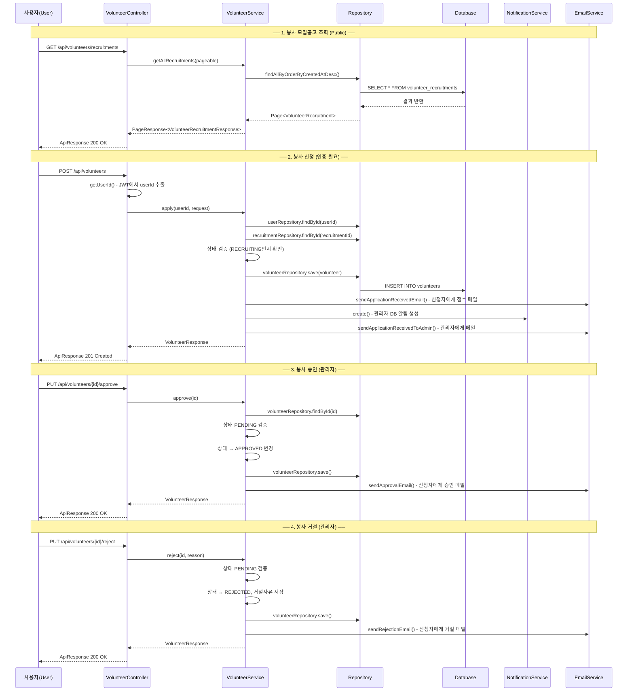
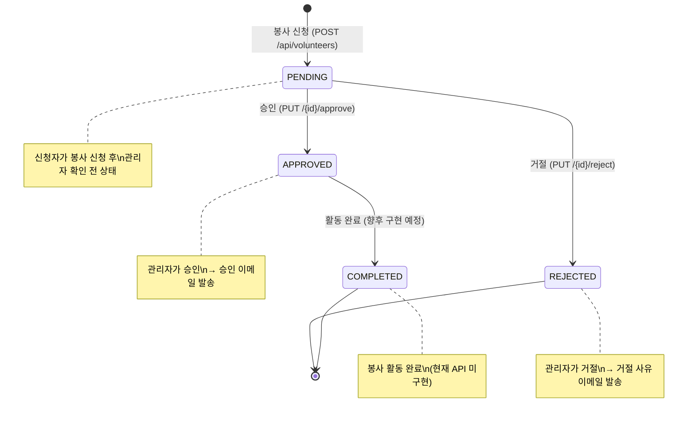

# 봉사(Volunteer) 로직 흐름 문서

> **프로젝트**: 62dn (62댕냥이 플랫폼)  
> **패턴**: MVC (Controller → Service → Repository → DB)  
> **기준 패키지**: `com.dnproject.platform`

---

## 1. 전체 흐름도 (Mermaid)



---

## 2. 보안 설정 (Security)

> **파일**: [`config/SecurityConfig.java`](../../backend/src/main/java/com/dnproject/platform/config/SecurityConfig.java) (L27~L46)

```java
// SecurityConfig.java 27~46번째 줄
// PUBLIC_PATHS 배열에 정의된 경로 → 인증 없이 접근 가능
private static final String[] PUBLIC_PATHS = {
    // ... (생략)
    "/api/volunteers/recruitments",      // ← 봉사 모집공고 목록 조회 (Public)
    "/api/volunteers/recruitments/**",   // ← 봉사 모집공고 상세 조회 (Public)
    // ...
};
```

| API 엔드포인트 | 접근 권한 | 설명 |
|---|---|---|
| `GET /api/volunteers/recruitments` | 🟢 **Public** | 모집공고 목록 - 누구나 조회 가능 |
| `GET /api/volunteers/recruitments/{id}` | 🟢 **Public** | 모집공고 상세 - 누구나 조회 가능 |
| `POST /api/volunteers/recruitments` | 🔒 **인증 필요** | 모집공고 등록 (보호소 관리자) |
| `POST /api/volunteers` | 🔒 **인증 필요** | 봉사 신청 |
| `GET /api/volunteers/my` | 🔒 **인증 필요** | 내 봉사 목록 |
| `GET /api/volunteers/shelter/pending` | 🔒 **인증 필요** | 보호소 대기 목록 |
| `PUT /api/volunteers/{id}/approve` | 🔒 **인증 필요** | 승인 처리 (관리자) |
| `PUT /api/volunteers/{id}/reject` | 🔒 **인증 필요** | 거절 처리 (관리자) |

---

## 3. 상태(Enum) 상수 정의

### 3-1. VolunteerStatus (봉사 신청 상태)

> **파일**: [`domain/constant/VolunteerStatus.java`](../../backend/src/main/java/com/dnproject/platform/domain/constant/VolunteerStatus.java) (L6~L11)

```java
// 패키지: com.dnproject.platform.domain.constant
// 클래스: VolunteerStatus.java, 6~11번째 줄
// 봉사 신청의 처리 상태를 나타내는 열거형(enum)
public enum VolunteerStatus {
    PENDING,    // 대기 중 - 봉사 신청 후 관리자 확인 전 초기 상태
    APPROVED,   // 승인 완료 - 관리자가 봉사 신청을 승인한 상태
    REJECTED,   // 거절 - 관리자가 봉사 신청을 거절한 상태
    COMPLETED   // 활동 완료 - 봉사 활동이 완료된 상태
}
```

### 3-2. RecruitmentStatus (모집공고 상태)

> **파일**: [`domain/constant/RecruitmentStatus.java`](../../backend/src/main/java/com/dnproject/platform/domain/constant/RecruitmentStatus.java) (L6~L9)

```java
// 패키지: com.dnproject.platform.domain.constant
// 클래스: RecruitmentStatus.java, 6~9번째 줄
// 봉사 모집 공고의 상태
public enum RecruitmentStatus {
    RECRUITING,  // 모집 중 - 봉사자를 모집하고 있는 상태
    CLOSED       // 마감 - 모집이 종료된 상태
}
```

### 3-3. ActivityCycle (활동 주기)

> **파일**: [`domain/constant/ActivityCycle.java`](../../backend/src/main/java/com/dnproject/platform/domain/constant/ActivityCycle.java) (L6~L9)

```java
// 패키지: com.dnproject.platform.domain.constant
// 클래스: ActivityCycle.java, 6~9번째 줄
public enum ActivityCycle {
    REGULAR,    // 정기 봉사
    IRREGULAR   // 비정기 봉사
}
```

### 3-4. VolunteerType (봉사자 유형)

> **파일**: [`domain/constant/VolunteerType.java`](../../backend/src/main/java/com/dnproject/platform/domain/constant/VolunteerType.java) (L6~L9)

```java
// 패키지: com.dnproject.platform.domain.constant
// 클래스: VolunteerType.java, 6~9번째 줄
public enum VolunteerType {
    INDIVIDUAL,  // 개인 봉사
    GROUP        // 단체 봉사
}
```

---

## 4. 도메인 엔티티 (Domain Entity)

### 4-1. VolunteerRecruitment (봉사 모집공고)

> **파일**: [`domain/VolunteerRecruitment.java`](../../backend/src/main/java/com/dnproject/platform/domain/VolunteerRecruitment.java) (L10~L65, 총 66줄)  
> **DB 테이블**: `volunteer_recruitments`

```java
// 패키지: com.dnproject.platform.domain
// 클래스: VolunteerRecruitment.java

@Entity
@Table(name = "volunteer_recruitments", indexes = {
    // L11~14: DB 인덱스 설정 - 검색 성능 최적화
    @Index(name = "idx_volunteer_recruitments_shelter", columnList = "shelter_id"),  // 보호소별 조회용
    @Index(name = "idx_volunteer_recruitments_status", columnList = "status"),       // 상태별 필터용
    @Index(name = "idx_volunteer_recruitments_deadline", columnList = "deadline")    // 마감일 정렬용
})
public class VolunteerRecruitment {

    @Id
    @GeneratedValue(strategy = GenerationType.IDENTITY)
    private Long id;                    // L23~25: 기본키 (자동 증가)

    @ManyToOne(fetch = FetchType.LAZY)
    @JoinColumn(name = "shelter_id", nullable = false)
    private Shelter shelter;            // L27~29: 공고를 등록한 보호소 (N:1 관계, 지연로딩)

    private String title;              // L31~32: 공고 제목 (최대 200자, NOT NULL)
    private String content;            // L34~35: 공고 내용 (TEXT 타입, NOT NULL)
    private Integer maxApplicants;     // L37~38: 모집 인원
    private LocalDate deadline;        // L40~41: 마감일

    @Builder.Default
    private RecruitmentStatus status = RecruitmentStatus.RECRUITING;
                                       // L43~46: 공고 상태 (기본값 RECRUITING)

    private Instant createdAt;         // L48~49: 생성 시각 (자동 설정)
    private Instant updatedAt;         // L51~52: 수정 시각 (자동 설정)

    // L54~59: @PrePersist - 엔티티 최초 저장 시 타임스탬프 자동 설정
    // L61~64: @PreUpdate - 엔티티 수정 시 updatedAt 자동 갱신
}
```

### 4-2. Volunteer (봉사 신청)

> **파일**: [`domain/Volunteer.java`](../../backend/src/main/java/com/dnproject/platform/domain/Volunteer.java) (L12~L113, 총 114줄)  
> **DB 테이블**: `volunteers`

```java
// 패키지: com.dnproject.platform.domain
// 클래스: Volunteer.java

@Entity
@Table(name = "volunteers", indexes = {
    // L13~16: DB 인덱스 설정
    @Index(name = "idx_volunteers_user", columnList = "user_id"),           // 사용자별 조회용
    @Index(name = "idx_volunteers_shelter", columnList = "shelter_id"),     // 보호소별 조회용
    @Index(name = "idx_volunteers_date", columnList = "volunteer_date_start") // 날짜별 정렬용
})
public class Volunteer {

    @Id
    @GeneratedValue(strategy = GenerationType.IDENTITY)
    private Long id;                    // L25~27: 기본키

    /* ── 관계 매핑 (L29~L43) ── */
    @ManyToOne(fetch = FetchType.LAZY)
    private User user;                  // L29~31: 봉사 신청한 사용자 (NOT NULL)

    @ManyToOne(fetch = FetchType.LAZY)
    private Shelter shelter;            // L33~35: 봉사 대상 보호소 (NOT NULL)

    @ManyToOne(fetch = FetchType.LAZY)
    private VolunteerRecruitment recruitment; // L37~39: 연결된 모집공고

    @ManyToOne(fetch = FetchType.LAZY)
    private Board board;                // L41~43: 연결된 게시글 (선택)

    /* ── 신청자 정보 (L45~L58) ── */
    private String applicantName;       // L45~46: 신청자 이름 (최대 50자)
    private String applicantPhone;      // L48~49: 신청자 전화번호 (최대 20자)
    private String applicantEmail;      // L51~52: 신청자 이메일 (최대 100자)
    private String activityRegion;      // L54~55: 활동 희망 지역 (최대 100자)
    private String activityField;       // L57~58: 활동 분야 (예: "산책", "청소")

    /* ── 활동 일정 (L60~L71) ── */
    private LocalDate volunteerDateStart;  // L60~61: 봉사 시작일
    private LocalDate volunteerDateEnd;    // L63~64: 봉사 종료일
    private ActivityCycle activityCycle;    // L66~68: 활동 주기 (정기/비정기)
    private String preferredTimeSlot;      // L70~71: 선호 시간대

    /* ── 추가 정보 (L73~L86) ── */
    @Builder.Default
    private VolunteerType volunteerType = VolunteerType.INDIVIDUAL;
                                           // L73~76: 봉사자 유형 (기본: 개인)
    private String experience;             // L78~79: 봉사 경험 (TEXT)
    private String specialNotes;           // L81~82: 특이사항/메모 (TEXT)
    @Builder.Default
    private Integer participantCount = 1;  // L84~86: 참여 인원 (기본: 1명)

    /* ── 상태 관리 (L88~L100) ── */
    @Builder.Default
    private VolunteerStatus status = VolunteerStatus.PENDING;
                                           // L88~91: 신청 상태 (기본: 대기)
    private String rejectReason;           // L93~94: 거절 사유
    private Instant createdAt;             // L96~97: 생성 시각
    private Instant updatedAt;             // L99~100: 수정 시각

    // L102~107: @PrePersist - 저장 시 자동 타임스탬프 설정
    // L109~112: @PreUpdate - 수정 시 자동 타임스탬프 갱신
}
```

---

## 5. DTO (Data Transfer Object)

### 5-1. VolunteerRecruitmentCreateRequest (모집공고 등록 DTO)

> **파일**: [`dto/request/VolunteerRecruitmentCreateRequest.java`](../../backend/src/main/java/com/dnproject/platform/dto/request/VolunteerRecruitmentCreateRequest.java) (L17~L34, 총 35줄)

```java
// 패키지: com.dnproject.platform.dto.request
// 클래스: VolunteerRecruitmentCreateRequest.java
// 용도: 보호소 관리자가 봉사 모집공고를 등록할 때 사용하는 입력 DTO
public class VolunteerRecruitmentCreateRequest {

    @NotNull(message = "보호소 ID는 필수입니다")
    private Long shelterId;            // L19~20: 공고를 등록하는 보호소 ID

    @NotBlank(message = "제목은 필수입니다")
    private String title;              // L22~23: 공고 제목

    @NotBlank(message = "내용은 필수입니다")
    private String content;            // L25~26: 공고 상세 내용

    @NotNull(message = "모집 인원은 필수입니다")
    @Positive
    private Integer maxApplicants;     // L28~30: 모집 인원 (양수만 허용)

    @NotNull(message = "마감일은 필수입니다")
    private LocalDate deadline;        // L32~33: 마감일
}
```

### 5-2. VolunteerApplyRequest (봉사 신청 DTO)

> **파일**: [`dto/request/VolunteerApplyRequest.java`](../../backend/src/main/java/com/dnproject/platform/dto/request/VolunteerApplyRequest.java) (L17~L44, 총 45줄)

```java
// 패키지: com.dnproject.platform.dto.request
// 클래스: VolunteerApplyRequest.java
// 용도: 일반 사용자가 봉사를 신청할 때 사용하는 입력 DTO
public class VolunteerApplyRequest {

    @NotNull(message = "모집공고 ID는 필수입니다")
    private Long recruitmentId;        // L19~20: 어떤 모집공고에 신청하는지

    @NotBlank(message = "신청자 이름은 필수입니다")
    private String applicantName;      // L22~23: 신청자 이름

    private String applicantPhone;     // L25: 신청자 전화번호 (선택)
    private String applicantEmail;     // L26: 신청자 이메일 (선택, 미입력 시 사용자 이메일)

    private String activityRegion;     // L28~29: 활동 희망 지역 (선택, 미입력 시 빈 문자열)

    @NotBlank(message = "활동 분야는 필수입니다")
    private String activityField;      // L31~32: 활동 분야 (산책, 청소 등)

    @NotNull(message = "희망 시작일은 필수입니다")
    private LocalDate startDate;       // L34~35: 봉사 시작 희망일

    private LocalDate endDate;         // L37: 봉사 종료 희망일 (선택)

    private Integer participantCount;  // L39~40: 신청 인원 (미입력 시 1명)

    private String message;            // L42~43: 하고 싶은 말/메모 (선택)
}
```

### 5-3. VolunteerRecruitmentResponse (모집공고 응답 DTO)

> **파일**: [`dto/response/VolunteerRecruitmentResponse.java`](../../backend/src/main/java/com/dnproject/platform/dto/response/VolunteerRecruitmentResponse.java) (L16~L27, 총 28줄)

```java
// 패키지: com.dnproject.platform.dto.response
// 클래스: VolunteerRecruitmentResponse.java
// 용도: 모집공고 조회 시 클라이언트로 반환되는 응답 DTO
public class VolunteerRecruitmentResponse {
    private Long id;                   // 공고 ID
    private Long shelterId;            // 보호소 ID
    private String shelterName;        // 보호소 이름
    private String title;              // 공고 제목
    private String content;            // 공고 내용
    private Integer maxApplicants;     // 모집 인원
    private LocalDate deadline;        // 마감일
    private RecruitmentStatus status;  // 상태 (RECRUITING/CLOSED)
    private Instant createdAt;         // 생성일시
}
```

### 5-4. VolunteerResponse (봉사 신청 응답 DTO)

> **파일**: [`dto/response/VolunteerResponse.java`](../../backend/src/main/java/com/dnproject/platform/dto/response/VolunteerResponse.java) (L15~L35, 총 36줄)

```java
// 패키지: com.dnproject.platform.dto.response
// 클래스: VolunteerResponse.java
// 용도: 봉사 신청 결과를 클라이언트에 반환하는 응답 DTO
public class VolunteerResponse {
    private Long id;                   // 봉사 신청 ID
    private Long recruitmentId;        // 연결된 모집공고 ID
    private String recruitmentTitle;   // 모집공고 제목 (어떤 공고에 대한 신청인지)
    private String shelterName;        // 대상 보호소 이름
    private String applicantName;      // 신청자 이름
    private String applicantPhone;     // 신청자 전화번호
    private String applicantEmail;     // 신청자 이메일
    private String activityRegion;     // 활동 희망 지역
    private String activityField;      // 활동 분야
    private String startDate;          // 봉사 시작일 (String 변환)
    private String endDate;            // 봉사 종료일 (String 변환)
    private Integer participantCount;  // 참여 인원
    private String message;            // 신청 메모
    private VolunteerStatus status;    // 처리 상태 (PENDING/APPROVED/REJECTED/COMPLETED)
    private Instant createdAt;         // 신청일시
}
```

---

## 6. Repository (데이터 접근 계층)

### 6-1. VolunteerRecruitmentRepository

> **파일**: [`repository/VolunteerRecruitmentRepository.java`](../../backend/src/main/java/com/dnproject/platform/repository/VolunteerRecruitmentRepository.java) (L9~L16, 총 17줄)

```java
// 패키지: com.dnproject.platform.repository
// 클래스: VolunteerRecruitmentRepository.java
public interface VolunteerRecruitmentRepository extends JpaRepository<VolunteerRecruitment, Long> {

    // L11: 특정 보호소의 모집공고를 최신순으로 조회
    Page<VolunteerRecruitment> findByShelter_IdOrderByCreatedAtDesc(Long shelterId, Pageable pageable);

    // L13: 특정 상태의 공고를 마감일 오름차순으로 조회
    Page<VolunteerRecruitment> findByStatusOrderByDeadlineAsc(RecruitmentStatus status, Pageable pageable);

    // L15: 전체 모집공고를 최신순으로 조회 (공개 API용)
    Page<VolunteerRecruitment> findAllByOrderByCreatedAtDesc(Pageable pageable);
}
```

### 6-2. VolunteerRepository

> **파일**: [`repository/VolunteerRepository.java`](../../backend/src/main/java/com/dnproject/platform/repository/VolunteerRepository.java) (L9~L18, 총 19줄)

```java
// 패키지: com.dnproject.platform.repository
// 클래스: VolunteerRepository.java
public interface VolunteerRepository extends JpaRepository<Volunteer, Long> {

    // L11: 전체 봉사 내역 최신순 (관리자 전체 조회용)
    Page<Volunteer> findAllByOrderByCreatedAtDesc(Pageable pageable);

    // L13: 특정 사용자의 봉사 내역 최신순 (내 봉사 목록용)
    Page<Volunteer> findByUser_IdOrderByCreatedAtDesc(Long userId, Pageable pageable);

    // L15: 특정 보호소의 전체 봉사 내역
    Page<Volunteer> findByShelter_Id(Long shelterId, Pageable pageable);

    // L17: 특정 보호소 + 특정 상태의 봉사 내역 (대기 목록 필터용)
    Page<Volunteer> findByShelter_IdAndStatus(Long shelterId, VolunteerStatus status, Pageable pageable);
}
```

---

## 7. Controller (컨트롤러 계층)

> **파일**: [`controller/VolunteerController.java`](../../backend/src/main/java/com/dnproject/platform/controller/VolunteerController.java) (L19~L108, 총 109줄)

```java
// 패키지: com.dnproject.platform.controller
// 클래스: VolunteerController.java

@Tag(name = "Volunteer", description = "봉사 API")  // Swagger 문서 그룹명
@RestController                     // REST 컨트롤러 선언
@RequestMapping("/api/volunteers")  // 기본 URL 경로
@RequiredArgsConstructor            // 생성자 주입
public class VolunteerController {

    private final VolunteerService volunteerService;

    // L27~31: JWT 토큰에서 userId를 추출하는 헬퍼 메서드
    private Long getUserId(HttpServletRequest request) {
        Long userId = (Long) request.getAttribute("userId");
        if (userId == null) throw new UnauthorizedException("인증이 필요합니다.");
        return userId;
    }
```

### 8개 API 엔드포인트 상세:

| # | HTTP | URL | 메서드 | 인증 | 줄 번호 |
|---|---|---|---|---|---|
| 1 | `GET` | `/recruitments` | `getAllRecruitments` | 🟢 공개 | L33~40 |
| 2 | `GET` | `/recruitments/{id}` | `getRecruitmentById` | 🟢 공개 | L42~47 |
| 3 | `POST` | `/recruitments` | `createRecruitment` | 🔒 인증 | L49~57 |
| 4 | `POST` | `/` | `apply` | 🔒 인증 | L59~66 |
| 5 | `GET` | `/shelter/pending` | `getPendingByShelter` | 🔒 인증 | L68~77 |
| 6 | `GET` | `/my` | `getMyList` | 🔒 인증 | L79~88 |
| 7 | `PUT` | `/{id}/approve` | `approve` | 🔒 인증 | L90~95 |
| 8 | `PUT` | `/{id}/reject` | `reject` | 🔒 인증 | L97~102 |

```java
    // ── [1] 모집공고 목록 (Public) ──
    @Operation(summary = "봉사 모집공고 목록")
    @GetMapping("/recruitments")
    public ApiResponse<PageResponse<VolunteerRecruitmentResponse>> getAllRecruitments(
            @RequestParam(defaultValue = "0") int page,
            @RequestParam(defaultValue = "10") int size) {
        PageResponse<VolunteerRecruitmentResponse> data =
            volunteerService.getAllRecruitments(PageRequest.of(page, size));
        return ApiResponse.success("조회 성공", data);
    }

    // ── [2] 모집공고 상세 (Public) ──
    @Operation(summary = "봉사 모집공고 상세")
    @GetMapping("/recruitments/{id}")
    public ApiResponse<VolunteerRecruitmentResponse> getRecruitmentById(@PathVariable Long id) {
        VolunteerRecruitmentResponse data = volunteerService.getRecruitmentById(id);
        return ApiResponse.success("조회 성공", data);
    }

    // ── [3] 모집공고 등록 (보호소 관리자) ──
    @Operation(summary = "봉사 모집공고 등록 (보호소)")
    @PostMapping("/recruitments")
    public ApiResponse<VolunteerRecruitmentResponse> createRecruitment(
            @Valid @RequestBody VolunteerRecruitmentCreateRequest request,
            HttpServletRequest httpRequest) {
        Long userId = getUserId(httpRequest);
        VolunteerRecruitmentResponse data = volunteerService.createRecruitment(userId, request);
        return ApiResponse.created("등록 완료", data);
    }

    // ── [4] 봉사 신청 (일반 사용자) ──
    @Operation(summary = "봉사 신청")
    @PostMapping
    public ApiResponse<VolunteerResponse> apply(
            @Valid @RequestBody VolunteerApplyRequest request,
            HttpServletRequest httpRequest) {
        Long userId = getUserId(httpRequest);
        VolunteerResponse data = volunteerService.apply(userId, request);
        return ApiResponse.created("신청 완료", data);
    }

    // ── [5] 보호소 대기 목록 (보호소 관리자) ──
    @Operation(summary = "보호소 대기 신청 목록 (보호소 관리자)")
    @GetMapping("/shelter/pending")
    public ApiResponse<PageResponse<VolunteerResponse>> getPendingByShelter(
            @RequestParam(defaultValue = "0") int page,
            @RequestParam(defaultValue = "20") int size,
            HttpServletRequest httpRequest) {
        Long userId = getUserId(httpRequest);
        PageResponse<VolunteerResponse> data =
            volunteerService.getPendingByShelterForCurrentUser(userId, page, size);
        return ApiResponse.success("조회 성공", data);
    }

    // ── [6] 내 봉사 목록 ──
    @Operation(summary = "내 봉사 목록")
    @GetMapping("/my")
    public ApiResponse<PageResponse<VolunteerResponse>> getMyList(
            @RequestParam(defaultValue = "0") int page,
            @RequestParam(defaultValue = "10") int size,
            HttpServletRequest httpRequest) {
        Long userId = getUserId(httpRequest);
        PageResponse<VolunteerResponse> data = volunteerService.getMyList(userId, page, size);
        return ApiResponse.success("조회 성공", data);
    }

    // ── [7] 봉사 승인 (관리자) ──
    @Operation(summary = "봉사 신청 승인 (관리자)")
    @PutMapping("/{id}/approve")
    public ApiResponse<VolunteerResponse> approve(@PathVariable Long id) {
        VolunteerResponse data = volunteerService.approve(id);
        return ApiResponse.success("승인 완료", data);
    }

    // ── [8] 봉사 거절 (관리자) ──
    @Operation(summary = "봉사 신청 거절 (관리자)")
    @PutMapping("/{id}/reject")
    public ApiResponse<VolunteerResponse> reject(
            @PathVariable Long id,
            @RequestBody(required = false) RejectBody body) {
        VolunteerResponse data =
            volunteerService.reject(id, body != null ? body.getRejectReason() : null);
        return ApiResponse.success("거절 완료", data);
    }

    // L104~107: 거절 사유를 받기 위한 내부 DTO 클래스
    @lombok.Data
    public static class RejectBody {
        private String rejectReason;
    }
}
```

---

## 8. Service (서비스 계층 - 비즈니스 로직)

> **파일**: [`service/VolunteerService.java`](../../backend/src/main/java/com/dnproject/platform/service/VolunteerService.java) (L31~L254, 총 255줄)

### 8-1. 의존성 주입 (L36~L41)

```java
// 패키지: com.dnproject.platform.service
// 클래스: VolunteerService.java

@Service
@RequiredArgsConstructor
@Slf4j
public class VolunteerService {

    // L36~41: 6개의 Repository/Service 의존성 주입
    private final VolunteerRepository volunteerRepository;          // 봉사 데이터 접근
    private final VolunteerRecruitmentRepository recruitmentRepository; // 모집공고 데이터 접근
    private final UserRepository userRepository;                    // 사용자 데이터 접근
    private final ShelterRepository shelterRepository;              // 보호소 데이터 접근
    private final NotificationService notificationService;          // DB 알림 생성
    private final EmailService emailService;                        // 이메일 발송
```

### 8-2. createRecruitment - 모집공고 등록 (L43~L56)

```java
    // L43~56: 보호소 관리자가 새로운 봉사 모집공고를 등록
    @Transactional
    public VolunteerRecruitmentResponse createRecruitment(Long userId, VolunteerRecruitmentCreateRequest request) {
        VolunteerRecruitment rec = VolunteerRecruitment.builder()
                .shelter(shelterRepository.findById(request.getShelterId())
                        .orElseThrow(() -> new NotFoundException("보호소를 찾을 수 없습니다.")))
                        // ↑ 보호소 존재 여부 확인 (없으면 404)
                .title(request.getTitle())          // 공고 제목
                .content(request.getContent())      // 공고 내용
                .maxApplicants(request.getMaxApplicants()) // 모집 인원
                .deadline(request.getDeadline())     // 마감일
                .status(RecruitmentStatus.RECRUITING)// 초기 상태: 모집중
                .build();
        rec = recruitmentRepository.save(rec);       // DB에 저장
        return toRecruitmentResponse(rec);           // 엔티티 → 응답 DTO 변환
    }
```

### 8-3. getAllRecruitments - 모집공고 목록 조회 (L58~L70)

```java
    // L58~70: 모집공고 목록을 페이징하여 조회 (Public API)
    @Transactional(readOnly = true)
    public PageResponse<VolunteerRecruitmentResponse> getAllRecruitments(Pageable pageable) {
        Page<VolunteerRecruitment> page = recruitmentRepository.findAllByOrderByCreatedAtDesc(pageable);
        return PageResponse.<VolunteerRecruitmentResponse>builder()
                .content(page.getContent().stream()
                    .map(this::toRecruitmentResponse).toList())
                .page(page.getNumber())
                .size(page.getSize())
                .totalElements(page.getTotalElements())
                .totalPages(page.getTotalPages())
                .first(page.isFirst())
                .last(page.isLast())
                .build();
    }
```

### 8-4. apply - ⭐ 봉사 신청 (핵심 로직, L79~L116)

```java
    // L79~116: 봉사 신청의 핵심 비즈니스 로직
    @Transactional
    public VolunteerResponse apply(Long userId, VolunteerApplyRequest request) {

        // ── [Step 1] 사용자 존재 확인 (L81~82) ──
        User user = userRepository.findById(userId)
                .orElseThrow(() -> new NotFoundException("사용자를 찾을 수 없습니다."));

        // ── [Step 2] 모집공고 존재 확인 (L83~84) ──
        VolunteerRecruitment recruitment = recruitmentRepository.findById(request.getRecruitmentId())
                .orElseThrow(() -> new NotFoundException("모집공고를 찾을 수 없습니다."));

        // ── [Step 3] 상태 검증 (L85~87) ──
        // 모집이 RECRUITING 상태가 아니면 신청 불가
        if (recruitment.getStatus() != RecruitmentStatus.RECRUITING) {
            throw new CustomException("모집이 마감되었습니다.", HttpStatus.BAD_REQUEST, "RECRUITMENT_CLOSED");
        }

        // ── [Step 4] 입력값 정리 (L88~94) ──
        // null 값을 기본값으로 대체하는 방어적 처리
        String phone = request.getApplicantPhone() != null ? request.getApplicantPhone() : "";
        String email = request.getApplicantEmail() != null
            ? request.getApplicantEmail() : user.getEmail();
            // ↑ 이메일 미입력 시 사용자 계정 이메일 사용
        String activityRegion = (request.getActivityRegion() != null
            && !request.getActivityRegion().isBlank())
            ? request.getActivityRegion().trim() : "";
        int participantCount = (request.getParticipantCount() != null
            && request.getParticipantCount() >= 1)
            ? request.getParticipantCount() : 1;  // 최소 1명
        String specialNotes = request.getMessage() != null
            ? request.getMessage().trim() : null;

        // ── [Step 5] Volunteer 엔티티 생성 (L95~111) ──
        Volunteer volunteer = Volunteer.builder()
                .user(user)                            // 신청자
                .shelter(recruitment.getShelter())      // 대상 보호소 (공고에서 가져옴)
                .recruitment(recruitment)               // 연결된 모집공고
                .applicantName(request.getApplicantName()) // 신청자 이름
                .applicantPhone(phone)                 // 전화번호
                .applicantEmail(email)                 // 이메일
                .activityRegion(activityRegion)         // 활동 희망 지역
                .activityField(request.getActivityField()) // 활동 분야
                .volunteerDateStart(request.getStartDate()) // 시작일
                .volunteerDateEnd(request.getEndDate())     // 종료일
                .activityCycle(ActivityCycle.IRREGULAR)  // 기본: 비정기
                .volunteerType(VolunteerType.INDIVIDUAL) // 기본: 개인
                .participantCount(participantCount)     // 참여 인원
                .specialNotes(specialNotes)             // 메모
                .status(VolunteerStatus.PENDING)        // 초기 상태: 대기
                .build();

        // ── [Step 6] DB 저장 (L112) ──
        volunteer = volunteerRepository.save(volunteer);

        // ── [Step 7] 알림 & 이메일 발송 (L113~114) ──
        // 기부와 달리 try-catch 없이 직접 호출 (실패 시 예외 전파)
        emailService.sendApplicationReceivedEmail(email, request.getApplicantName(), "봉사");
        notifyAndEmailAdmin(volunteer, request.getApplicantName(), recruitment.getTitle());

        return toVolunteerResponse(volunteer);
    }
```

### 8-5. getPendingByShelterForCurrentUser - 보호소 대기 목록 (L134~L139)

```java
    // L134~139: 현재 로그인한 관리자의 보호소에 대한 대기 중 봉사 신청 목록 조회
    @Transactional(readOnly = true)
    public PageResponse<VolunteerResponse> getPendingByShelterForCurrentUser(Long userId, int page, int size) {
        // userId로 관리자가 담당하는 보호소를 조회
        var shelter = shelterRepository.findByManager_Id(userId)
                .orElseThrow(() -> new CustomException(
                    "보호소 관리자만 조회할 수 있습니다.", HttpStatus.FORBIDDEN, "FORBIDDEN"));
        // 해당 보호소의 PENDING 상태 봉사 신청만 조회
        return getPendingByShelter(shelter.getId(), page, size);
    }
```

### 8-6. approve - 봉사 승인 (L174~L185)

```java
    // L174~185: 관리자가 봉사 신청을 승인하는 로직
    @Transactional
    public VolunteerResponse approve(Long id) {
        Volunteer v = volunteerRepository.findById(id)
                .orElseThrow(() -> new NotFoundException("봉사 신청을 찾을 수 없습니다."));
        // 상태 검증 - PENDING인 경우만 승인 가능
        if (v.getStatus() != VolunteerStatus.PENDING) {
            throw new CustomException("대기 중인 신청만 승인할 수 있습니다.",
                HttpStatus.BAD_REQUEST, "INVALID_STATUS");
        }
        v.setStatus(VolunteerStatus.APPROVED);    // 상태 → 승인
        v = volunteerRepository.save(v);
        // 신청자에게 승인 이메일 발송
        emailService.sendApprovalEmail(v.getApplicantEmail(), v.getApplicantName(), "봉사");
        return toVolunteerResponse(v);
    }
```

### 8-7. reject - 봉사 거절 (L187~L199)

```java
    // L187~199: 관리자가 봉사 신청을 거절하는 로직
    @Transactional
    public VolunteerResponse reject(Long id, String rejectReason) {
        Volunteer v = volunteerRepository.findById(id)
                .orElseThrow(() -> new NotFoundException("봉사 신청을 찾을 수 없습니다."));
        // 상태 검증 - PENDING인 경우만 거절 가능
        if (v.getStatus() != VolunteerStatus.PENDING) {
            throw new CustomException("대기 중인 신청만 거절할 수 있습니다.",
                HttpStatus.BAD_REQUEST, "INVALID_STATUS");
        }
        v.setStatus(VolunteerStatus.REJECTED);    // 상태 → 거절
        v.setRejectReason(rejectReason);           // 거절 사유 저장
        v = volunteerRepository.save(v);
        // 신청자에게 거절 이메일 발송 (거절 사유 포함)
        emailService.sendRejectionEmail(
            v.getApplicantEmail(), v.getApplicantName(), "봉사", rejectReason);
        return toVolunteerResponse(v);
    }
```

### 8-8. notifyAndEmailAdmin - 관리자 알림/이메일 (L216~L231)

```java
    // L216~231: 봉사 신청 시 보호소 관리자에게 알림을 보내는 내부 메서드
    private void notifyAndEmailAdmin(Volunteer volunteer, String applicantName, String recruitmentTitle) {
        var shelter = volunteer.getShelter();
        if (shelter == null) return;       // 보호소 정보 없으면 중단
        var manager = shelter.getManager();

        // (1) DB 알림 생성 (NotificationService 호출)
        if (manager != null) {
            notificationService.create(manager.getId(), "VOLUNTEER_APPLICATION",
                    applicantName + "님의 봉사 신청이 접수되었습니다. (" + recruitmentTitle + ")",
                    "/admin?tab=applications");
        }

        // (2) 관리자 이메일 발송
        //     수신 주소 우선순위: 매니저 이메일 > 보호소 이메일
        String adminEmail = (manager != null && manager.getEmail() != null
            && !manager.getEmail().isBlank())
            ? manager.getEmail()
            : (shelter.getEmail() != null && !shelter.getEmail().isBlank()
                ? shelter.getEmail() : null);

        if (adminEmail != null) {
            emailService.sendApplicationReceivedToAdmin(
                adminEmail, applicantName, "봉사", "모집: " + recruitmentTitle);
        } else {
            log.warn("관리자(보호소) 이메일 없음 - 봉사 신청 알림 미발송");
        }
    }
```

### 8-9. 변환 메서드 (Mapper, L201~L253)

```java
    // L201~213: VolunteerRecruitment 엔티티 → VolunteerRecruitmentResponse DTO 변환
    private VolunteerRecruitmentResponse toRecruitmentResponse(VolunteerRecruitment r) {
        String shelterName = r.getShelter() != null ? r.getShelter().getName() : null;
        return VolunteerRecruitmentResponse.builder()
                .id(r.getId())
                .shelterId(r.getShelter() != null ? r.getShelter().getId() : null)
                .shelterName(shelterName)
                .title(r.getTitle())
                .content(r.getContent())
                .maxApplicants(r.getMaxApplicants())
                .deadline(r.getDeadline())
                .status(r.getStatus())
                .createdAt(r.getCreatedAt())
                .build();
    }

    // L233~253: Volunteer 엔티티 → VolunteerResponse DTO 변환
    private VolunteerResponse toVolunteerResponse(Volunteer v) {
        String shelterName = v.getShelter() != null ? v.getShelter().getName() : null;
        String recruitmentTitle = v.getRecruitment() != null ? v.getRecruitment().getTitle() : null;
        return VolunteerResponse.builder()
                .id(v.getId())
                .recruitmentId(v.getRecruitment() != null ? v.getRecruitment().getId() : null)
                .recruitmentTitle(recruitmentTitle)
                .shelterName(shelterName)
                .applicantName(v.getApplicantName())
                .applicantPhone(v.getApplicantPhone())
                .applicantEmail(v.getApplicantEmail())
                .activityRegion(v.getActivityRegion())
                .activityField(v.getActivityField())
                .startDate(v.getVolunteerDateStart() != null
                    ? v.getVolunteerDateStart().toString() : null) // LocalDate → String 변환
                .endDate(v.getVolunteerDateEnd() != null
                    ? v.getVolunteerDateEnd().toString() : null)
                .participantCount(v.getParticipantCount() != null
                    ? v.getParticipantCount() : 1)
                .message(v.getSpecialNotes())
                .status(v.getStatus())
                .createdAt(v.getCreatedAt())
                .build();
    }
}
```

---

## 9. 공통 컴포넌트 (알림/이메일)

### 9-1. NotificationService (DB 알림)

> **파일**: `service/NotificationService.java`

기부 파트와 동일한 구조이며, `type`만 다르게 전달됩니다.

| 호출 시점 | type 값 | message 예시 |
|---|---|---|
| 봉사 신청 시 | `VOLUNTEER_APPLICATION` | "홍길동님의 봉사 신청이 접수되었습니다. (봉사 모집 제목)" |

### 9-2. EmailService (이메일 발송)

> **파일**: `service/EmailService.java`  
> **외부 서비스**: Resend API

봉사 흐름에서 호출되는 이메일 메서드 (기부 파트와 같은 메서드를 `type="봉사"`로 호출):

| 메서드 | 호출 시점 | 수신자 | type 인자 |
|---|---|---|---|
| `sendApplicationReceivedEmail` | 봉사 신청 시 | 신청자 | `"봉사"` |
| `sendApplicationReceivedToAdmin` | 봉사 신청 시 | 보호소 관리자 | `"봉사"` |
| `sendApprovalEmail` | 승인 시 | 신청자 | `"봉사"` |
| `sendRejectionEmail` | 거절 시 | 신청자 | `"봉사"` |

> [!NOTE]
> `EmailService`의 이메일 메서드들은 **기부/봉사 공용**입니다.  
> `type` 파라미터 값이 `"기부"` 또는 `"봉사"`로 달라지면서 이메일 제목과 본문이 자동으로 바뀝니다.

---

## 10. 상태 전이 다이어그램



---

## 11. 기부(Donation)와의 비교

| 비교 항목 | 기부 (Donation) | 봉사 (Volunteer) |
|---|---|---|
| **공고 엔티티** | `DonationRequest` | `VolunteerRecruitment` |
| **신청 엔티티** | `Donation` | `Volunteer` |
| **공고 상태** | `RequestStatus` (OPEN/CLOSED) | `RecruitmentStatus` (RECRUITING/CLOSED) |
| **신청 상태** | `DonationStatus` (PENDING/COMPLETED/CANCELLED) | `VolunteerStatus` (PENDING/APPROVED/REJECTED/COMPLETED) |
| **승인 방식** | `complete` (수령 완료) | `approve` (승인) |
| **거절 방식** | `reject` → CANCELLED | `reject` → REJECTED |
| **수량 관리** | ✅ currentQuantity 업데이트 | ❌ 현재 신청 인원 집계 없음 |
| **금액** | BigDecimal amount (물품: 0) | 없음 |
| **활동 정보** | 없음 | ✅ 지역, 분야, 일정, 주기 |
| **알림 에러 처리** | try-catch (실패해도 신청 성공) | 직접 호출 (실패 시 예외 전파) |

---

## 12. 참고 사항

> [!IMPORTANT]
> - **COMPLETED 전환 API 미구현**: `VolunteerStatus.COMPLETED`는 Enum에 정의되어 있지만, 상태를 COMPLETED로 변경하는 API 엔드포인트가 아직 없습니다. (향후 개발 필요)
> - **모집 인원 초과 검증 없음**: `maxApplicants` 필드는 존재하지만, 신청 시 현재 신청 인원을 체크하여 초과를 방지하는 로직이 없습니다.
> - **자동 마감 기능 미구현**: 모집공고의 마감일(deadline)이 지나도 자동으로 `CLOSED` 상태로 변경되는 스케줄러 로직이 없습니다.
> - **알림 에러 처리 차이**: 기부 파트는 알림/이메일 실패 시 try-catch로 감싸 신청은 성공 처리하지만, 봉사 파트는 try-catch 없이 직접 호출합니다. 이메일 발송 실패 시 전체 트랜잭션이 롤백될 수 있습니다.
